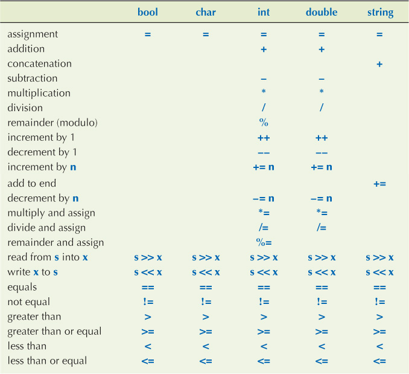

# Data Structures

A **data structure is a data organization, management, and storage format** that enables efficient access and modification.

The data structure is a collection of data values, the relationships among them, and the functions or operations applied to the data.

## Introduction

There are two types of Data structures:

1. [Physical](#physical): They define how the data is arranged in memory.

   - [Arrays](#arrays)
   - Linked List
   - Etc.

2. [Logical](#logical): They define how the data can be utilized and the arrangement is.

   - Linear Data Structures:

     - **Stack** (LIFO)
     - **Queues** (LIFO)

   - Non-Linear Data Structures:

     - **Tress**
     - **Graph**

   - Tabular (linear/non-linear):
     - **Hash Table**

### Problem solving vs programming:

1. Problem-solving: It requires maths to solve problems. And maths does not have loops, it has [Recursion](#recursion). Problem-solving is a lifetime of work.

2. Programming: Learning the syntax of a language and implementing the solution in it.

### Revising C/C++ Concepts

We will revise some basic concepts of C/C++.

The main memory is divided into:

1. Heap:

2. Stack:

3. Code Section:

_Example:_

```c
int main()
{
    int A[5];
    int B[5]={2,4,6,8,10};
    int i;
    for(i=0;i<5;i++)
    {
        printf("%d", B[i]);
    }
}
// Arrays A and B will appear in the Stack after declaration.
```

#### Types and objects

- A _type_ defines a set of possible values and a set of operations (for an object).
- An _object_ is some memory that holds a value of a given type.
- A _value_ is a set of bits in memory interpreted according to a type.
- A _variable_ is a named object.
- A _declaration_ is a statement that gives a name to an object.
- A _definition_ is a declaration that sets aside memory for an object.

**Operations on data types**:



#### struct (Structure)

_Definition:_ It is a **physically grouped list of dissimilar data items under one name in a block of memory**, allowing the different data items to be **accessed via a single pointer**. It is used for defining user-defined data types, apart from the primitive data types.

_Example:_

```c
struct Rectangle
{
    int length;
    int breadth;
}

int main()
{
    struct Rectangle r;
    struct Rectangle r1={10,5};
    r1.length=25;
    printf("Area of the Rectangle is %d", r.length * r.breadth);
}
```

In the above example, we defined a `struct` called **Rectangle**.

- Its size will the **sum of sizes consumed by all of its elements**.
- We can declare an array of structures as shown below:

_Example:_

```c
struct Card
{
  int face;
  int shape;
  int color;
}

int main()
{
  struct Card deck[52]={{1,0,0}, {0,0,1}, .... };
  deck[0].face=2;
}
```

#### Pointers

_Definition:_ Pointer is **an address variable** that is meant for **storing the address of another variable**.

- The size of a pointer will always be equal to size the of its type.

Pointers are used for:

- Accessing heap memory. The program will not automatically access the heap. So heap memory is external to the program.
- Accessing resources, such as files, keyboard, monitor, etc.:
  - Like access files, files are stored in hard disks and are external to the program. So, file pointers are used to access these files.
  - Similarly to interact with any external device we use the pointer.
- Functions use Pointers as parameters while using call by reference method.

_Example:_

```c
int main()
{
    // data variable
    int a=10;
    // pointer variable
    int *p;

    // save address of a
    p=&a;

    // print data present in a
    printf("%d", a);
    printf("%d", *p);
    // also know as dereferencing
}
```

Accessing heap memory:

- In c `malloc` is used to get memory in heap. Its present in `<stdlib.h>` and takes size as a parameter.
- `malloc` returns a `void` pointer (generic pointer), so we have to type-caste it and say it is an `integer` pointer.

_Example:_

```c
#include<stdlib.h>
int main()
{
    int *p;
    p=(int *)malloc(5 * sizeof(int));
    // type-caste, malloc will now provide memory for an array of length 5 and each element of size int
}
```

Similarly in C++:

```cpp
#include<stdlib.h>
int main()
{
    int *p;
    p=new int[5];
}
```

Pointer to a [Structure](#Structure):

_Example:_

```c
struct Rectangle
{
    int length;
    int breadth;
}

int main()
{
    struct Rectangle r={10,5};
    struct Rectangle *p=&r;

    r.length=15;
    (*p).breadth=25; // *p is enclosed inside a bracket because `.` has higher priority than `*`
    p->length=25; // alternative method
}
```

Dynamic allocation of Pointer (in heap memory):

_Example:_

```c
// struct from the above example
int main()
{
    struct Rectangle *p;
    p=(struct Rectangle *)malloc(sizeof(struct Rectangle));

    p->length=22;
    p->breadth=10;
}
```

#### Reference

_Definition:_ It's an alias of a given variable.

- While referencing both the variable and its reference have the same address.

_Example:_

```cpp
int main()
{
    int a=10;
    int &r=a;
    // r is referring to a

    cout<<a; // 10
    r++;
    cout<<r; // 11
    cout<<a; // 11
}
```

::: tip NOTE
Reference is not a part of the C language.
:::

#### Functions

_Definition:_ A function is **a named sequence of statements**. A function can return a result (also called a return value).

> Also called _subroutine_

_Example:_

```c
// Addition function
int add(int a, int b) // This line is known as the prototype or signature of the function
{
    // int a and b are known as formal parameters
    int c;
    c = a + b;
    return(c);
}

// main function
int main()
{
    int x, y, z;
    x = 10;
    y = 5;
    y = add(x, y); // here int z and x are known as actual parameters
    printf("Sum is %d", y);
}
```

##### Parameter Passing

There are three ways of passing the parameters to a function.

1. Pass/Call by Value: In pass by value, changes in formal parameters do not reflect in the actual parameters. Refer to the above example.

2. Pass/Call by Address: In pass by address, changes in formal parameters reflect in actual parameters.

   _Example:_

   ```c
   void swap(int *x, int *y) // to use variable address, define pointers
   {
       int temp;
       temp=*x;
       *x=*y;
       *y=temp;
   }

   int main()
   {
       int a;
       int b;
       swap(&a, &b); // pass the variable address not the value
       printf("A == %d, B == %d", a, b);
   }
   ```

3. Pass/Call by Reference: In pass by reference also, changes in formal parameters reflect in actual parameters.

   _Example:_

   ```cpp
   void swap(int &x, int &y) // using & we reference the variables a and b
   {
       int temp;
       temp=*x;
       *x=*y;
       *y=temp;
   }

   int main()
   {
       int a;
       int b;
       swap(a, b); // no changes
       printf("A == %d, B == %d", a, b);
   }
   ```

::: tip NOTE
Pass by Reference should be used very carefully as it converts the modular code into monolithic code.
:::

Arrays as Parameters:

- Arrays cannot be passed by value, they are passed by address.

_Example:_

```c
void fun(int A[], int n) // here A[] is a pointer to an array, int *A is the same as int A[]
{
    int i;
    for(i=0; i<n; i++)
    {
        printf("%d", A[i]);
    }
}

int main()
{
    int A[5] = {1,2,3,4,5};
    fun(A, 5);
}
```

Function that returns a Pointer:

_Example:_

```c
int [] fun(int n)
{
    int *p;
    p = (int *)malloc(n * sizeof(int));
    return(p);
}

int main()
{
    int *A;
    A = fun(5);
}
```

Structure as parameter:

1. Pass/Call by Value:

   _Example:_

   ```c
   struct Rectangle
   {
       int length;
       int breadth;
   }

   int area(struct Rectangle r1)
   {
       return r1.length * r1.breath;
   }

   int main()
   {
       struct Rectangle r = {1, 2};
       printf("Area of the Rectangle is %d", area(r));
   }
   ```

2. Pass/Call by Address:

   _Example:_

   ```c
   struct Rectangle
   {
       int length;
       int breadth;
   }

   int changeLength(struct Rectangle *p, int l)
   {
       p->length = l;
   }

   int main()
   {
       struct Rectangle r = {1, 2};
       changeLength(&r, 20);
   }
   ```

::: tip NOTE
Even when a `struct` has an array member, it can be passed by value even though array alone cannot be passed by value.
:::

::: warning

- Confirm if true or false: C does not have any built-in data structures.
- As part of the code activation record of the function, all the variables are created in the stack.

:::

#### Structure of the Code

1. In C, `main()` function should only have variable declarations and function calls.

   These functions must be responsible for initialization, mutation, etc.

   The structure is usually maintained as structs and functions related to them.

   _Example:_

   ```c
   struct Rectangle
   {
       int length;
       int breadth;
   }

   void initialize(struct Rectangle *r, int l, int b)
   {
       r->length = l;
       r->breadth = b;
   }

   int area(struct Rectangle r)
   {
       return r.length * r.breadth;
   }

   void changeLength(struct Rectangle *r1, int l)
   {
       r->length = l;
   }

   int main()
   {
       struct Rectangle r;

       initialize(&r, 10, 5);
       printf("Area of the Rectangle is %d", area(r));
       changeLength(&r, 20);
   }
   ```

2. Similarly in C++, OOP’s concepts are used to organize the code.

   All the variables and functions related to them are grouped together as a class.

   _Example:_

   ```cpp
   class Rectangle
   {
       private int length;
       private int breadth;

       // instead of initialize function we use a constructor to set the values
       Rectangle(int l, int b)
       {
           length = l;
           breadth = b;
       }

       public int area()
       {
           return length * breadth;
       }

       public void changeLength(int l)
       {
           length = l;
       }
   }

   int main()
   {
       Rectangle r(10, 5);
       printf("Area of the Rectangle is %d", r.area());
       r.changeLength(20);
   }
   ```

   _Example:_

   ```cpp
   #include<iostream> // .h depends on compiler (check)

   using namespace std; // if only iostream is used

   class Rectangle
   {
       private:
           int length;
           int breadth;

       public:
           // default constructor
           Rectangle()
           {
               length = 1;
               breadth = 1;
           }

           // parameterized construct (using constructor overloading)
           Rectangle(int l, int b); // prototype or signature of the function

           // below two functions are facilitators which perform some operations on data members
           int area();
           int perimeter();

           // below two functions are accessor/getter (get()) and mutator/setter (set()) function
           int getLength()
           {
               return length;
           }
           void setLength(int l)
           {
               length = l;
           }

           // destructor (call whenever dynamic memory is allocated by the class)
           ~Rectangle();
   };

   Rectangle::Rectangle(int l, int b)
   {
       length = l;
       breadth = b;
   }

   int Rectangle::area()
   {
       return length * breadth;
   }

   int Rectangle::perimeter()
   {
       return 2 * (length + breadth);
   }

   Rectangle::~Rectangle()
   {
       // free the dynamically allocated memory
   }

   int main()
   {
       Rectangle r(10, 5);
       cout<<r.area();
       cout<<r.perimeter();
       r.setLength(20);
       cout<<r.getLength();

       // now destructor will automatically called when the object goes outside the scope
   }
   ```

3. C++ program supports generic(template) functions and generic(template) classes.

   ```cpp
   template <class T>
   class Arithmetic
   {
       private:
           T a;
           T b;

       public:
           Arithmetic(T a, T b);
           T add();
           T sub();
   };

   template <class T>
   Arithmetic<T>::Arithmetic(T a, T b)
   {
       // this refers to class member variables not the function variables
       this->a = a;
       this->b = b;
   }

   template <class T>
   T Arithmetic<T>::add()
   {
       T c;
       c = a + b;
       return c;
   }

   template <class T>
   T Arithmetic<T>::sub()
   {
       T c;
       c = a - b;
       return c;
   }

   int main()
   {
       Arithmetic<int> ar(10, 5);
       cout<<ar.add();

       Arithmetic<float> ar1(1.5, 2.3);
       cout<<ar1.add();
   }
   ```

#### C/C++ Setup

For now, we will use [Dev-C++](https://www.bloodshed.net/dev/devcpp.html). Download the **with Mingw/GCC** version so that compiler will also be included.

Make the below changes in **Tools** --> **Compiler Options**:

1. In the **Compiler** section, tick mark **Add the following commands when calling compiler:** and add `-g` in the text available below. This helps while debugging the code.
2. Now, in **Programs** section, append `-std=c++99` to **gcc:** and **g++:** like `gcc.exe -std=c++11` and `g++.exe -std=c++11`. To use the latest C++ 11 standards.

## Arrays

_Definition:_ Contiguous area of memory consisting of equal-size elements

Indexed by contiguous integers.

- Arrays have constant-time access to any element and to add/remove at the end. Linear time to add/remove at an arbitrary location.

- To find the address of any element in an array use: `array_starting_address + element_size * (index_of_element - index_of_first_element)`

### Multi-Dimensional Arrays

- Row-major: if we stack all elements of an array as (1,1),(1,2)...,(1,n),(2,1),(2,2)...,(2,n)..., the column values change rapidly, hence Row-Major.
- Column-major: if we stack all elements of an array as (1,1),(2,1)...,(n,1),(1,2),(2,2)...,(n,2)..., the row values change rapidly, hence Column-Major.

### Performance

|     ~     | Add  | Remove |
| :-------: | :--: | :----: |
| Beginning | O(n) |  O(n)  |
|    End    | O(1) |  O(1)  |
|  Middle   | O(n) |  O(n)  |

::: tip NOTE
Most languages use zero-based indexing, some use one as the starting index, and some allow the user to specify the starting index.
:::

## Stack vs Heap

Stack Memory is also known as Static Memory, as the size is fixed and known during compile time.

Heap Memory is known as Dynamic Memory, as the size is known only during run time?.

- Memory is divided into a small addressable unit known as a _byte_.
- Large size memory will be divided into segments, usually of 64Kb.

Steps of execution of a program:

1. The program is copied into the code section of the memory.
2. All the variables will have memory allocation in Stack Frame or Activation Record of the function which is part of the Stack section of the memory. The main function will have the first Stack Frame inside the Stack Memory. The functions called by the main function and subsequent function’s activation record will have to be saved as a Stack. Organized memory.

Abstract Data Type (ADT):

- Data Type is defined as:
  - Representation of Data
  - Operations allowed on Data

## Singly-Linked Lists

## References

1. [Udemy - Data Structures](https://tcsglobal.udemy.com/course/datastructurescncpp/learn/lecture/13319372#overview)
2. [Coursera - Data Structures](https://www.coursera.org/learn/data-structures)
3. [Udemy - Data Structures and Algorithms](https://tcsglobal.udemy.com/course/learn-data-structure-algorithms-with-java-interview/learn/lecture/13778082#overview)
4. [Topcoder - The importance of algorithms](https://www.topcoder.com/community/competitive-programming/tutorials/the-importance-of-algorithms/)
