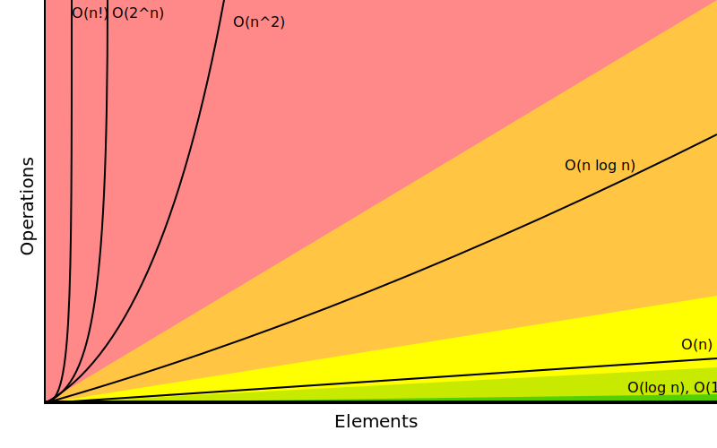
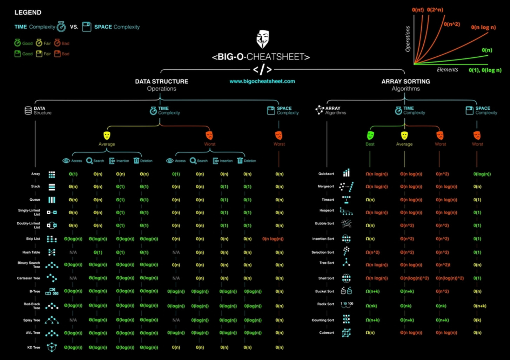

# Algorithms

Informally, an **algorithm** is any well-defined computational procedure that takes some value, or set of values, as **input** and produces some value, or set of values, as **output**. An algorithm is thus a sequence of computational steps that transform the input into the output.

An algorithm is said to be **correct if, for every input instance, it halts with the correct output**

Problem-solving vs Programming:

1. Problem-solving: Maths is required to solve problems. Maths does not have loops; it has [Recursion](./Recursion.md). It's a lifetime of work

2. Programming: Learning the syntax of a language and implementing the solution in it

## Analysing Algorithms

Analysing an algorithm has come to mean predicting the resources that the algorithm requires (mostly compute time and space)

Employ mathematical tools such as combinatorics, probability theory, algebraic dexterity, and the ability to identify the most significant terms in a formula

One way to analyse an algorithm is to run and collect metrics like memory usage, time to execute, CPU usage, etc. But there are several issues with this approach:

- Running an algorithm on a computer provides timing data specific to that computer, input, implementation, compiler, libraries, and concurrent tasks
- Timing results can vary even on the same computer with the same input
- Single-timing runs offer limited insight into the algorithm's performance on different inputs, computers, or implementations

So, instead of relying on timing runs, analyse the algorithm by counting pseudocode line executions and evaluating their execution times. The analysis produces a precise formula for running time, which can be simplified using convenient notation to compare algorithms

Input size:

- Running time depends on input size, with larger inputs generally taking more time to sort
- The focus is on input size, the primary factor affecting running time, described as a function of input size
- The appropriate measure of input size varies by problem, depending on factors like the number of items, bits (like multiplying 2 integers), or specific characteristics such as vertices and edges in a graph

Defining running time:

- Running time is the number of instructions and data accesses executed, independent of any specific computer, based on the [RAM model](#ram-model)
- Assume each line of pseudocode takes a constant amount of time, reflecting typical implementation on most computers

_Example:_ Analysing [Insertion Sort](./Sorting_Algorithms.md#insertion-sort)

- The running time of an algorithm on an input of size `n` by `T(n)`

```text
INSERTION-SORT(A, n)                cost  times
1 for i = 1 to n                    c1    n
2     key = A[i]                    c2    n - 1
3     j = i - 1                     c3    n - 1
4     while j > 0 and A[j] > key    c4    $\sum_{i=1}^{n} t_i$
5         A[j + 1] = A[j]           c5    $\sum_{i=1}^{n} (t_i - 1)$
6         j = j - 1                 c6    $\sum_{i=1}^{n} (t_i - 1)$
7     A[j + 1] = key                c7    n - 1
```

- We have $t_i = 1$ for $i = 2, 3, ..., n$, and the best-case running time is given by:

$$ \begin{align} T(n) & = c_1n + c_2(n - 1) + c_3(n - 1) + c_4(n - 1) + c_7(n - 1) \\ & = (c_1 + c_2 + c_3 + c_4 + c_7)n - (c_2 + c_3 + c_4 + c_7) \end{align} $$

- We can express this running time as $a_n + b$ for constants $a$ and $b$ that depend on the statement costs $c_k$ (where $a = c_1 + c_2 + c_4 + c_5 + c_8$ and $b = c_2 + c_4 + c_5 + c_8$). The running time is thus a _linear function_ of $n$

- In analysing Insertion Sort, we simplified by:

  - Using constants ck to represent statement costs.
  - Simplifying expressions further:

    - Best-case: $an + b$
    - Worst-case: $an^2 + bn + c$

  - Where $a$, $b$, and $c$ depend on $c_k$

- This approach ignores both actual and abstract statement costs, providing a more generalized complexity analysis

### Order of growth

It is the **rate of growth**, or **order of growth**, of the running time that really interests us

- We consider only the leading term and ignore constant coefficients, as they're less significant for large inputs
- Constant factors matter less than growth rate for large inputs

_Example:_ For $n^2/100 + 100n + 17 microseconds$, $n^2/100$ dominates when $n > 10,000$

Greek letter `Θ`‚ (theta) [Θ-notation](#big-o-o-notation) represents order of growth:

- Insertion sort worst-case: `Θ(n^2)`
- Insertion sort best-case: `Θ(n)`

**Θ-notation** informally means **"roughly proportional when n is large"**

- Algorithms with lower order of growth in worst-case are generally considered more efficient

- For sufficiently large inputs, a `Θ(n^2)` algorithm always outperforms a `Θ(n^3)` algorithm, regardless of hidden constants

Usually (but not always) we concentrate on finding only the worst-case running time, because:

- **Guarantee of Performance**: The worst-case analysis provides an upper bound on the running time, ensuring that the algorithm will not exceed this time, no matter the input. This feature is especially important for real-time computing, in which operations must complete by a deadline

- **Relevance in Practice**: For some algorithms, the worst case occurs fairly often. For example, in searching a database for a particular piece of information, the searching algorithm's worst case often occurs when the information is not present in the database. In some applications, searches for absent information may be frequent

### RAM Model

The RAM (Random Access Machine) model is a theoretical framework that analyses algorithms by simplifying how a computer operates. Here are the main points:

- **Single Processor**: The RAM model assumes a single processor that executes one instruction at a time, which is sequentially fetched from memory

- **Constant Time Operations**: Basic operations like addition, subtraction, multiplication, division, comparison, and data access take constant time (`O(1)`)

- **Memory Access**: Memory is uniformly accessible, meaning any memory location can be accessed in constant time, regardless of its location

- **Word Size**: The word size (the number of bits in a machine word) is assumed to be large enough to hold any data value or address used by the algorithm

- **No Parallelism**: The model does not account for parallel processing; all operations are performed sequentially

- **Instruction Set**: The model uses a basic set of instructions, similar to those in real computers, but abstracted to focus on algorithm efficiency rather than implementation details

This model helps provide a clear, consistent basis for analysing the time complexity of algorithms, independent of specific hardware or programming languages

## Asymptotic Notation

The efficiency of an algorithm depends on the amount of time, storage and other resources required to execute the algorithm. The efficiency is measured with the help of _asymptotic notations_

The study of **change in performance** of the algorithm **with the change in the order of the input size** is defined as **asymptotic analysis**

- Asymptotic notation can apply to functions that characterize some other aspect of algorithms (the amount of space they use, for example), or even to functions that have nothing whatsoever to do with algorithms.

- Algorithm times are measured in terms of _growth_ of an algorithm

"How many 2's do we multiply together to get 128?"

$$\log_2 128 = 7$$

Asymptotic Equivalence $\sim$:

$$n^2 \sim n^2 + n$$

Because

$$\lim_{n \to \infty} \frac{n^2 + n} {n^2} = \lim_{n \to \infty} 1 + \frac{1} {n} = 1$$

-$\sim$ is symmetric

Proof: Say $f \sim g$. Now:

$$\lim \frac{g}{f} = \lim \frac{1}{\frac{f}{g}} = \frac{1}{\lim \frac{f}{g}} = \frac{1}{1}$$

Transitivity of $\sim$: Suppose $f \sim g$ and $g \sim h$, prove $f \sim h$

$$1 = \lim \frac{f}{g} = \lim \frac{\frac{f}{h}}{\frac{g}{h}} = \frac{\lim \frac{f}{h}}{\lim \frac{g}{h}}$$

$$1 = \frac{\lim \frac{f}{h}}{1}$

Corollary: $\sim$ is an equivalence relation

Summary:

| Func       | Desc                   |
| ---------- | ---------------------- |
| $f \sim g$ | $f$ & $g$ nearly equal |
| $f = o(g)$ | $f$ much less than $g$ |
| $f = O(g)$ | $f$ roughly ≤ $g$      |
| $f = Θ(g)$ | $f$ roughly equal $g$  |

### Big O (_O-notation_)

_O-notation_ characterizes an _upper bound_ on the asymptotic behaviour of a function

- It says that a function grows _no faster_ than a certain rate, based on the highest-order term

**Definition**: For a given function $g(n)$, we denote by $O(g(n))$ (pronounced "big-oh of $g$ of $n$" or sometimes just "oh of $g$ of $n$") the _set of functions_:

```text
O(g(n)) = {
            f(n): there exist positive constants `c` and `n0` such that
                  0 ≤ f(n) ≤ cg(n) for all n ≥ n0
}
```

_Example:_ $f(n) = 2n^2 + 3n$ is $O(n^2)$ because for $c = 3$ and $n_0 = 3$, $2n^2 + 3n ≤ 3n^2$ for all $n ≥ 3$

- $f(n)$ grows no faster than $g(n)$ in the worst case

_Big O_ is the most commonly used notation

- **Dominant term** of the function is taken for consideration

- Big-O notation represents the **upper bound** of the running time of an algorithm

- It provides the **worst-case scenario**, representing the maximum amount of time an algorithm could take as the input size increases

_Example:_ Function $7n^3 + 100n^2 - 20n + 6$

- Its highest-order term is $7n^3$, and so we say that this function's rate of growth is $n^3$
- Because this function grows no faster than $n3$, we can write that it is $O(n^3)$
- This function is also $O(n^4)$. Why? Because the function grows more slowly than $n^4$, we are correct in saying that it grows no faster
- Hence, this function is also $O(n^5)$, $O(n^6)$, and so on
- More generally, it is $O(n^c)$ for any constant $c ≥ 3$

Basically:

- How code slows as data grows
- Not the same as running time
- Big trend over time

> "Big O notation is a mathematical notation that describes the limiting behaviour of a function when the argument tends towards a particular value or infinity. It is a member of a family of notations invented by Paul Bachmann, Edmund Landau, and others, collectively called Bachmann–Landau notation or asymptotic notation."

### Big Omega (_Ω-notation_)

Ω-notation characterizes a _lower bound_ on the asymptotic behaviour of a function

- It says that a function grows _at least as fast as_ a certain rate, based as in O-notation - on the highest-order term

- Because the highest-order term in the function $7n^3 + 100n^2 - 20n + 6$ grows at least as fast as $n^3$, this function is $Ω(n^3)$. This function is also $Ω(n^2)$ and $Ω(n)$
- More generally, it is $Ω(n^c)$ for any constant $c ≤ 3$

- It represents the **best-case scenario**, showing the minimum amount of time an algorithm will take

**Definition**: For a given function $g(n)$, we denote by $Ω(g(n))$ (pronounced "big-omega of $g$ of $n$" or sometimes just "omega of $g$ of $n$") the _set of functions_:

```text
Ω(g(n)) = {
            f(n): there exist positive constants `c` and `n0` such that
                  0 ≤ cg(n) ≤ f(n) for all n ≥ n0
}
```

_Example:_ $f(n) = n^2/2 - 2n$ is $Ω(n^2)$ because for $c = 1/4$ and $n_0 = 8$, $n^2/4 ≤ n^2/2 - 2n$ for all $n ≥ 8$

- $f(n)$ grows at least as fast as $g(n)$ in the best case

### Theta (_Θ-notation_)

Θ-notation characterizes a _tight bound_ on the asymptotic behaviour of a function

- It says that a function grows _precisely_ at a certain rate, based on the highest-order term

- Characterizes the rate of growth of the function to within a constant factor from above and to within a constant factor from below. These two constant factors need not be equal

- Since the function $7n^3 + 100n^2 - 20n + 6$ is both $O(n^3)$ and $Ω(n^3)$, it is also $Θ(n^3)$

**Definition**: For a given function $g(n)$, we denote by $Θ(g(n))$ (pronounced "theta of $g$ of $n$") the _set of functions_:

```text
Θ(g(n)) = {
            f(n): there exist positive constants `c1`, `c2`, and `n0` such that
                  0 ≤ c1g(n) ≤ f(n) ≤ c2g(n) for all n ≥ n0
}
```

**Theorem**: For any two functions $f(n)$ and $g(n)$, we have $f(n) = Θ(g(n))$ if and only if $f(n) = O(g(n))$ and $f(n) = Ω(g(n))$

_Example:_ $f(n) = 3n^2 + 2n - 1$ is $Θ(n^2)$ because for $c1 = 2$, $c2 = 4$, and $n0 = 2$, $2n^2 ≤ 3n^2 + 2n - 1 ≤ 4n^2$ for all $n ≥ 2$

- **Theta (`Θ()`)** describes the **exact bound** of the complexity

- Theta notation encloses the function from above and below

- Since it represents the upper and the lower bound of the running time of an algorithm, it is used for analysing the **average-case complexity** of an algorithm

### Other Notations

1. Little O (_o-notation_): For a given function $g(n)$, we denote by $o(g(n))$ ("little-oh of $g$ of $n$") the _set of functions_:

   ```text
   o(g(n)) = {
               f(n): for any positive constant `c > 0`, there exists a constant
                     n0 > 0 such that 0 ≤ f(n) ≤ cg(n) for all n ≥ n0
   }
   ```

   _Example:_ $f(n) = n is o(n^2)$ because for any $c > 0$, we can choose $n_0 = 1/c$, and then $n < cn^2$ for all $n > n_0$

   - **Little O** describes the **upper bound excluding the exact bound** (i.e. denote an upper bound that is not asymptotically tight)

2. Little-omega (_𝜔-notation_): For a given function $g(n)$, we denote by $𝜔(g(n))$ ("little-omega of $g$ of $n$") the _set of functions_:

   ```text
   𝜔(g(n)) = {
               f(n): for any positive constant `c > 0`, there exists a constant
                     n0 > 0 such that 0 ≤ cg(n) ≤ f(n) for all n ≥ n0
   }
   ```

   _Example:_ $f(n) = n^2 is 𝜔(n)$ because for any $c > 0$, we can choose $n_0 = c + 1$, and then $cn < n^2$ for all $n > n_0$

## Time and Space Complexity

There are often many approaches to solving a problem. How do we choose between them? At the heart of computer program design are two (sometimes conflicting) goals:

1. To design an algorithm that is easy to understand, code, and debug

2. To design an algorithm that makes efficient use of the computer's resources

The method for evaluating the efficiency of an algorithm or computer program is called **asymptotic analysis**

- A method for estimating the efficiency of an algorithm or computer program by identifying its growth rate. Asymptotic analysis also gives a way to define the inherent difficulty of a problem. We frequently use the term algorithm analysis to mean the same thing

- Asymptotic analysis also gives a way to define the inherent difficulty of a problem

Order of the polynomial equation or [Big O](#big-o): How time scales with respect to some input variables

- Usually `n` is used to denote the variable (any letter can be used)

Rules:

1. Different steps get added: `O(a)` and `O(b)` will be added to `O(a+b)`

2. Drop constants: If the complexity is `2n`, the constant `2` is dropped and Big O is represented as `O(n)`

3. Different inputs should use different variables. So, instead of using `n` for two different arrays use `a` and `b`. So, Big O is `O(a * b)` not `O(n^2)`

4. Drop non-dominate terms: If a function has two complexities such as `O(n)` and `O(n^2)`. Drop `O(n)` and just use `O(n^2)`

- `O(n)`:

  ```c
  // one for loop
  for (int i=0; i<n; i++) {
      /* Code */
      }
  ```

- `O(n^2)`:

  ```c
  // one for loop
  for (int i=0; i<n; i++) {
      for (int i=0; i<n; i++) {
      /* Code */
      }
  }
  ```

Time functions

Terms:

- complexity

  - Complexity is different for small numbers than large numbers

- time complexity
- algorithmic complexity
- asymptotic complexity

- Amortization:

  - Long-term averaging
  - Operations can take different times

- Worst case:
  - Typical case vs worst case

Terminology:

- `O(...n...)`
- `n`: how much data
- `O`: "Order of"
- Not a function! (It's just a notation)

_Big-O Complexity:_



1. `O(1)`: **Constant time** (size of data dose not matter)

   - Constant time beats linear if data is sufficiently big

   ```python
   # Array
   arr = [1, 2, 3]
   arr.append(4)    # push to end
   arr.pop()        # pop from end
   arr[0]           # lookup
   arr[1]
   arr[2]

   # HashMap/Set
   hashMap = {}
   hashMap["key"] = 10     # insert
   print("key" in hashMap) # lookup
   print(hashMap["key"])   # lookup
   hashMap.pop("key")      # remove
   ```

2. `O(n)`: **Linear time**

   - Time grows proportionally to data

   ```python
   arr = [1, 2, 3]
   sum(arr)           # sum of array
   for n in arr:      # looping
      print(n)

   arr.insert(1, 100) # insert
   arr.remove(100)    # remove
   print(100 in arr)  # search

   import heapq
   heapq.heapify(arr) # build heap

   # sometimes even nested loops can be O(n)
   # (e.g. monotonic stack or sliding window)
   ```

3. `O(n^2)`: **Quadratic time**

   ```python
   # Traverse a square grid
   arr = [[1, 2, 3], [4, 5, 6], [7, 8, 9]]
   for i in range(len(arr)):
      for j in range(len(arr[i])):
         print(arr[i][j])


   # Get every pair of elements in array
   arr = [1, 2, 3]
   for i in range(len(arr)):
      for j in range(i + 1, len(arr)):
         print(arr[i], arr[j])

   # Insertion sort (insert in middle n times -> n^2)
   ```

4. `O(n*m)`:

   ```python
   # Get every pair of elements from two arrays
   arr1, arr2 = [1, 2, 3], [4, 5]
   for i in range(len(arr1)):
      for j in range(len(arr2)):
         print(arr1[i], arr2[j])

   # Traverse rectangle grid
   arr = [[1, 2, 3], [4, 5, 6]]
   for i in range(len(arr)):
      for j in range(len(arr[i])):
         print(arr[i][j])
   ```

5. `O(n^3)`: and so on

   ```python
   # Get every triplet of elements in array
   arr = [1, 2, 3]
   for i in range(len(arr)):
      for j in range(i + 1, len(arr)):
         for k in range(j + 1, len(arr)):
               print(arr[i], arr[j], arr[k])
   ```

6. `O(log n)`:

   ```python
   # Binary search
   arr = [1, 2, 3, 4, 5]
   target = 6
   l, r = 0, len(arr) - 1
   while l <= r:
      m = (l + r) // 2
      if target < arr[m]:
         r = m - 1
      elif target > arr[m]:
         l = m + 1
      else:
         print(m)
         break

   # Binary Search on BST
   def search(root, target):
      if not root:
         return False
      if target < root.val:
         return search(root.left, target)
      elif target > root.val:
         return search(root.right, target)
      else:
         return True

   # Heap Push and Pop
   import heapq
   minHeap = []
   heapq.heappush(minHeap, 5)
   heapq.heappop(minHeap)
   ```

7. `O(n log n)`:

   ```python
   # Heap Sort
   import heapq
   arr = [1, 2, 3, 4, 5]
   heapq.heapify(arr)     # O(n)
   while arr:
      heapq.heappop(arr) # O(log n)

   # Merge Sort (and most built-in sorting functions)
   ```

8. `O(2^n)`:

   ```python
   # Recursion, tree height n, two branches
   def recursion(i, arr):
      if i == len(arr):
         return 0
      branch1 = recursion(i + 1, arr)
      branch2 = recursion(i + 2, arr)
   ```

9. `O(c^n)`:

   ```python
   # c branches, where c is sometimes n.
   def recursion(i, arr, c):
      if i == len(arr):
         return 0

      for j in range(i, i + c):
         branch = recursion(j + 1, arr)
   ```

10. `O(sqrt(n))`:

    ```python
    # Get all factors of n
    import math
    n = 12
    factors = set()
    for i in range(1, int(math.sqrt(n)) + 1):
       if n % i == 0:
          factors.add(i)
          factors.add(n // i)
    ```

11. `O(n!)`:

    - Permutations
    - Travelling Salesman Problem



Static and Global variables:

## Call Stack

A call stack is a [_stack data structure_](../Data-Structures/Stack.md) that stores information about the active subroutines of a computer program.

- The order in which elements come off a stack gives rise to its alternative name, **LIFO** (last in, first out).

## Algorithm Design

- Master Theorem

### Divide-and-Conquer Algorithm

Divide and conquer algorithm is a strategy of solving a large problem by:

1. Breaking the problem into smaller sub-problems
2. Solving the sub-problems, and
3. Combining them to get the desired output

A problem is recursively broken down into smaller sub-problems of the same type until they become simple enough to solve directly. The solutions to the sub-problems are then combined to give a solution to the original problem

Steps:

1. **Divide** the problem into one or more sub-problems that are smaller instances of the same problem
2. **Conquer** the sub-problems by solving them recursively
3. **Combine** the sub-problem solutions to form a solution to the original problem

Based on multi-branched [Recursion](./Recursion.md)

_Example:_ Analysing [Merge Sort](./Sorting_Algorithms.md#merge-sort)

It's applications:

- [Binary Search](./Searching_Algorithms.md#binary-search)
- [Quick Sort](./Sorting_Algorithms.md#quick-sort)
- Finding the GCD is an use case of D&C.
- Check Euclid's algorithm for GCD.
- Strassen's Matrix multiplication
- Karatsuba Algorithm

## P vs NP Problem

### NP-Complete Problems

NP-Complete problems are a class of computational problems in computer science and mathematics that are considered to be among the hardest problems to solve efficiently

A problem is NP-Complete if it's in NP (_Non-deterministic Polynomial time_) and all other NP problems can be reduced to it in polynomial time

Key characteristics:

- No known polynomial-time algorithm to solve them
- Verifying a solution is relatively quick (polynomial time)
- No one knows whether or not efficient algorithms exist for NP-complete problems
- If an efficient algorithm exists for any one of them, then efficient algorithms exist for all of them
- Several NP-complete problems are similar, but not identical, to problems for which we do know of efficient algorithms

_Examples:_

- The Travelling Salesperson problem

  Performance: **O(n!)**

  Implementation

- Boolean Satisfiability Problem (SAT)
- Graph Colouring Problem
- Subset Sum Problem

## Famous Algorithms

- Dynamic programming
- Greedy algorithm

  - Dijkstra's Shortest Path algorithm

- Backtracking

- Sliding window

- Monotonic stack

## References

- _Grokking Algorithms: An illustrated guide for programmers and other curious people_, by Adiya Y. Bhargava
- _Introduction to Algorithms_, 4th edition, by Thomas H. Cormen, Charles E. Leiserson, Ronald L. Rivest, Clifford Stein
