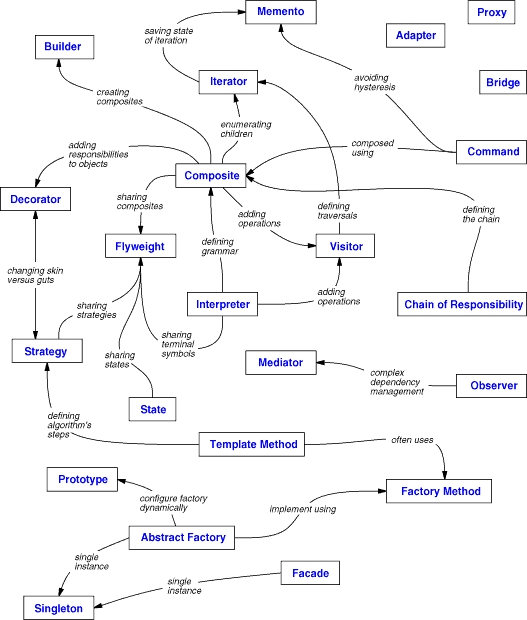

# Design Patterns

Design patterns are common approaches to solving similar problems

They are like pre-made blueprints that you can customize to solve a recurring design problem in your code

The 1995 book _Design Patterns: Elements of Reusable Object-Oriented Software_ by Erich Gamma, Richard Helm, Ralph Johnson, and John Vlissides, also know as _Gang of Four (GoF)_, describes **23 patterns**

Quote from the book:

> A design pattern systematically names, motivates, and explains a general design that addresses a recurring design problem in object-oriented systems. It describes the problem, the solution,, when to apply the solution, and its consequences. It also gives implementation hints and examples. The solution is a general arrangement of objects and classes that solve the problem. The solution is customized and implemented to solve the problem in a particular context

Why use design patterns?

- Reusable solutions to common problems
- Standardized terminology
- Scalability
- Maintainability
- Performance
- Documentation
- Best practices
- Cross-Domain Applicability
- They are just guidelines that help us avoid bad design that are:
  - Rigid
  - Fragile
  - Immobile

- Some design patterns tend to **cause more problems** than they solve, and are thus commonly referred to as **anti-patterns**

**Prerequisite**: Knowing [OOPs concepts](./Programming_Paradigms/Object-Oriented_Programming.md)

## Need to Know

- [ ] SAGA
- [ ] 2-way pattern
- [ ] Add advantages, usage, and UML for each pattern

## Criticism of Patterns

- Kludges for a weak programming language: [Revenge of the Nerds](http://www.paulgraham.com/icad.html)
  - [Are Design Patterns Missing Language Features](http://wiki.c2.com/?AreDesignPatternsMissingLanguageFeatures)

  - For example, the [Strategy pattern](#strategy-pattern) can be implemented with a simple anonymous (lambda) function in most modern programming languages

- Leads to inefficient solutions

- Unjustified use:

  > If all you have is a hammer, everything looks like a nail

## Elements of a Pattern

- **Pattern Name**: A meaningful name that describes the pattern
- **Problem**: Describes the problem and its context
- **Solution**: Describes the elements that make up the design, their relationships, responsibilities, and collaborations
- **Consequences**: Describes the results and trade-offs of applying the pattern

## Classification of Patterns

All patterns can be categorized by their **purpose** or _know how_:

1. [Creational Patterns](#creational-patterns): Deal with object creation mechanisms, trying to create objects in a manner suitable to the situation

2. [Structural Patterns](#structural-patterns): Deal with object composition, and typically identify simple ways to realize relationships between different objects

3. [Behavioural Patterns](#behavioural-patterns): Deal with object communication, how objects interact with each other and how to assign responsibilities between them

These pattern can also be divided based on their **scope**:

- Class:
  - Deal with relationships between classes and their subclasses
  - These relationships are established through inheritance
  - So they are static, fixed at compile-time

- Object:
  - Deal with object relationships
  - Which can be changed at run-time and are more dynamic

The most **basic and low-level patterns** are often called **idioms**. They usually apply only to a single programming language

The most **universal and high-level patterns** are **architectural patterns**. Developers can implement these patterns in virtually any language. Unlike other patterns, they can be used to design the architecture of an entire application



### Other Types of Patterns

- Concurrency design patterns: When you are dealing with multi threading programming these are the patterns that you will want to use

- Architectural design patterns: Design patterns that are used on the system's architecture, like MVC or MVVM

## Creational Patterns

Creational patterns provide **object creation mechanisms** that increase flexibility and reuse of existing code: **How objects are created**

- When the regular object creation manner would cause more complexity or bring problems to the code

Patterns:

1. [Abstract Factory](#abstract-factory): Creates an instance of several families of classes

2. [Builder](#builder-pattern): Separates object construction from its representation

3. [Factory Method](#factory-method): Creates an instance of several derived classes

4. [Prototype](#prototype-pattern): A fully initialized instance to be copied or cloned

5. [Singleton](#singleton-pattern): A class of which only a single instance can exist

### Abstract Factory

| Popularity | Complexity | Scope  | AKA |
| ---------- | ---------- | ------ | --- |
| Important  | 2          | Object | Kit |

_Intent:_ Provide an interface for creating families of related or dependent objects without specifying their concrete classes

- Groups object factories that have a common theme

### Builder Pattern

| Popularity | Complexity | Scope  |
| ---------- | ---------- | ------ |
| Common     | 2          | Object |

_Intent:_ Separate the construction of a complex object from its representation so that the same
construction process can create different representations

_Example:_

```javascript
class HotDog {
  constructor(bun, ketchup, mustard, kraut) {
    this.bun = bun;
    this.ketchup = ketchup;
    this.mustard = mustard;
    this.kraut = kraut;
  }
}

// passing parameters to constructor becomes
// problematic if there are many
const snack = new HotDog("wheat", false, true, true);

// add properties to object
// via methods
class HotDog {
  constructor(bun) {
    this.bun = bun;
  }

  addKetchup() {
    this.ketchup = true;
    return this;
  }
  addMustard() {
    this.mustard = true;
    return this;
  }
  addKraut() {
    this.kraut = true;
    return this;
  }
}

const snack = new HotDog("wheat");

// method chaining
snack.addKetchup().addKraut();

console.log(snack); // { bun: 'wheat', ketchup: true, kraut: true }
```

_Usage_:

- May be very useful while writing Unit Tests

### Factory Method

| Popularity | Complexity | Scope | AKA                 |
| ---------- | ---------- | ----- | ------------------- |
| Important  | 2          | Class | Virtual Constructor |

_Intent:_ The Factory Method pattern defines an interface for creating objects, but lets subclasses decide which class to instantiate

- Factory Method lets a class defer instantiation to subclasses

_Applicability:_

- Use the Factory Method when you don't know beforehand the exact types and dependencies of the objects your code should work with

- Use the Factory Method when you want to provide users of your library or framework with a way to extend its internal components

#### Simple Factory Design

In _Simple Factory Design_ pattern, a **client** asks for an object without knowing where the object is coming from (that is, which class is used to generate it)

_Example:_

```javascript
class IOSButton {}

class AndroidButton {}

// without factory
const button1 = os === "ios" ? new IOSButton() : new AndroidButton();
const button2 = os === "ios" ? new IOSButton() : new AndroidButton();

class ButtonFactory {
  createButton(os) {
    if (os === "ios") {
      return new IOSButton();
    }

    return new AndroidButton();
  }
}

// with factory
const factory = new ButtonFactory();

const btn1 = factory.createButton(os);
const btn2 = factory.createButton(os);
```

_Usage:_

- Consider we want to read data from a _json_ or _XML_ file as per the needs

- The below two classes are used to read data from these files:

  ```python
  import json

  class JSONDataExtractor:
      def __init__(self, filepath):
          self.data = dict()

          with open(filepath, mode='r', encoding='utf-8') as f:
              self.data = json.load(f)

          @property
          def parsed_data(self):
              return self.data


  import xml.etree.ElementTree as etree

  class XMLDataExtractor:
      def __init__(self, filepath):
          self.tree = etree.parse(filepath)

          @property
          def parsed_data(self):
              return self.tree
  ```

- Now, write a factory method that returns an instance of _JSONDataExtractor_ or _XMLDataExtractor_ depending on the extension of the file:

  ```python
  def data_extraction_factory(filepath):
      if filepath.endswith('json'):
          extractor = JSONDataExtractor
      elif filepath.endswith('xml'):
          extractor = XMLDataExtractor
      else:
          raise ValueError('Cannot extract the data from {}', format(filepath))

      return extractor(filepath)
  ```

- A wrapper function can be added to handle exceptions:

  ```python
  def extract_data_from(filepath):
      factory_obj = None

      try:
          factory_obj = data_extraction_factory(filepath)
      except ValueError as e:
          print(e)
      return factory_obj
  ```

- This can be used in any function to read data from either _json_ or _XML_ file

### Prototype Pattern

| Popularity | Complexity | Scope  |
| ---------- | ---------- | ------ |
| Not Common | 1          | Object |

_Intent:_ Lets you copy existing objects without making your code dependent on their classes

We can create objects that will be used as prototypes for other objects to be created

- Inheritance by prototypes ends up bringing a improvement in performance as well, because both objects have a reference to the same method that is implemented on the prototype, instead of being implemented on each one of them

- It enables us to extent the prototype with new functions that are immediately available to all the objects. **This is not a best practice**

_Example:_

```javascript
// constructor function
function Zombie(name) {
  this.name = name || "Zombie";
  this.reAnimated = Date.now();

  this.eatBrain = function () {
    return `${this.name} is hungry for 🧠`;
  };
}

Zombie.prototype.canRun = function () {
  return this.name !== "Zombie";
};

const obj = new Zombie("🧟‍♂️ Jeff");
const genericZombie = new Zombie();

console.log(obj);
// { name: '🧟‍♂️ Jeff', reAnimated: 1664717547330, eatBrain: () }
Object.getPrototypeOf(obj);
// { canRun: () }

obj.eatBrain();
// 🧟‍♂️ Jeff is hungry for 🧠
genericZombie.eatBrain();
// Zombie is hungry for 🧠

obj.canRun();
// true
genericZombie.canRun();
// false

obj.eatBrain = () => "I am Vegan";
Zombie.prototype.canRun = () => "Error";

obj.eatBrain();
// I am Vegan
genericZombie.eatBrain();
// Zombie is hungry for 🧠

obj.canRun();
// Error
genericZombie.canRun();
// Error
```

### Singleton Pattern

| Popularity | Complexity | Scope  |
| ---------- | ---------- | ------ |
| Important  | 1          | Object |

_Intent:_ Ensure a class only has one instance, and provide a global point of access to it

- Global point of access instead of encapsulation
- Hard to debug

_Example:_

```javascript
let configurationSingleton = (() => {
  // private value of the singleton initialized only once
  let config;

  const initializeConfiguration = (values) => {
    this.randomNumber = Math.random();
    values = values || {};
    this.number = values.number || 5;
    this.size = values.size || 10;
  };

  // We export the centralized method to return
  // the singleton's value
  return {
    getConfig: (values) => {
      // initialize the singleton only once
      if (config === undefined) {
        config = new initializeConfiguration(values);
      }

      // and always return the same value
      return config;
    },
  };
})();

const configObject = configurationSingleton.getConfig({ size: 8 });
// prints number: 5, size: 8, randomNumber: someRandomDecimalValue
console.log(configObject);

const configObject1 = configurationSingleton.getConfig({ number: 8 });
// prints number: 5, size: 8, randomNumber: same randomDecimalValue // como no primeiro config
console.log(configObject1);
```

- In JavaScript Singleton can basically be achieved by using object literals:

```typescript
// app settings
class Settings {
  static instance: Settings;
  public readonly mode = "dark";

  // prevent new with private constructor
  private constructor() {}

  static getInstance(): Settings {
    if (!Settings.instance) {
      Settings.instance = new Settings();
    }

    return Settings.instance;
  }
}

const settings = Settings.getInstance();

// same behaviour can be achieved using object literal
const settings = {
  dark: true,
};
```

- Meyer's Singleton

## Structural Patterns

Structural patterns explain how to assemble objects and classes into larger structures, while keeping these structures flexible and efficient: **How objects relate to each other**

- They guarantee that if a system's part change, nothing else has to change with it

Design Patterns:

1. [Adapter](#adapter-pattern): Match interfaces of different classes

2. [Bridge](#bridge-pattern): Separates an object's interface from its implementation

3. [Composite](#composite-pattern): A tree structure of simple and composite objects

4. [Decorator (Wrapper)](#decorator-pattern): Add responsibilities to objects dynamically

5. [Facade](#facade-pattern): A single class that represents an entire subsystem (Simplified API)

6. [Flyweight](#flyweight-pattern): A fine-grained instance used for efficient sharing

7. [Proxy](#proxy-pattern): An object representing another object (Substitution)

### Adapter Pattern

| Popularity | Complexity | Scope          |
| ---------- | ---------- | -------------- |
| Important  | 1          | Class & Object |

This pattern converts the interface of a class into another interface that clients expect. It allows classes to work together that couldn't otherwise because of incompatible interfaces

The Adapter Design Pattern, also known as the _Wrapper_, allows two classes to work together that otherwise would have incompatible interfaces

_Intent:_ Adapter is a structural design pattern that allows objects with incompatible interfaces to collaborate

- You can create an _adapter_. This is a special object that converts the interface of one object so that another object can understand it

_Applicability:_

- Use the Adapter class when you want to use some existing class, but its interface isn't compatible with the rest of your code

### Bridge Pattern

| Popularity | Complexity | Scope  |
| ---------- | ---------- | ------ |
| Rare       | 3          | Object |

### Composite Pattern

| Popularity | Complexity | Scope  |
| ---------- | ---------- | ------ |
| Important  | 2          | Object |

### Decorator Pattern

| Popularity | Complexity | Scope  | AKA     |
| ---------- | ---------- | ------ | ------- |
| Important  | 2          | Object | Wrapper |

This pattern attaches additional responsibilities to an object dynamically. Decorators provide a flexible alternative to sub-classing for extending functionality

_Intent:_ Decorator is a structural design pattern that lets you attach new behaviours to objects by placing these objects inside special wrapper objects that contain the behaviours

_Applicability:_

- Use the Decorator pattern when you need to be able to assign extra behaviours to objects at runtime without breaking the code that uses these objects

- Use the pattern when it's awkward or not possible to extend an object's behaviour using inheritance

### Facade Pattern

| Popularity | Complexity | Scope  |
| ---------- | ---------- | ------ |
| Important  | 1          | Object |

The facade design pattern is used when we want to create an abstraction layer between what is show publicly and the internal implementation. It is used when we want to have a simpler interface

This pattern is used, for example, on the DOM selectors of libraries as JQuery, Dojo and D3. These frameworks have powerful selectors that allow us to write complex queries on a very simple way. Something like jQuery(`.parent .child div.span`) seems simple, but it hides a complex query logic underneath

Here again, every time we create an abstraction layer above the code, we might end up having a loss of performance. Mostly this loss is irrelevant, but is always good to be considered

```javascript
// facade is just simplified API

class PlumbingSystem {
  // low level access to plumbing system
  setPressure(value) {}
  turnOn() {}
  turnOff() {}
}

class ElectricalSystem {
  // low level access to electrical system
  setVoltage(value) {}
  turnOn() {}
  turnOff() {}
}

// create
class House {
  constructor() {
    // private
    this.plumbing = new PlumbingSystem();
    this.electrical = new ElectricalSystem();
  }

  turnOnSystems() {
    this.electrical.setVoltage();
    this.electrical.turnOn();
    this.plumbing.setPressure();
    this.plumbing.turnOn();
  }

  shutDown() {
    this.electrical.turnOff();
    this.plumbing.turnOff();
  }
}

let client = new House();

client.turnOnSystems();
```

### Flyweight Pattern

| Popularity | Complexity | Scope  |
| ---------- | ---------- | ------ |
|            |            | Object |

### Proxy Pattern

| Popularity | Complexity | Scope  |
| ---------- | ---------- | ------ |
| Important  | 2          | Object |

## Behavioural Patterns

Behavioural patterns take care of effective communication and the assignment of responsibilities between objects: **How objects communicate with each other**

- They help to guarantee that unrelated parts of the application have a synchronized information
- These patterns address communication, responsibility, and algorithmic issues in object-oriented software design
- They help in making the design more flexible, extensible, and maintainable by promoting better communication and separation of concerns between objects and classes in the system

Design Patterns:

1. [Chain of Responsibility](#chain-of-responsibility): A way of passing a request between a chain of objects

2. [Command](#command-pattern): Encapsulate a command request as an object

3. [Interpreter](#interpreter-pattern): A way to include language elements in a program

4. [Iterator](#iterator-pattern): Sequentially access the elements of a collection

5. [Mediator](#mediator-pattern): Defines simplified communication between classes

6. [Memento](#memento-pattern): Capture and restore an object's internal state

7. [Observer](#observer-pattern): A way of notifying change to a number of classes

8. [State](#state-pattern): Alter an object's behaviour when its state changes

9. [Strategy](#strategy-pattern): Encapsulates an algorithm inside a class

10. [Template Method](#template-method-pattern): Defer the exact steps of an algorithm to a subclass

11. [Visitor](#visitor-pattern): Defines a new operation to a class without change

### Chain of Responsibility

| Popularity | Complexity | Scope  |
| ---------- | ---------- | ------ |
|            |            | Object |

### Command Pattern

| Popularity | Complexity | Scope  | AKA    |
| ---------- | ---------- | ------ | ------ |
| 3          | 1          | Object | Action |

Command is behavioural design pattern that converts requests or simple operations into objects

Encapsulate a call as an object

- It is a way to keep **separated the caller's context from the called**
- An abstraction layer to separate the objects that call the API from the objects that determine when to call it

It encapsulates a request as an object, allowing you to parametrize clients with queues, requests, and operations

- It enables you to decouple the sender from the receiver, providing flexibility in the execution of commands and supporting undoable operations

Cons:

A problem that arises with this pattern is that it **creates an additional abstraction layer**, and it may **impact the performance** of an app. It is important to know how to balance performance and code legibility

_Example:_ Let us consider a simple `Ligth` class that has two methods: `TurnOn` and `TurnOff`. To control the light, we can create a `RemoteControl` class that has a `PressButton` method that receives a command to on or off the light

- The `RemoteControl` class is tightly coupled with the `Light` class, and if we want to add a new command like `Dim` the light, we would have to change the `RemoteControl` class

To solve this problem, we can create a `Command` interface that has an `Execute` method. We can then create a `TurnOnCommand` and `TurnOffCommand` classes that implement the `Command` interface

- The `RemoteControl` class can then receive a `Command` object and call the `Execute` method
- This way, we can add new commands without changing the `RemoteControl` class

```text
+------------------------+                  +--------------------------------+
| RemoteControl          |                  | Command                        |
+------------------------+                  +--------------------------------+
| PressButton()          | <>-------------> | execute()                      |
+------------------------+                  +--------------------------------+
                                                             |
                                                             |
                                              +----------------------------+
                                              |                            |
                                              |                            |
                                              V                            V
+----------------+                    +----------------+           +----------------+
| Light          |                    | TurnOnCommand  |           | TurnOffCommand |
+----------------+                    +----------------+           +----------------+
| TurnOnCommand  |                    | execute()      |           | execute()      |
| TurnOffCommand |                    +----------------+           +----------------+
+----------------+                            |                            |
        ^                                     |                            |
        |                                     |                            |
        +-------------------------------------+----------------------------+
```

```javascript
// The object that knows how to execute the command
const invoker = {
  add: (x, y) => {
    return x + y;
  },
  subtract: (x, y) => {
    return x - y;
  },
};

// the object to be used as abstraction layer when
// we execute commands; it represents a interface
// to the caller object
let manager = {
  execute: (name, args) => {
    if (name in invoker) {
      return invoker[name].apply(invoker, [].slice.call(arguments, 1));
    }
    return false;
  },
};
// prints 8
console.log(manager.execute("add", 3, 5));
// prints 2
console.log(manager.execute("subtract", 5, 3));
```

### Interpreter Pattern

| Popularity | Complexity | Scope |
| ---------- | ---------- | ----- |
|            |            | Class |

### Iterator Pattern

| Popularity | Complexity | Scope  |
| ---------- | ---------- | ------ |
| 3          | 2          | Object |

This pattern provides a way to access the elements of an aggregate object sequentially without exposing its underlying representation

- It provides a way of iterating over an object without having to expose the object's internal structure, which may change in the future
- Changing the internals of an object should not effect its consumers

_Intent:_ Iterator is a behavioural design pattern that lets you traverse elements of a collection without exposing its underlying representation (_list_, _stack_, _tree_, etc.)

- Iterate pattern allows to traverse through a collection of object

_Applicability:_

- Use the Iterator pattern when your collection has a complex data structure under the hood, but you want to hide its complexity from clients (either for convenience or security reasons)

- Use the pattern to reduce duplication of the traversal code across your app

```text
+------------------------+                  +--------------------------------+
| Aggregate              |                  | Iterator                       |
+------------------------+                  +--------------------------------+
| createIterator()       | <>------------>  | next()                         |
+------------------------+                  | currentItem()                  |
                                            | hasNext()                      |
                                            +--------------------------------+
```

The Iterator pattern defines an interface for accessing the elements of a collection. The Iterator object keeps track of the current element and can compute the next element in the collection

- The 3 new methods help consumers to iterate over the object, without knowing the internal data structure
- The `next()` method returns the next element in the collection
- The `currentItem()` method returns the current element in the collection
- The `hasNext()` method returns `true` if there are more elements in the collection

The `Aggregate` class is the object that holds the collection of elements. It has a method called `createIterator()` that returns an instance of the `Iterator` class

- This complies with the _Single Responsibility Principle_ (SRP) as the `Aggregate` class is responsible for managing the collection of elements, while the `Iterator` class is responsible for traversing the collection

_Example:_

```javascript
function range(start, end, step = 1) {
  return {
    [Symbol.iterator]() {
      return this;
    },

    next() {
      if (start < end) {
        start = start + step;
        return { value: start, done: false };
      }

      return { value: end, done: true };
    },
  };
}

let sum = 0;

for (let num of range(0, 10)) {
  sum += num;
}

console.log(sum);
```

Some languages provide built-in iterators:

```java
for (Animal a : animals) {
  a.describe();
}
```

```python
for el in [9, 8, 7, 6, 5]:
  print(el)
```

```javascript
for (let val of aggregate) {
  console.log(val);
}
```

### Mediator Pattern

| Popularity | Complexity | Scope  |
| ---------- | ---------- | ------ |
|            |            | Object |

- Used a lot on decoupled system

- When we have different parts of a system that need to communicate on a coordinated manner, a mediator can be the best option

- It can have **many-to-many relationship**

- Middlewares

_Example:_

```javascript
class Airplane {
  land() {}
}

class Runway {
  constructor() {
    this.clear = false;
  }
}

class Tower {
  clearForLanding(runway, plane) {
    if (runway.clear) {
      console.log(`Plane ${plane} is clear for landing`);
    }
  }
}

const runway25A = new Runway();
const runway25B = new Runway();
const runway101 = new Runway();

const air567 = new Airplane();
const air007 = new Airplane();
const air69 = new Airplane();
```

### Memento Pattern

Without violating encapsulation, capture and externalize an object's internal state so that the object can be restored to this state later

| Popularity | Complexity | Scope  | AKA      |
| ---------- | ---------- | ------ | -------- |
| 1          | 3          | Object | Snapshot |

_Intent:_ Memento is a behavioural design pattern that lets you **save and restore** the previous state of an object **without revealing** the details of its **implementation**

It is used to **restore state of an object to a previous state**

- It delegates **creating the state** snapshots to the actual **owner of that state**
- Hence, the **original class** can make the snapshots since it has full access to its own state
- This pattern makes **full copies** of an object's state, which can be **expensive** in terms of memory

The Memento design pattern defines three distinct roles:

1. **Originator**: the object that knows how to save itself
   - **Produces snapshots** of its own state, and **restores its state** from snapshots
   - Sets and Gets values from the currently targeted Memento. Creates new Mementos and assigns current values to them

2. **Caretaker**: the object that knows why and when the Originator needs to save and restore itself
   - Responsible for **capturing** and **restoring** the Originator's state
   - Holds a list that contains all previous versions of the Memento. It can store and retrieve Mementos

3. **Memento**: the lock box that is written and read by the Originator, and shepherded by the Caretaker
   - Acts as a **snapshot** of the Originator's state
   - The basic object that is stored in different states

_Motivation:_

_Applicability_:

- Use the Memento pattern when you want to produce snapshots of the object's state to be able to restore a previous state of the object

- Consider a text editor that has an undo feature. The editor can save the state of the text editor at any point in time and restore it later. Undo feature is an example of the memento pattern

- Use the pattern when direct access to the object's fields/getters/setters violates its encapsulation

_Structure:_

_Participants:_

_Collaborations:_

_Consequences:_

- Pros:
  - You can produce snapshots of the object's state without violating its encapsulation
  - You can simplify the originator's code by letting the caretaker maintain the history of the originator's state

- Cons:
  - The app might **consume lots of RAM** if clients create mementos too often
  - Caretakers should track the originator's lifecycle to be able to destroy obsolete mementos
  - Most dynamic programming languages, such as JavaScript, Python, and Ruby, can implement the Memento pattern without the memento classes

_Implementation:_

_Known Uses:_

_Related Patterns:_

_Example:_ Consider the following user interactions with a text editor:

1. Add a title to the document: "The Memento Pattern"
2. Add a paragraph: "The memento pattern is..."
3. Change the title to: "The Behavioural Design Pattern"

To implement the undo feature, a single `Editor` class can be used to save the state of the document at each step. It can have a `title` and `content` properties and also fields that store each previous values for each of these properties

```text
+------------------------+
| Editor                 |
+------------------------+
| title : string         |
| content : string       |
| previousTitle : List   |
| previousContent : List |
+------------------------+
```

Problem with this approach:

- It is not scalable (if more properties are added to the `Editor` class, the number of fields to store previous values will increase)
- How would we implement the undo feature?
- If the user changed the title and then the content, then pressed undo, the current implementation has no knowledge of the order of changes

Finding a solution:

- Instead of having multiple fields in the `Editor` class, we can create a `EditorState` class that stores the state of the `Editor` class at a given point in time

```text
+------------------------+                  +--------------------------------+
| Editor                 |                  | EditorState                    |
+------------------------+                  +--------------------------------+
| title : string         | <*>------------> | title : string                 |
| content : string       |                  | content : string               |
| previousStates : List  |                  +--------------------------------+
+------------------------+
```

- Composite relationship: `Editor` is composed of, or has a field of, the `EditorState` class

This is a good solution as we can undo multiple times and we don't pollute the `Editor` class with many fields. However, this solution is violating the SRP, as the `Editor` class currently has multiple responsibilities:

- State management
- Providing the features that we need from an editor

We can move state management to a separate class, `History`, which will be responsible for managing the state of the `Editor` class

```text
+------------------------+                  +--------------------------------+
| Editor                 |                  | EditorState                    |
+------------------------+                  +--------------------------------+
| title : string         | ---------------> | title : string                 |
| content : string       |                  | content : string               |
+------------------------+                  +--------------------------------+
| createState()          |                          ^
| restore(state)         |                          |
+------------------------+                          |
                                                    |
                                                    ^
                                                    *
                                                    V
                                            +------------------------+
                                            | History                |
                                            +------------------------+
                                            | states : List          |
                                            | editor : Editor        |
                                            +------------------------+
                                            | push(state)            |
                                            | pop()                  |
                                            +------------------------+
```

- The `createState()` method returns an `EditorState` object, hence the dotted line arrow (dependency relationship). `History` has a field with a list of `EditorState`, hence the diamond arrow (composition relationship)

This is the Memento pattern in action:

- The `Editor` class is the _originator_
- The `EditorState` class is the _memento_
- The `History` class is the _caretaker_

### Observer Pattern

| Popularity | Complexity | Scope  |
| ---------- | ---------- | ------ |
| Important  | 2          | Object |

The _observer pattern_ is very useful when we want to **optimize the communication between separated parts of the system**

_Intent:_ Observer is a behavioural design pattern that lets you define a subscription mechanism to notify multiple objects about any events that happen to the object they're observing

- This pattern exemplifies loose coupling

- It promotes an integration of the parts **without making then too coupled**
  - Subjects and observers interact, but have little knowledge of each other

- It has **one-to-many relationship**

- This pattern defines a one-to-many dependency between objects so that **when one object changes state, all of its dependents are notified and updated automatically**

- Different ways to implement this pattern, but the **simpler case** is when we have **1 emitter and lots of observers**

One variant to this pattern is the **[publisher/subscriber pattern](#publish-subscribe-pattern)**

- Parts of Subject:
  - `registerObserver` or `subscribe`
  - `removeObserver` or `unsubscribe`
  - `notifyObserver` or `notifySubscribers`

_Applicability_:

- Use the Observer pattern when changes to the state of one object may require changing other objects, and the actual set of objects is unknown beforehand or changes dynamically

- Use the pattern when some objects in your app must observe others, but only for a limited time or in specific cases

_Example:_

```javascript
let publisherSubscriber = {};

// We pass an object to the container to manage subscriptions
((container) => {
  // the id represents a subscription to the topic
  let id = 0;

  // the objects will subscribe to a topic by
  // sending a callback to be executed when
  // the event is fired
  container.subscribe = (topic, f) => {
    if (!(topic in container)) {
      container[topic] = [];
    }

    container[topic].push({
      id: ++id,
      callback: f,
    });

    return id;
  };

  // Every subscription has it's own id, we will
  // use it to remove the subscription
  container.unsubscribe = (topic, id) => {
    let subscribers = [];
    for (var subscriber of container[topic]) {
      if (subscriber.id !== id) {
        subscribers.push(subscriber);
      }
    }
    container[topic] = subscribers;
  };

  container.publish = (topic, data) => {
    for (var subscriber of container[topic]) {
      // when we execute a callback it is always
      // good to read the documentation to know which
      // arguments are passed by the object firing
      // the event
      subscriber.callback(data);
    }
  };
})(publisherSubscriber);

let subscriptionID1 = publisherSubscriber.subscribe("mouseClicked", (data) => {
  console.log("mouseClicked, data: " + JSON.stringify(data));
});

let subscriptionID2 = publisherSubscriber.subscribe("mouseHovered", function (data) {
  console.log("mouseHovered, data: " + JSON.stringify(data));
});

let subscriptionID3 = publisherSubscriber.subscribe("mouseClicked", function (data) {
  console.log("second mouseClicked, data: " + JSON.stringify(data));
});

// When we publish an event, all callbacks should
// be called and you will see three logs
publisherSubscriber.publish("mouseClicked", { data: "data1" });
publisherSubscriber.publish("mouseHovered", { data: "data2" });

// We unsubscribe an event
publisherSubscriber.unsubscribe("mouseClicked", subscriptionID3);

// now we have 2 logs
publisherSubscriber.publish("mouseClicked", { data: "data1" });
publisherSubscriber.publish("mouseHovered", { data: "data2" });
```

#### Signals

Signals are a simple implementation of the observer pattern that can be used to create reactive state management systems. They allow you to create stateful values that can be observed and updated, triggering side effects when the state changes

- Signals at the core are an event system, where you have publishers and subscribers. The publisher is the signal, and the subscribers are the effects that are triggered when the signal changes
- It utilizes the push-pull model, where the signal pushes updates to the subscribers, and the subscribers pull the current value of the signal when they are triggered. This allows for efficient and reactive state management

```javascript
let activeEffect = null;
function effect(fn) {
  //callback, dependencies) {
  //  let cleanup;
  //  const runEffect = () => {
  // if (cleanup) cleanup();
  // cleanup = callback();
  //  };
  //
  //  runEffect();
  //
  //  return () => {
  // if (cleanup) cleanup();
  //  };

  activeEffect = fn;
  fn();
}

function get(signal) {
  if (activeEffect) {
    signal.subscribers.add(activeEffect);
  }
  return signal.value;
}

function set(signal, newValue) {
  signal.value = newValue;
  signal.subscribers.forEach((effect) => effect());
}

// Example usage:
const countSignal = state(0);

effect(() => {
  console.log("Count: ", get(countSignal));
});

setInterval(() => {
  set(countSignal, get(countSignal) + 1);
}, 1000);
```

Another simple implementation of signals:

```javascript
const context = [];

function getCurrentObserver() {
  return context[context.length - 1];
}

function createSignla(value) {
  let subscribers = new Set();

  function read() {
    const current = getCurrentObserver();
    if (current) {
      subscribers.add(activeEffect);
    }
    return value;
  }

  function write(newValue) {
    value = newValue;
    subscribers.forEach((subscriber) => subscriber());
  }

  return [read, write];
}

function createEffect(fn) {
  function execute() {
    context.push(wrappedEffect);
    try {
      fn();
    } finally {
      context.pop();
    }
  }

  execute();
}
```

### State Pattern

| Popularity | Complexity | Scope  |
| ---------- | ---------- | ------ |
| 2          | 1          | Object |

_Intent:_ State is a behavioural design pattern that lets an object alter its behaviour when its internal state changes. It appears as if the object changed its class

- The state pattern allows an object to behave differently depending on the state that it is in
- The state pattern is a solution to the problem of how to make behaviour dependent on state
- The state pattern suggests that you create a separate class for each possible state of an object and extract all state-specific behaviours into those classes

Classes and objects participating in the pattern:

- The _context_ is a class that has a field for storing a reference to one of the state objects
- The _state_ is an interface that defines a common method for all concrete states
- The _concrete states_ implement the state interface and provide their own implementations for the state-specific behaviours

The State pattern is closely related to the concept of a [Finite-State Machine](./Finte_State_Machine.md)

_Example:_ When writing a blog post, the post can be in different states:

1. Draft
2. Moderation (under review by an admin)
3. Published

There are 3 types of users:

1. Author
2. Admin
3. Reader

Only the author can change the state of the post from draft to moderation, and only the admin can change the state from moderation to published

First, let's create a simple solution that uses `if-else` statements to check the current state of the document to see whether the state of the document should be changed and by whom

- This solution is not scalable and violates the Open/Closed principle as we need to modify the `Document` class every time we add a new state or a new user type

The state pattern suggests that we should create a separate class for each state of the `Document` object, and extract all state-specific behaviours into those classes

- The `Document` class will store a reference to one of the state classes to represent the current state
- Then, instead of `Document` implementing state-specific behaviour by itself, it delegates all the state-related work to the state object that has a reference to

```text
+------------------------+                  +--------------------------------+
| Document               |                  | State                          |
+------------------------+                  +--------------------------------+
| state:State            | <>-------------> | publish()                      |
| currentUserRole:Roles  |                  +--------------------------------+
+------------------------+                          ^
| publish()              |                          |
+------------------------+                          |
                                                    |
                                            +------------------------+
                                            | DraftState             |
                                            +------------------------+
                                            | document               |
                                            +------------------------+
                                            | publish()              |
                                            +------------------------+
```

- `Document` keeps reference to (is composed of) a `State` object (using polymorphism)
- In `Document`, the `publish()` method calls the `publish()` method of the `State` object - delegates the work to the concrete state object
- This satisfies the Open/Closed principle as we can add new states without modifying the `Document` class

### Strategy Pattern

| Popularity | Complexity | Scope  |
| ---------- | ---------- | ------ |
| 3          | 1          | Object |

This pattern defines a family of algorithms, encapsulates each one, and makes them interchangeable. This lets the algorithm vary independently from clients that use it

_Intent:_ Strategy is a behavioural design pattern that lets you define a family of algorithms, put each of them into a separate class, and make their objects interchangeable

- The Strategy pattern is used to pass different algorithms, or behaviours, to an object

The Strategy pattern suggests that you take **a class that does something specific in a lot of different ways** and extract all of these algorithms into **separate classes called _strategies_**

- The original class, called _context_, must have **a field for storing a reference to one of the strategies**. The context delegates the work to a linked strategy object instead of executing it on its own

_Applicability:_

- Use the Strategy pattern when you want to use different variants of an algorithm within an object and be able to switch from one algorithm to another during runtime

_Example:_ Lets consider an application that stores videos. Before storing a video, the video needs to be compressed using a specific compression algorithm, such as `MOV` or `MP4`. Then, if necessary, apply an overlay to the video, such as black and white or blur. Create a `VideoStorage` class that can store videos using different compression and overlay algorithms

- When a new compression or overlay algorithm is added, the `VideoStorage` class should be modified to support the new algorithm. This violates the Open/Closed principle
- The Strategy pattern suggests that we should extract the compression and overlay algorithms into separate classes and pass them to the `VideoStorage` class
- When we create a `VideoStorage` object, we pass it the concrete compressor and overlay objects that we want it to use
- This is polymorphism in action: `VideoStorage` can accept many different forms of compressor and overlay objects

```text
+------------------------+                  +--------------------------------+
| VideoStorage           |                  | CompressionStrategy            |
+------------------------+                  +--------------------------------+
| compressionStrategy    | <*>------------> | compress()                     |
| overlayStrategy        |                  +--------------------------------+
+------------------------+                          ^                ^
| store()                |                          |                |
+------------------------+                          |                |
                                                    |                |
                                            +------------+    +------------+
                                            | MP4        |    | MOV        |
                                            +------------+    +------------+
                                            | compress() |    | compress() |
                                            +------------+    +------------+

-- Same for overlay strategy
```

- The `VideoStorage` class is known as the _context_ class
- The `CompressionStrategy` class is known as the _strategy_ interface

Other examples:

- Ducks
- Algorithms used to show a route in map for different mode of transport differ

[State Pattern](#state-pattern) vs. Strategy Pattern:

- The two patterns are similar in practice, but they have different intents
  - States store a reference to the context object that contains them, but strategies don't
  - States are allowed to replace themselves (i.e., to change the state of the context object to something else), but strategies don't
  - Strategies only handle a single, specific task, while states provide the underlying implementation for everything (or most things) that the context object does

- State can be considered as an extension of the Strategy pattern
- Both are based on composition: they change the behaviour of the context by delegating some work to helper objects
- _Strategy_ makes these objects completely independent and unaware of each other
- However, _State_ doesn't restrict dependencies between concrete states, letting them alter the state of the context at will

Pros:

- Satisfies the Open/Closed principle
- Eliminates conditional statements

Cons:

- Clients must be aware of the differences between strategies to choose the right one
- If you only have a couple of algorithms and they rarely change, there's no real reason to overcomplicate the program with new classes and interfaces

### Template Method Pattern

| Popularity | Complexity | Scope |
| ---------- | ---------- | ----- |
| Important  | 2          | Class |

### Visitor Pattern

| Popularity | Complexity | Scope  |
| ---------- | ---------- | ------ |
|            |            | Object |

## Constructor Pattern

When we think on the classic implementation of object oriented languages, a **constructor is a special function that initializes the class's values** on default or with input from the caller

- [JavaScript Object Constructor](../../Languages/JavaScript/JavaScript.md#object-creation)

## Module Pattern

- [JavaScript Closures](../../Languages/JavaScript/JavaScript.md#closures)

- [JavaScript ESM](../../Languages/JavaScript/JavaScript.md#esm-ecmascript-modules)

_Example:_

```javascript
// Basic structure
const fruitsCollection = (() => {
  // private
  const objects = [];

  // public
  return {
    addObject(object) {
      objects.push(object);
    },

    removeObject(object) {
      let index = objects.indexOf(object);
      if (index >= 0) {
        objects.splice(index, 1);
      }
    },

    getObjects() {
      return JSON.parse(JSON.stringify(objects));
    },
  };
})();
```

### Revealing Module Pattern

This is an **evolution of the module pattern**

- Main difference being that we write all object's logic on the _private scope_ and then expose what we want trough an _anonymous object_

- We can also change the private member's names when we map then to the public ones

- [Checkout modules in Node.js](../../Languages/JavaScript/Node.js/Node.js.md#revealing-module-pattern)

- Overriding object properties can lead to bug in this pattern

```javascript
// we write the whole logic as private members
// and expose an anonymous object that maps the
// methods we want as their public counterparts
const fruitsCollection = (() => {
  // private
  const objects = [];

  const addObject = (object) => {
    objects.push(object);
  };

  const removeObject = (object) => {
    let index = objects.indexOf(object);
    if (index >= 0) {
      objects.splice(index, 1);
    }
  };

  const getObjects = () => JSON.parse(JSON.stringify(objects));

  // public
  return {
    addName: addObject,
    removeName: removeObject,
    getNames: getObjects,
  };
})();
```

## Publish-Subscribe Pattern

Messaging pattern where senders of messages, called publishers, do not program the messages to be sent directly to specific receivers, called subscribers

- Messaging pattern, provides framework for exchanging of messages
- Publisher publishes messages to channels/topics
- No constant polling for information, updates are pushed to subscribers
- Publishers do not send messages directly to subscribers, there is a message broker
- Loose coupling between publishers and subscribers

## References

- [C# Design patterns](https://www.dofactory.com/net/design-patterns)

- [Refactoring Guru - Design Patterns](https://refactoring.guru/design-patterns)

- [Source Making: Design Patterns](https://sourcemaking.com/design_patterns)

- [Design Questions](https://www.geeksforgeeks.org/software-design-patterns/)

- [design-patterns-JS](https://github.com/fbeline/design-patterns-JS)
