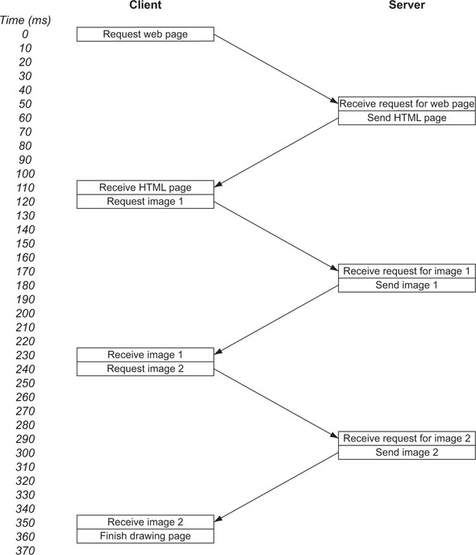

# Hypertext Transfer Protocol (HTTP)

**Hypertext Transfer Protocol (HTTP)** is an _application-layer_ protocol for transmitting hypermedia documents, such as HTML.

- HTTP is one of the main technologies used by the World Wide Web (WWW).

- Uses _Client-Server_ model.
- Based on a _request_ and a _response_.
- HTTP is often based on _TCP/IP_ layer, it can be used on any reliable transport layer.

The main features of HTTP are:

- HTTP is simple - human-readable.
- HTTP is extendable - easy to implement new features.
- HTTP is a [stateless protocol](https://en.wikipedia.org/wiki/Stateless_protocol), meaning that the server does not keep any data (state) between two requests. **Not session less**, HTTP Cookies allow the use of stateful sessions.

::: tip Internet
The internet is a collection of public computers through the shared use of the Internet Protocol (IP). It's made up of many services, including the WWW (or the web), email, file sharing, and internet telephony. The web, therefore, is but one part of the internet, though it’s the most visible part.
:::

## What happens when you browse the web?

1. The browser requests for the real address of [www.google.com](http://www.google.com/) from a Domain Name System (DNS) server.

   - DNS returns an IP address.
   - This IP address can be in an IPv4 or the newer IPv6.

2. The browser asks your computer to open a _Transmission Control Protocol (TCP)_ connection over IP to this address on the standard web port (port 80) or over the standard secure web port (port 443).

   - IP is used to direct traffic through the internet, but TCP adds stability and retransmissions to make the connection reliable.
   - TCP/IP together, they form the backbone of much of the internet.

3. When the browser has a connection to the webserver, it can start asking for the website. This step is where HTTP comes in, and the web browser uses HTTP to ask the Google server for the Google home page.

   - The actual full URL includes the port and would be [http://www.google.com:80](http://www.google.com/), but if standard ports are being used (80 for HTTP and 443 for HTTPS), the browser hides the port.
   - If nonstandard ports are being used, the port is shown. Some systems, particularly in development environments, use port 8080 for HTTP or 8443 for HTTPS, for example.

4. The Google server responds with whatever URL you asked for. Typically, what gets sent back from the initial page is the text that makes up the web page in HTML format.

   - Instead of an HTML page, however, the response may be an instruction to go to a different location. Google, for example, runs only on HTTPS, so if you go to [http://www.google.com](http://www.google.com/), the response is a special HTTP instruction (usually, a 301 or 302 response code) that redirects to a new location at [https://www.google.com](https://www.google.com/).
   - Similarly, if something goes wrong, you get back an HTTP response code, the best-known of which is the 404 Not Found response code.

5. The web browser processes the returned request. Assuming that the returned response is HTML, the browser starts to parse the HTML code and builds in memory the Document Object Model (DOM), which is an internal representation of the page.
6. The web browser requests any additional resources it needs. Each of these resources is requested similarly, following steps 1–6, and yes, that includes this step, because those resources may in turn request other resources. The average website isn’t as lean as Google and needs 75 resources, often from many domains, so steps 1–6 must be repeated for all of them. This situation is one of the key things that makes web browsing slow and one of the key reasons for HTTP/2, the main purpose of which is to make requesting these additional resources more efficient.
7. When the browser has enough of the critical resources, it starts to render the page onscreen. Choosing when to start rendering the page is a challenging task and not as simple as it sounds. If the web browser waits until all resources are downloaded, it would take a long time to show web pages, and the web would be an even slower, more frustrating place. But if the web browser starts to render the page too soon, you end up with the page jumping around as more content downloads, which is irritating if you’re in the middle of reading an article when the page jumps down. A firm understanding of the technologies that make up the web—especially HTTP and HTML/CSS/JavaScript—can help website owners reduce these annoying jumps while pages are being loaded, but far too many sites don’t optimize their pages effectively to prevent these jumps.
8. After the initial display of the page, the web browser continues, in the background, to download other resources that the page needs and update the page as it processes them. These resources include non-critical items such as images and advertising tracking scripts. As a result, you often see a web page displayed initially without images (especially on slower connections), with images being filled in as more of them are downloaded.
9. When the page is fully loaded, the browser stops the loading icon (a spinning icon on or near the address bar for most browsers) and fires the _OnLoad JavaScript_ event, which JavaScript code may use as a sign that the page is ready to perform certain actions.
10. At this point, the page is fully loaded, but the browser hasn’t stopped sending out requests. We’re long past the days when a web page was a page of static information. Many web pages are now feature-rich applications that continually communicate with various servers on the internet to send or load additional content. This content may be user-initiated actions, such as when you type requests in the search bar on Google’s home page and instantly see search suggestions without having to click the Search button, or it may be application-driven actions, such as your Facebook or Twitter feed’s automatically updating without your having to click a refresh button. These actions often happen in the background and are invisible to you, especially advertising and analytics scripts that track your actions on the site to report analytics to website owners and/or advertising networks.


## HTTP Versions

The HTTP Request and Response syntax have been updated in each version.

### HTTP/0.9

The first published specification for HTTP was version 0.9, issued in 1991.

1. Connection is made over **TCP/IP** or a similar connection-oriented service.
2. Optional port or **80** if no port is provided.
3. A single line of ASCII text should be sent, consisting of **GET**, the document address (with no spaces), and a carriage return and line feed (the carriage return being optional).
4. Response is a message in HTML format ("a byte stream of ASCII characters").
5. The **connection is closed** after each response is received.
6. Hard to distinguish an error response from a satisfactory response.
7. Server doesn't store any information about the request, hence it is **stateless**.

The only possible command in HTTP/0.9:

```markdown
GET /page.html↵
```

where:

- `GET` is an HTTP method.
- `/page.html` is the resource that we need.

::: tip NOTE
There is no concept of headers in HTTP/0.9 or any other media, such as images.
:::

### HTTP/1.0

The HTTP/1.0 RFC is not a formal specification and was published in 1996.

1. More request methods: **HEAD** and **POST** were added to the previously defined GET.
2. Addition of an optional **HTTP version number** for all messages. HTTP/0.9 is assumed by default to aid in backward compatibility.
3. **HTTP headers**, which could be sent with both the request and the response to provide more information about the resource being requested and the response being sent.
4. A **3-digit response code** indicating (for example) whether the response was successful. This code also enabled redirect requests, conditional requests, and error status (404).
5. **GET** can send data in the form of query parameters that are specified at the end of a URL, after the **?** character. `https://www.google.com/?q=search+string`.

#### Request Syntax

With headers:

```markdown
GET /page.html HTTP/1.0↵
Header1: Value1↵
Header2: Value2↵
↵
```

And without headers:

```markdown
GET /page.html HTTP/1.0↵
↵
```

Here we can see some changes to the HTTP/1.0 GET request as compared to HTTP/0.9:

- The first line now contains an optional HTTP _version_ section.
- Then an optional HTTP header section followed by two return characters (`↵`)

#### Response Syntax

A typical response from a HTTP/1.0 server:

```markdown
HTTP/1.0 200 OK
Date: Sun, 27 Sep 2020 13:30:24 GMT
Content-Type: text/html
Server: Apache

<!doctype html>
<html>
<head>
etc.
```

- The first line consists of an HTTP version (HTTP/1.0), a 3-digit HTTP status code (200), and a text description of that status code (Ok).

The status codes and descriptions are not present in HTTP/0.9.

Here are some of the HTTP/1.0 response codes:

| Category            | Value | Description           | Details                                                                                                                                                                                          |
| ------------------- | ----- | --------------------- | ------------------------------------------------------------------------------------------------------------------------------------------------------------------------------------------------ |
| 1xx (informational) | N/A   | N/A                   | HTTP/1.0 doesn't define any 1xx status codes, but does define the category.                                                                                                                      |
| 2xx (successful)    | 200   | OK                    | This code is the standard response code for a successful request.                                                                                                                                |
|                     | 201   | Created               | This code should be returned for a POST request.                                                                                                                                                 |
|                     | 202   | Accepted              | The request is being processed but hasn't completed processing yet.                                                                                                                              |
|                     | 204   | No content            | The request has been accepted and processed, but there's no BODY response to send back.                                                                                                          |
| 3xx (redirection)   | 300   | Multiple choices      | This code isn't used directly. It explains that the 3xx category implies that the resource is available at one (or more) locations, and the exact response provides more details on where it is. |
|                     | 301   | Moved permanently     | The Location HTTP response header should provide the new URL of the resource.                                                                                                                    |
|                     | 302   | Moved temporarily     | The Location HTTP response header should provide the new URL of the resource.                                                                                                                    |
|                     | 304   | Not modified          | This code is used for conditional responses in which the BODY doesn't need to be sent again.                                                                                                     |
| 4xx (client error)  | 400   | Bad request           | The request couldn't be understood and should be changed before resending.                                                                                                                       |
|                     | 401   | Unauthorized          | This code usually means that you’re not authenticated.                                                                                                                                           |
|                     | 403   | Forbidden             | This code usually means that you’re authenticated, but your credentials don't have access.                                                                                                       |
|                     | 404   | Not found             | This code is probably the best-known HTTP status code, as it often appears on error pages.                                                                                                       |
| 5xx (server error)  | 500   | Internal server error | The request couldn't be completed due to a server-side error.                                                                                                                                    |
|                     | 501   | Not implemented       | The server doesn't recognize the request (such as an HTTP method that hasn't yet been implemented).                                                                                              |
|                     | 502   | Bad gateway           | The server is acting as a gateway or proxy and received an error from the downstream server.                                                                                                     |
|                     | 503   | Service unavailable   | The server is unable to fulfill the request, perhaps because the server is overloaded or down for maintenance.                                                                                   |

::: tip NOTE
Some missing codes _(203, 303, 402)_ which are not part of HTTP/1.0.
[List of all status codes](https://www.iana.org/assignments/http-status-codes/http-status-codes.xhtml)
:::

### HTTP/1.1

The first HTTP/1.1 specification was published in January 1997, updated Specification in June 1999, and then enhanced for a third time in June 2014.

Headers that are most used:

#### Host

Host is a **Mandatory header**. The URL provided with the first line of an HTTP request isn't an absolute URL but a relative URL.
Nowadays, many web servers host several sites on the same server (a situation is known as _virtual hosting_), so it's important to tell the server which site you want as well as which relative URL you want on that site.
So, the host header was implemented to include the full absolute URL.

```markdown
GET / HTTP/1.1
Host: www.google.com
```

::: warning NOTE

```markdown
GET / HTTP/1.1
```

As the above request is not according to the HTTP/1.1 specification, this request should be rejected by the server (with a **400** response code).
Most of the web servers are more forgiving than they should be and have a default host that is returned for such requests.
:::

::: tip CONVERSATION
[Link](https://lists.w3.org/Archives/Public/ietf-http-wg-old/1999SepDec/0014.html) of the conversation over the HTTP host header.
:::

#### Connection

The connection between the server and the client was closed after each request. This created unnecessary delays while requesting multiple resources.
Hence, the new _Connection_ HTTP header with the value _Keep-Alive_ was added, so that the client can ask the server to keep the connection open for additional requests.

```markdown
GET /page.html HTTP/1.0
Connection: Keep-Alive
```

- If the server supports persistent connections, it includes a _Connection: Keep-Alive_ header in the response:

```markdown
HTTP/1.0 200 OK
Date: Sun, 25 Jun 2017 13:30:24 GMT
Connection: Keep-Alive
Content-Type: text/html
Content-Length: 12345
Server: Apache

<!doctype html>
<html>
<head>
etc.
```

- It is difficult to know when the response is completed and when the client sends another request. To overcome this, **Content-Length HTTP header** is used to define the length of the response body, and when the entire body is received, the client is free to send another request.
- HTTP/1.1 sets **Connection: Keep-Alive** by default, hence no need of including it in the header (some clients and servers include this).
- If the server did want to close the connection, it had to explicitly include a **Connection: close** HTTP header in the response.

```markdown
HTTP/1.1 200 OK
Date: Sun, 25 Jun 2017 13:30:24 GMT
Connection: close
Content-Type: text/html; charset=UTF-8
Server: Apache

<!doctype html>
<html>
<head>
etc.
Connection closed by foreign host.
```

| HTTP Version | Connection Header | Connection |
| ------------ | ----------------- | ---------- |
| HTTP/1.0     | Not Included      | Closed     |
| HTTP/1.0     | Included          | Kept open  |
| HTTP/1.1     | Both              | Kept Open  |

::: tip NOTE
Connection header is supported by many _HTTP/1.0_ servers, even though it wasn't included in the HTTP/1.0 specification.
:::

HTTP/1.1 added the concept of **pipelining**, it is possible to send several requests over the same persistent connection and get the responses back in order. If a web browser is processing an HTML document, for example, and sees that it needs a CSS file and a JavaScript file, it should be able to send the requests for these files together and get the responses back in order rather than waiting for the first response before sending the second request.

```markdown
GET /style.css HTTP/1.1
Host: www.example.com

GET /script.js HTTP/1.1
Host: www.example.com

HTTP/1.1 200 OK
Date: Sun, 25 Jun 2017 13:30:24 GMT
Content-Type: text/css; charset=UTF-8
Content-Length: 1234
Server: Apache

.style {
etc.

HTTP/1.1 200 OK
Date: Sun, 25 Jun 2017 13:30:25 GMT
Content-Type: application/x-javascript; charset=UTF-8
Content-Length: 5678
Server: Apache

Function(
etc.
```

::: danger IMPORTANT
Support for pipelining in both clients (browsers) and servers is poor.
So, HTTP/1.1 is still fundamentally a request-and-response protocol for most implementations.
While that one request is being handled, the HTTP connection is blocked from being used for other requests.
:::

#### Other New Features

- New methods are PUT, OPTIONS, and the less-used CONNECT, TRACE, and DELETE.
- Better caching methods. These methods allowed the server to instruct the client to store the resource (such as a CSS file) in the browser’s cache so it could be reused later if required. The Cache-Control HTTP header introduced in HTTP/1.1 had more options than the Expires header from HTTP/1.0.
- HTTP cookies to allow HTTP sessions and move from the stateless protocol.
- The introduction of character sets (as shown in some examples in this chapter) and language in HTTP responses.
- Proxy support.
- Authentication.
- New status codes.
- Trailing headers.

## HTTPS

HTTP is a plain-text protocol. HTTP messages are unencrypted and are readable by any party.

Hence, HTTPS a secure version of HTTP was introduced.

**HTTPS** encrypts messages in transit by using the **Transport Layer Security** (TLS) protocol, though it's often known by its **previous incarnation as Secure Sockets Layer** (SSL).

HTTPS adds 3 important concepts to HTTP messages:

1. **Encryption** - Messages can't be read by third parties while in transit.
2. **Integrity** - The message hasn't been altered in transit, as the entire encrypted message is digitally signed, and that signature is cryptographically verified before decryption.
3. **Authentication** - The server is the one you intended to talk to.

### SSL, TLS, HTTPS, and HTTP

History of HTTP encryption:

1. SSLv1 was never released outside Netscape.
2. SSLv2 and **SSLv3** were released in 1995 and 1996 respectively.
3. SSL was standardized as TLS.
4. TLSv1.0 is similar to SSLv3, though not compatible.
5. TLSv1.1 and TLSv1.2 were released in 2006 and 2008 respectively.
6. **TLSv1.3** was released in 2018 (current standard).
7. **SSLv3** was widely used, but in 2014 major vulnerabilities were discovered and support for SSLv3 is **not supported** by browsers.

### HTTPS Workings

HTTPS works by using public-key encryption, which allows servers to provide public keys in the form of digital certificates when users first connect. The browser encrypts messages by using this public key, which only the server can decrypt, as only it has the corresponding private key. This system allows us to communicate securely with a website without having to know a shared secret key in advance, which is crucial for a system like the internet, where new websites and users come and go every second of every day.

The digital certificates are issued, and digitally signed, by various _certificate authorities (CAs)_ trusted by the browser.

- Post **443** is used instead of port _80_.
- `https://` URL scheme is used instead of `http://`
- HTTPS doesn't alter the way HTTP is used in terms of syntax or message format except for the encryption and decryption itself.

::: danger Certificates
HTTPS indicates to us that the connection is secure, but does not give any information about the trustworthiness of the server.

Benefits of EV or Domain Validated (DV) or Organizational Validated (OV) certificates is highly disputed.
:::

Telnet cannot be used to send HTTPS requests as it dose not handle the encryption and decryption part. So, programs like **OpenSSL** can be used.

```bash
openssl s_client -crlf -connect www.google.com:443 -quiet↵
GET / HTTP/1.1↵
Host: www.google.com↵
↵
```

## Drawbacks Of HTTP/1.x

- The internet is built upon HTTP/1.x
- Has been functioning reasonably well for a 20-year-old technology.

### Why websites still take time to load even though the internet speed has increased significantly?

- Broadband speeds have increased, hence decreasing the time taken to download the assets required by the website.
- As a result websites should load really fast, but that is not the case. Websites still take time to load.
- This is due to the way HTTP/1.x works. HTTP was a request and response based protocol.
- Each website makes multiple HTTP requests to get the required assets. These requests are synchronous, i.e. the second request is made only after a response is received for the first request.
- Thus website loads slowly if there are many requests being made.

Let us consider a scenario:

Imagine a simple web page with some text and two images.

1. Suppose that a request takes 50ms to reach the web server and the server takes 10ms to respond and the browser takes 10ms to process the response.
2. Now the following steps happen when we request for a web page:

   

3. So the total time taken to load the web page was 360ms. Out of which 60ms was spent on processing the requests. And a total of 300ms or 80% of the time, was spent waiting for messages.
4. In this scenario, the browser knows that it requires 2 images. So instead of requesting for both the images, the browser ask for image 1 and waits for the response before asking for image 2.
5. This is an inefficient process. Some browsers open multiple connections to the servers to overcome the waiting process.
6. If the number of assets required by the web page is large then the loading time will increase significantly.

- _Latency_ measures how long it takes to send a single message to the server.
- _Bandwidth_ measures how much a user can download in those messages.
- Latency is the biggest problem of the internet rather than the bandwidth.
- Because of increased bandwidths, the size of a typical web page has increased without harming the loading time significantly.
- On the other hand, latency has not improved that much. Thus preventing the increase in requests made by the web page without effecting loading time severely.

### Pipelining for HTTP/1.1

- HTTP/1.1 tired to introduce _pipelining_, which allows concurrent requests to be sent before responses are received so that requests can be sent parallel.
- The initial HTML still needs to be requested separately, the rest of the requests can be sent concurrently. Thus shaving off 100ms loading time in the previous example.
- Pipelining should have brought huge improvements to HTTP performance, but for many reasons, it was difficult to implement, easy to break, _head-of-line_ (HOL) blocking, and not well supported by web browsers or web servers.

::: danger SUPPORT
Pipelining was rarely used.
:::

### Domain Sharding

- Multiple connections are opened to overcome the issues with pipelining. About 6 connections are opened per domain.
- Websites can serve static contents through sub-domains, thus allowing further 6 more connections per sub-domain. This technique is known as _domain sharding_.
- Domain sharding helps to increase performance, reduce HTTP headers such as cookies.

Disadvantages:

- Extra memory and processing is required to maintain multiple connections over TCP.
- TCP is significantly inefficient.

## Tools

There are many tools that can be used to create a TCP/IP connection, hence the same tools can be used to send a HTTP request.

Some of the tools are:

1. **Telnet**: It opens a TCP/IP connection to a server.

   ```bash
   printf 'HEAD / HTTP/1.1\r\nHost: en.wikipedia.org\r\n\r\n' | nc en.wikipedia.org 80
   ```

   - `printf` - Similar to `cat` but smarter
   - `nc` - netCat is used to talk to internet

2. **Openssl**: Can be used to for HTTPS connection.

::: tip Warning
HTTP is not based on Ping. Ping is much simpler than HTTP
:::

## References

- [URI - Specification](https://tools.ietf.org/html/rfc1630)
- [HTTP-Core Github](https://github.com/httpwg/http-core)
