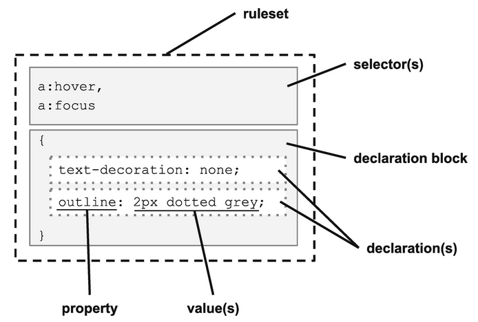

# CSS

Cascading Style Sheets (CSS) is a **style sheet language** used for describing the presentation of a document written in a markup language such as HTML

It is one of the three building block any web application.

- CSS is a declarative language.

## Structure

1. Rule-set

```html

```

### Selectors

1. Universal selector - `*`: Selector that matches every element on the page.

   ```css
   * {
     box-sizing: border-box;
     padding: 0;
     margin: 0;
   }
   ```

2. Type Selector: Selecting an element using the tag name.

   ```css
   a {
     text-decoration: none;
   }
   ```

3. Class Selector: Selecting an element using its class names assigned to its class attribute. Class names have to be prefixed with a dot `.` and as HTML element can have multiple classes, multiple class selectors may be combined.

   ```css
   .invisible {
     visibility: hidden;
   }
   ```

4. ID Selector: Selecting an element using its ID assigned to its id attribute. As all ids inside a HTML are unique, there should not be duplicate ID selectors.

   ```css
   #ok {
     font-size: 1.5rem;
     font-weight: bold;
   }
   ```

5. Attribute Selector: Selecting an element based upon one of its attributes. This selector uses square brackets to contain the attribute match and may be optionally combined with a type selector.

   ```css
   a[target="_blank"] {
     background-color: yellow;
   }
   ```

   ::: tip NOTE
   Because class and ID are both HTML attributes, the class and ID selectors have attribute selector equivalents.

   |                 | Basic Selector | Attribute Selector   |
   | :-------------- | :------------- | :------------------- |
   | Select by ID    | `#contactForm` | `[id=contactForm]`   |
   | Select by Class | `.outline`     | `[class~="outline"]` |

   :::

#### Combinators

Combinators help in combing different selectors. They also provide a hierarchical context based upon the element's relationship within the DOM.

| Name             | Combinator  | Example         | Description                                                                         |
| :--------------- | :---------- | :-------------- | :---------------------------------------------------------------------------------- |
| Descendant       | " " (space) | `nav a`         | All anchor tags inside of a nav element                                             |
| Child            | ">"         | `nav > ul > li` | First list items inside a navigation list, ignoring any items after the first level |
| Sibling          | "~"         | `p ~ p`         | All paragraphs (after the first) that share the same parent element                 |
| Adjacent Sibling | "+"         | `h2 + p`        | All paragraphs that immediately follow an `<h2>` tag on the same hierarchy          |

#### Pseudo Elements

Pseudo-Element is a keyword added to a selector that lets you style a specific part of the selected element(s)

```css
/* The first line of every <p> element. */
p::first-line {
  color: blue;
  text-transform: uppercase;
}
```

List of Pseudo Elements:

- `::first-letter`: Select the first letter of the element.
- `::first-line`: Select the first visible line of the element.
- `::before`: Select or Add content before the first child of the element.
- `::after`: Select or Add content after the last child of the element.
- `::placeholder`: represents the placeholder text in an `<input>` or `<textarea>` element.
- `::backdrop`:
- `::selection`: Apply styles to the part of a document that has been highlighted by the user (such as clicking and dragging the mouse across text).

::: warning NOTE
The CSS specification calls for a two-colon prefix before a pseudo element, such as `::after`. However, most browsers support pseudo elements with just a single colon (`:after`) without throwing an error.

Best practice is to use two-colon prefix for two reasons:

1. It adheres to the CSS specification.
2. It clearly distinguishes pseudo elements from pseudo classes.

:::

#### Pseudo Classes

Pseudo-Class is a keyword added to a selector that specifies a special state of the selected element(s). For example, `:hover` can be used to change a button's color when the user's pointer hovers over it.

List of Pseudo Classes:

- `:hover`: Match when an element is being hovered over (such as using the mouse)
- `:focus`: Match an element selected with the keyboard (by tabbing), or with the mouse (by clicking the element)
- `:active`: Match an element in the process of being activated (such as clicking, while the mouse button is depressed)
- `:target`: Select an element that has an ID matching the URL’s fragment (the portion after the #)

### Properties

The properties in CSS refer to the various aspects of layout and style that can be affected.

### Units

Types of units:

1. Absolute

   - `px`: Unit of measure for computer graphics; this is only suitable for screen-based displays.
   - `in`: Inch. _1in. = 6pc = 72pt = 2.54cm_. This will be a true inch on printers, but defined relative to a reference pixel for screens which is _96px_ regardless of the screen resolution.
   - `pc`: Pica. Unit of measure in typography.
   - `pt`: Point. Unit of measure in typography.
   - `cm`: Centimeter. _1cm = 10mm_.
   - `mm`: Millimeter.

2. Font-Relative

   - `ch`: Represents the width of the **0** character in the element’s font (consisting of both typeface and size).
   - `ex`: Represents the height of the **x** character in the element’s font (consisting of both typeface and size).
   - `em`: The calculated font-size of the element. If this unit is used on the font-size property, it will be relative to the inherited font-size.
   - `rem`: Exactly the same as `em`, but always relative to the font-size of the root element (which is the `<html>` for HTML documents). This is the preferred default unit for many web designers as it allows for manageable fluid layouts while addressing accessibility concerns.

3. Viewport-Relative

   - `vh`: Equal to _1%_ of the height of the viewport
   - `vw`: Equal to _1%_ of the width of the viewport
   - `vmin`: Equal to the smaller of `vh` or `vw`
   - `vmax`: Equal to the larger of `vh` or `vw`

4. Percentage

   - Many CSS properties will accept a _percentage_ or a _length-percentage_ (meaning either a length or a percentage). While the rem is the best choice for many purposes, especially those relating to content and accessibility, percentage works relative to any inherited size including font-relative, view-relative, or even absolute units.

### Functions

CSS has a large number of available functions to perform a variety of tasks. But CSS dose not allow user-defined functions.

- **Shape**: There are a number of non-rectangular shapes supported through the functions `circle()`, `ellipse()`, `inset()`, and `polygon()`. Combine with the shape-outside property to wrap text to a specific shape, or with clip-path to crop an image or container.

- **Transformation**: There are a large number of transformation functions, including `rotateX()`, `scale()`, and `skewY()`. There are also 3D transformations such as `perspective()`, `matrix3d()`, and `scaleZ()`. These transformations can adjust the shape, orientation, and position of elements on the screen to create a wide range of visual effects and layouts.

- **Gradients**: There are a large number of functions to support the creation of gradients, including `linear-gradient()`, `radial-gradient()`, `repeating-linear-gradient()`, and `repeating-radial-gradient()`. The blending of colors enabled by gradients supports a large number of visual effects.

- **Effects**: There are other visual effects beyond just gradients. The `blur()` function will produce a Gaussian blur on the selected element, even an image. This can be useful for the backdrop of a modal dialog. The `drop-shadow()` adds some dimension to a theme. And `opacity()` allows elements to be somewhere between fully opaque and fully transparent, to allow dimensional overlays. (Note that if you want opaque text but a semitransparent background, you may want to consider using the `rgba()` or `hsla()` color functions as described in the following text.)

- **Color**: The most common way of specifying color in CSS is with the 3- or 6-digit hex code preceded by a hash symbol, such as _#FF0000_ for the color red. Colors can also be specified by hue, saturation, and lightness using the `hsl()` and `hsla()` functions, or as RGB (red, green, blue) using `rgb()` or `rgba()`. The _"a"_ in each of these function sets refers to the alpha channel which specifies level of opacity or transparency.

- **Colors**: also be manipulated in a consistent fashion using the filter property with alterations such as `contrast()`, `saturate()`, and `hue-rotate()` and effects applied such as `grayscale()` or `sepia()`. These functions are particularly useful because they can apply to an image as well as text on the page.

- **Resources**: The `url()` function is used to add image resources to a design through CSS. This allows the `` tag in HTML to be reserved for images that are relevant to the content, rather than to the layout and design.

- **Counting**: The counting functions `counter()`, `counters()`, and `symbols()` are used to manage counter variables.

- **Math**: Sometimes the built-in units aren’t enough and you need to calculate size or position based upon other elements. The `calc()` function makes it possible to do some basic math with a mix of units. Addition, subtraction, multiplication, and division are supported along with parentheses. As an example, you could use height: `calc(10vh - 1rem)` to calculate the height of a header that was _10%_ of the viewport height, but accounted for a _1rem_ border.

### Variables

CSS has support for variables.

- **Custom properties**: These variables are defined much like any other CSS property and can contain any value that would be valid in CSS. They can then be referenced later in a style sheet using the `var()` function.

- **Attributes**: Using the `attr()` function , you can pull in the value from an HTML attribute. Combine this with the content property to display attribute data in unique ways.

- **Counters**: Every HTML element can have _0_ to many named counters associated within the document tree and manipulated using CSS. HTML lists generate a _"list-item"_ counter automatically, incrementing by _1_ with every list element unless explicitly reset. This also includes unordered lists. Use counter-set, counter-increment, or counter-decrement properties to adjust the counters and use `counter()` or `counters()` to display the value of a named counter in a way you choose. This exists to support nested lists, but may have many other uses.

_Example:_

```html
<h1>Variables</h1>
<ul>
  <li category="fruit">Apple</li>
  <li category="vegetable">Lettuce</li>
  <li category="starch">Corn</li>
</ul>
```

```css
ul {
  counter-reset: li;
}

li::before {
  display: inline-block;
  padding: 0.5rem 1rem;
  margin: 0 1rem 1rem 0;
  text-transform: capitalize;
  content: counter(li) "-" attr(category) ": ";
  counter-increment: li;
  background: lightblue;
  border-radius: 25px;
}
```

### At-Rules

The CSS at-rules (so-named because of the **@** or _"at"_ symbol in the name of each) are language features that provide some control over the structure of your styles. Among other things these rules provide a mechanism for collecting or grouping other rulesets.

#### Media

`@media` at-rule is used to perform queries against the system, environment, or user agent. These media queries can be used to build responsive layouts.

#### Import

`@import` helps in importing styles from a different style sheet.

#### Supports

`@supports` at-rule allows rules to be applied based upon specific support of CSS features by the user agent.

```css
p {
  text-decoration: underline;
  text-underline-offset: 1rem;
}

@supports not (text-underline-offset: 1rem) {
  p {
    display: inline-block;
    padding-bottom: 1rem;
    text-decoration: none;
    border-bottom: solid 3px orange;
  }
}
```

## Order of Importance

One of the important features of CSS is the ability for the user, browser, and web developer to all exert influence over the final output of the page. To dictate what property value "wins", a multi-step calculation is performed.

### Inheritance

Inheritance is the mechanism by which CSS allows a value set on a parent element (such as `<body>`) to propagate to its descendants. This helps determine what value is used when no property is declared on an element property. The inherited value is determined by the computed value of a parent or ancestor. If none exists, the initial value, or default set by the browser, is used.

Not all property values are inherited by default. Properties that do are generally related to theming such as typography-related properties (font-size, line-height, letter-spacing, etc.). Layout-related properties such as display, border, width, and height are generally not. If there is no declared value on a non-inheritable property, then the initial value is used.

### Global Values

Inherit, unset, and initial are available on all properties and can either reset a value to default or to a new value.

```css
p:nth-of-type(2) {
  padding: unset;
}
p:nth-of-type(3) {
  padding: default;
}
p:nth-of-type(3) {
  padding: initial;
}
p:nth-of-type(4) {
  padding: inherit;
}
```

#### Unset

Unset works differently depending upon the property to which it is being assigned. If the value can be inherited from the parent, it will inherit; otherwise, it will set the property value to initial.

#### Initial

The initial value for a property may be set by the browser and can vary depending on the user agent. If an initial value is declared in the CSS specification, then initial should return that value.

#### Inherit

The property value will equate that of the parent’s property whether the property is by default inherited or not.

## Rests or Neutralizers CSS

Each browsers has its own set of default styles applied to the page. This may cause some problems with the uniformity of the CSS across different browsers. So, we can reset or neutralizer these default CSS behavior of browsers.

There are plenty of available presets.

## Typography

It is if not the most important part of the web page. As even today most of the content on the page is presented in the form of text. So, focusing on the usual aspects of the text is very important.

In Typography, _Typeface_ is the overall design of an entire family of fonts like _Helvetica_ and the _Font_ is the graphical representation of text characters, like font size, font weight, italic, boldness, etc..

Choosing a font:

- Choose Sans-serif font for heading and Serif for the body or vice-versa.
- Fonts should have good contrasts, like the more important text must be emphasized.
- Font selection must be consistent through out the application (web page).
- Proper use of white spaces (negative space).
- Alignment
- Text colour

::: tip NOTE
Create a doc on [Typography](https://careerfoundry.com/en/blog/ui-design/beginners-guide-to-typography).
:::

### Fluid Font Sizes

Fluid typography is the idea that `font-size` (and perhaps other attributes of type, like `line-height`) change depending on the screen size (or perhaps container queries if we had them).

Sample snippets for fluid font-sizes (not optimal):

1. Using `clamp`:

   - `font-size: 16px` for screen widths smaller than **320px** and larger than **1920px**.
   - `font-size` will vary from **16px** to **22px** for screen widths between **320px** and **1000px** depending on the screen width.
   - `font-size: 22px` for screens widths between **1000px** and **1920px**.

   ```css
   html {
     font-size: 16px;
   }
   @media screen and (min-width: 320px) {
     html {
       font-size: calc(16px + 6 * ((100vw - 320px) / 680));
     }
   }
   @media screen and (min-width: 1000px) {
     html {
       font-size: 22px;
     }
   }
   ```

   The above snippet can be simplified with:

   ```css
   /* NOT WIDELY SUPPORTED */
   html {
     font-size: min(max(16px, 4vw), 22px);
   }

   /* EVEN BETTER IMPLEMENTATION */
   html {
     font-size: clamp(16px, 4vw, 22px);
     /* clamp(min size, variable size, max size) */
   }
   ```

   ::: tip REFERENCE

   - For more info on `calc`, `min` and `max` go to [w3.org](https://www.w3.org/TR/css-values-4/#calc-notation).
   - Also watch [Video](https://twitter.com/i/status/1252140444231712769).
   - Using device-width-ration see [Github Gist](https://gist.github.com/scottkellum/1438467)

   :::

2. Using `calc`:

   ```css
   font-size: calc(18px + ((100vw - 1025px) * (22 - 18) / (1920 - 1024)));
   ```

## Media Queries

Media queries are useful when you want to modify your site or app depending on a device's general type (such as print vs. screen) or specific characteristics and parameters (such as screen resolution or browser viewport width).

## CSS Layouts

### Flexbox

- It is a **1-dimensional layout system**.

[A complete guide to flexbox](https://css-tricks.com/snippets/css/a-guide-to-flexbox/)

### Grid

- CSS Grid Layout is the most **powerful layout system** available in CSS.
- It is **2-dimensional system**.

```css
.container {
  display: grid;
}
```

1. `grid-template-columns`: Set the proportions for tracks along the inline axis of the grid container.

[A complete guide to grid](https://css-tricks.com/snippets/css/complete-guide-grid/)

## CSS Animation

CSS animation is divided into 2 categories:

1. **CSS transitions**: are animations made by **interpolating values between two distinct states, a start state and an end state**.

2. **CSS keyframe**: animations allow for more complex animations with **control over intermediary steps besides start and end** using keyframes.

### Transition Animations

CSS transitions are controlled with the `transition` property.

`transition` property accepts 4 attributes:

- The **element property name to animate** (such as color or width). **If omitted, all properties** that can be animated will transition.
- **Duration** of the animation.
- Optional **timing function** to control the acceleration curve (such as **ease-in and ease-out**).
- Optional **delay** before the animation starts.

### Keyframe Animations

CSS keyframe are controlled with the `keyframe` property.

TO use keyframes, we need to specify animation steps in a separate block with a `@keyframes`rule and a name to reference it.

_Example:_

```css
@keyframes pulsing-heart {
  0% {
    transform: none;
  }
  50% {
    transform: scale(1.4);
  }
  100% {
    transform: none;
  }
}
```

## Tools

1. [PostCSS](https://postcss.org/) - A tool for transforming CSS with JavaScript.
2. [Browserslist](https://github.com/browserslist/browserslist) - Helps to share target browsers and Node.js versions between different front-end tools.
