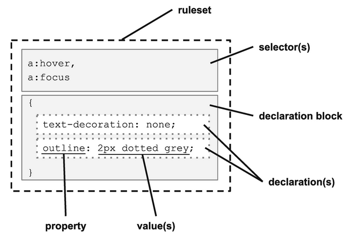

# CSS

[Cascading Style Sheets](https://www.w3.org/TR/CSS/) (CSS) is a **style sheet language** for describing the rendering of structured documents (such as HTML and XML) on screen, on paper, etc.

- CSS is a declarative language

- It is one of the three building block any web application (**[HTML](../HTML/HTML.md)**, **CSS**, and **[JavaScript](../JavaScript/)**)

## Using CSS

For styling the HTML document, we can add CSS in two ways:

1. **Inline styles**: The CSS is directly written in the HTML document as an attribute of the HTML element

   ```html
   <p style="color: red; font-size: 20px;">This is my first paragraph.</p>
   ```

2. **Internal stylesheet**: The CSS is written inside the `<style>` element in the HTML document

   ```html
   <style>
     p {
       color: red;
       font-size: 20px;
     }
   </style>
   ```

3. **External stylesheet**: The CSS is written in a separate file, which is then referenced by the HTML document through the use of `<link>` element. The external file has a file extension as `.css`
   - CSS inside external file, like `styles.css`:

   ```css
   p {
     color: red;
     font-size: 20px;
   }
   ```

   - Linking the external style sheet inside the HTML document:

   ```html
   <head>
     <link href="./index.css" rel="stylesheet" type="text/css" />
   </head>
   ```

## Syntax

CSS associates style rules with HTML elements. For example, a CSS rule could be:

```css
p {
  color: red;
  font-size: 20px;
}
```

- This rule sets the colour of all `<p>` elements to red and the font size to 20 pixels
- The rule consists of a [**selector**](#selector) (`p`) and a **declaration block** (`{ color: red; font-size: 20px; }`)
- The selector is used to target the HTML element(s) to which the style should be applied
- The declaration block contains one or more **declarations** separated by semicolons (`;`)
- Each declaration includes a **property** (`color`, `font-size`) and a **value** (`red`, `20px`) separated by a colon (`:`)



The basic building blocks are:

- The **property** which is an identifier, that is a human-readable name, that defines which feature is considered

- The **value** which describe how the feature must be handled by the engine. Each property has a set of valid values, defined by a formal grammar, as well as a semantic meaning, implemented by the browser engine

## Selectors

This is the HTML element name at the start of the rule-set. It defines the element(s) to be styled

1. **Universal selector (`*`)**: Applies to all elements in the document

   ```css
   * {
     box-sizing: border-box;
     padding: 0;
     margin: 0;
   }
   ```

2. **(Element/Tag/Type) Selector**: Matches element names

   ```css
   a {
     text-decoration: none;
   }
   ```

3. **Class Selector**: Matches elements whose class attribute has a value that matches the one specified after the period (`.`)
   - Class names have to be prefixed with a dot `.` and as HTML element can have multiple classes, multiple class selectors may be combined

   ```css
   .invisible {
     visibility: hidden;
   }
   ```

4. **ID Selector**: Matches an element whose id attribute has a value that matches the one specified after the pound or hash symbol (`#`)
   - As all ids inside a HTML are unique, avoid using same id for multiple elements

   ```css
   #ok {
     font-size: 1.5rem;
     font-weight: bold;
   }
   ```

5. **[Pseudo-Class Selector](#pseudo-classes)**: Selecting an element, but only when in the specified state. (For example, when a cursor hovers over a link change the colour)

   ```css
   a:hover {
     color: red;
   }
   ```

6. **Attribute Selector**: Selecting an element based upon one of its attributes. This selector uses square brackets to contain the attribute match and may be optionally combined with a type selector

   ```css
   a[target="_blank"] {
     background-color: yellow;
   }
   ```

   | Selector  | Meaning                                                                                      | Example                                                        |
   | --------- | -------------------------------------------------------------------------------------------- | -------------------------------------------------------------- |
   | Existance | `[]` - Matches a specific attribute                                                          | `p[class]` - Matches all `<p>` elements with a class attribute |
   | Equality  | `[=]` - Matches a specific value                                                             | `input[type="text"]` - Matches all text `<input>` elements     |
   | Space     | `[~=]` - Matches a specific attribute whose value appears in a space-separated list of words | `p[class~="red"]` - Matches all `<p>` elements with class red  |
   | Prefix    | `[^=]` - Matches a specific attribute whose value begins with a certain string               | `a[href^="https://"]` - Matches all links to `https://`        |
   | Substring | `[*=]` - Matches a specific attribute whose value contains a certain substring               | `a[href*="example"]` - Matches all links with `example`        |
   | Suffix    | `[$=]` - Matches a specific attribute whose value ends with a certain string                 | `a[href$=".pdf"]` - Matches all links to PDF files             |

::: tip NOTE

Because class and ID are both HTML attributes, the class and ID selectors have attribute selector equivalents

| Type            | Basic Selector | Attribute Selector   |
| --------------- | -------------- | -------------------- |
| Select by ID    | `#contactForm` | `[id=contactForm]`   |
| Select by Class | `.outline`     | `[class~="outline"]` |

:::

### Combinators

Combinators help in combing different selectors. They also provide a hierarchical context based upon the element's relationship within the DOM:

| Name             | Combinator  | Example         | Description                                                                         |
| ---------------- | ----------- | --------------- | ----------------------------------------------------------------------------------- |
| Descendant       | ` ` (space) | `nav a`         | All anchor tags inside of a `<nav>` element                                         |
| Child            | `>`         | `nav > ul > li` | First list items inside a navigation list, ignoring any items after the first level |
| Sibling          | `~`         | `p ~ p`         | All paragraphs (after the first) that share the same parent element                 |
| Adjacent Sibling | `+`         | `h2 + p`        | All paragraphs that immediately follow an `<h2>` tag on the same hierarchy          |

1. **Descendant Selector**: Matches an element that is a descendant of another specified element (not just a direct child)
   - The descendant combinator (` `) is placed between two CSS selectors. It matches those elements matched by the second selector that are descendants of an element matched by the first

   ```css
   /* Targets any `<a>` elements that are descendants of a `<li>` element */
   /* This will target `<a>` elements that are nested further down the hierarchy */
   li a {
     color: red;
   }
   ```

2. **Child Selector**: Matches an element that is a direct child of another
   - The child combinator (`>`) is placed between two CSS selectors. It matches only those elements matched by the second selector that are the direct children of elements matched by the first

   ```css
   /* Targets any `<a>` elements that are direct children of a `<li>` element */
   /* This will not target `<a>` elements that are nested further down the hierarchy */
   li > a {
     color: red;
   }
   ```

3. **Adjacent Sibling Selector**: Matches an element that is the adjacent sibling of another
   - The adjacent sibling combinator (`+`) is placed between two CSS selectors. It matches only those elements matched by the second selector that are immediately preceded by an element matched by the first

   ```css
   /* Targets the first `<p>` element after any `<h2>` element (but not other `<p>` elements) */
   h2 + p {
     font-size: 1.5rem;
   }
   ```

4. **General Sibling Selector**: Matches an element that is a sibling of another, although not necessarily immediately
   - The general sibling combinator (`~`) is placed between two CSS selectors. It matches those elements matched by the second selector that are siblings of an element matched by the first

   ```css
   /* Targets any `<p>` elements that are siblings of a `<h2>` element */
   /* This will target all `<p>` elements that are siblings of the `<h2>` element, not just the first one */
   h2 ~ p {
     font-size: 1.5rem;
   }
   ```

### Pseudo Elements

Pseudo-Element is a keyword added to a selector that lets you style a specific part of the selected element(s):

```css
/* The first line of every <p> element. */
p::first-line {
  color: blue;
  text-transform: uppercase;
}
```

List of Pseudo Elements:

- `::first-letter`: Select the first letter of the element
- `::first-line`: Select the first visible line of the element
- `::before`: Select or Add content before the first child of the element
- `::after`: Select or Add content after the last child of the element
- `::placeholder`: represents the placeholder text in an `<input>` or `<textarea>` element
- `::backdrop`:
- `::selection`: Apply styles to the part of a document that has been highlighted by the user (such as clicking and dragging the mouse across text)

::: warning NOTE

The CSS specification calls for a two-colon prefix before a pseudo element, such as `::after`. However, most browsers support pseudo elements with just a single colon (`:after`) without throwing an error

Best practice is to use two-colon prefix for two reasons:

1. It adheres to the CSS specification
2. It clearly distinguishes pseudo elements from pseudo classes

:::

### Pseudo Classes

Pseudo-Class is a keyword added to a selector that specifies a special state of the selected element(s)

- For example, `:hover` can be used to change a button's colour when the user's pointer hovers over it

Some Pseudo Classes:

- `:hover`: Match when an element is being hovered over (such as using the mouse)

- `:focus`: Match an element selected with the keyboard (by tabbing), or with the mouse (by clicking the element)

  ```css
  /* For links and other elements */
  a:focus {
    outline: 2px solid var(--clr-primary);
    outline-offset: 4px;
  }

  /* For buttons */
  button:focus {
    outline: none;
    box-shadow:
      0 0 0 2px var(--clr-bg),
      0 0 0 4px var(--clr-primary);
  }
  ```

- `:focus-visible` (new): Matches the `:focus` pseudo-class and the UA (User Agent) determines via heuristics that the focus should be made evident on the element

  ```css
  .element:focus-visible {
    background-color: pink; /* Something to get the user's attention */
  }
  ```

- `:active`: Match an element in the process of being activated (such as clicking, while the mouse button is depressed)

  ```css
  button:active {
    background-color: #333;
    border-color: #333;
    color: #eee;
  }
  ```

- `:target`: Select an element that has an ID matching the URL's fragment (the portion after the #)

- `:has()`: It represents an element if any of the selectors passed as parameters represent at least one element

  ```css
  /* selects any <li> element that contains an <a> element */
  li:has(a) {
    background-color: yellow;
  }
  ```

## Properties

The properties in CSS refer to the various aspects of layout and style that can be affected. These are ways in which you can style an HTML element

- For instance, you can use a CSS property like `color` to change the text colour of a paragraph, or use `font-size` to adjust the size of the text

## Units

Types of units:

1. Absolute:
   - `px`: Unit of measure for computer graphics; this is only suitable for screen-based displays
   - `in`: Inch. _1in. = 6pc = 72pt = 2.54cm_. This will be a true inch on printers, but defined relative to a reference pixel for screens which is _96px_ regardless of the screen resolution
   - `pc`: Pica. Unit of measure in typography
   - `pt`: Point. Unit of measure in typography
   - `cm`: Centimetre. _1cm = 10mm_
   - `mm`: Millimetre

2. Font-Relative:
   - `ch`: Represents the width of the **0** character in the element's font (consisting of both typeface and size)
   - `ex`: Represents the height of the **x** character in the element's font (consisting of both typeface and size)
   - `em`: The calculated font-size of the element. If this unit is used on the font-size property, it will be relative to the inherited font-size
   - `rem`: Exactly the same as `em`, but always relative to the font-size of the root element (which is the `<html>` for HTML documents). This is the preferred default unit for many web designers as it allows for manageable fluid layouts while addressing accessibility concerns

3. Viewport-Relative:
   - `vh`: Equal to _1%_ of the height of the viewport
   - `vw`: Equal to _1%_ of the width of the viewport

   - `vmin`: Equal to the smaller of `vh` or `vw`
   - `vmax`: Equal to the larger of `vh` or `vw`

   - `lvh` and `lvw`: The large viewport-percentage units are defined with respect to the large viewport size: the viewport sized assuming any UA interfaces that are dynamically expanded and retracted to be retracted

   - `svh` and `svw`: The small viewport-percentage units are defined with respect to the small viewport size: the viewport sized assuming any UA interfaces that are dynamically expanded and retracted to be expanded

   - `dvh` and `dvw`: The dynamic viewport-percentage units are defined with respect to the dynamic viewport size: the viewport sized with dynamic consideration of any UA interfaces that are dynamically expanded and retracted. This allows authors to size content such that it can exactly fit within the viewport whether or not such interfaces are present

4. Percentage:
   - Many CSS properties will accept a _percentage_ or a _length-percentage_ (meaning either a length or a percentage). While the rem is the best choice for many purposes, especially those relating to content and accessibility, percentage works relative to any inherited size including font-relative, view-relative, or even absolute units

## How CSS Rules Cascade

The cascade is the process of combining multiple style sheets and resolving conflicts between them. It is the process of determining which styles apply to an element when more than one rule could apply

CSS priority scheme (highest to lowest):

| Priority | CSS source type                          | Description                                                                                  |
| -------- | ---------------------------------------- | -------------------------------------------------------------------------------------------- |
| 1        | Importance                               | The "`!important`" annotation overwrites the previous priority types                         |
| 2        | Inline                                   | A style applied to an HTML element via HTML `style` attribute                                |
| 3        | Media Type                               | A property definition applies to all media types unless a media-specific CSS is defined      |
| 4        | User defined                             | Most browsers have the accessibility feature: a user-defined CSS                             |
| 5        | Selector specificity                     | A specific contextual selector (`#heading p`) overwrites generic definition                  |
| 6        | Rule order                               | Last rule declaration has a higher priority                                                  |
| 7        | Parent inheritance                       | If a property is not specified, it is inherited from a parent element                        |
| 8        | CSS property definition in HTML document | CSS rule or CSS inline style overwrites a default browser value                              |
| 9        | Browser default                          | The lowest priority: browser default value is determined by W3C initial value specifications |

1. **Last Rule**: If the two selectors are the same, the last rule will take precedence

   ```css
   p {
     color: red;
   }

   /* This will override the previous rule */
   p {
     color: blue;
   }
   ```

2. **Specificity**: If one selector is more specific than the others, the more specific rule will take precedence over more general ones

   | Selectors                           | Specificity |
   | ----------------------------------- | ----------- |
   | `h1 {color: white;}`                | 0, 0, 0, 1  |
   | `p em {color: green;}`              | 0, 0, 0, 2  |
   | `.grape {color: red;}`              | 0, 0, 1, 0  |
   | `p.bright {color: blue;}`           | 0, 0, 1, 1  |
   | `p.bright em.dark {color: yellow;}` | 0, 0, 2, 2  |
   | `#id218 {color: brown;}`            | 0, 1, 0, 0  |
   | `style=" "`                         | 1, 0, 0, 0  |

   How to calculate specificity:
   1. Count the number of ID selectors in the selector, and record the number (N) as `a`
   2. Count the number of class selectors, attributes selectors, and pseudo-classes in the selector, and record the number (N) as `b`
   3. Count the number of type selectors and pseudo-elements in the selector, and record the number (N) as `c`
   4. Concatenate the three numbers `a`, `b`, and `c` into a three-digit number (i.e., `abc`)
   5. The selector with the higher specificity will take precedence
   6. If two selectors have the same specificity, the one that comes last in the CSS will take precedence

   ```css
   * {
     color: red;
   }

   /* More specific than `*` */
   p {
     color: blue;
   }

   /* More specific than `p` */
   p b {
     color: green;
   }

   /* More specific than `p` */
   p#ok {
     color: yellow;
   }
   ```

3. **Importance**: If a rule is marked with `!important`, it will take precedence over normal rules

   ```css
   /* `important` will override the next rule */
   p {
     color: red !important;
   }

   p {
     color: blue;
   }
   ```

### Order of Importance

One of the important features of CSS is the ability for the user, browser, and web developer to all exert influence over the final output of the page. To dictate what property value "wins", a multi-step calculation is performed

#### Inheritance

Inheritance is the mechanism by which CSS allows a value set on a parent element (such as `<body>`) to propagate to its descendants. This helps determine what value is used when no property is declared on an element property. The inherited value is determined by the computed value of a parent or ancestor. If none exists, the initial value, or default set by the browser, is used

Not all property values are inherited by default. Properties that do are generally related to theming such as typography-related properties (font-size, line-height, letter-spacing, etc.). Layout-related properties such as display, border, width, and height are generally not. If there is no declared value on a non-inheritable property, then the initial value is used

- You can force inheritance on a property by using the `inherit` keyword

  ```css
  p {
    color: inherit;
  }
  ```

#### Global Values

Inherit, unset, and initial are available on all properties and can either reset a value to default or to a new value

```css
p:nth-of-type(2) {
  padding: unset;
}
p:nth-of-type(3) {
  padding: default;
}
p:nth-of-type(3) {
  padding: initial;
}
p:nth-of-type(4) {
  padding: inherit;
}
```

##### Unset

Unset works differently depending upon the property to which it is being assigned. If the value can be inherited from the parent, it will inherit; otherwise, it will set the property value to initial

##### Initial

The initial value for a property may be set by the browser and can vary depending on the user agent. If an initial value is declared in the CSS specification, then initial should return that value

##### Inherit

The property value will equate that of the parent's property whether the property is by default inherited or not

## CSS Layouts

CSS layout is the process of arranging elements on a web page. It is a process of positioning and aligning elements on a web page

CSS treats each HTML element as if it is in its own box. This box will either be a **block-level** box or an **inline** box

- Block-level elements **start on a new line** and take up the full width available (e.g., `<div>`, `<h1>`, `<p>`)
- Inline elements do **not start on a new line** and only take up as much width as necessary (e.g., `<span>`, `<a>`)

If one block-level element sits inside another block-level element, the outer box is known as the **parent** and the inner box is known as the **child**

### Display Property

The `display` property specifies the display behaviour (the type of rendering box) of an element

- The `display` property can have the following values:
  - `block`: Displays an element as a block element (like `<p>`)
  - `inline`: Displays an element as an inline element (like `<span>`)
  - `inline-block`: Displays an element as an inline-level block container. The element itself is formatted as an inline element, but you can apply block properties to it
  - [`flex`](#flexbox): Displays an element as a block-level flex container
  - [`grid`](#grid): Displays an element as a block-level grid container
  - `none`: The element is completely removed

```css
div {
  display: inline-block;
}
```

### Box Model

The CSS box model is a box that wraps around every HTML element. It consists of: `margins`, `borders`, `padding`, and the actual content

- By default a box's size is determined by its content, but the `width` and `height` properties can be used to set the size of the box

- Size of the box can be specified in different units like `px`, `em`, `rem`, `vh`, `vw`, etc.
  - When using pixels, the size of the box is fixed and does not change when the window is resized
  - When using percentage, the size of the box is relative to the size of the parent element
  - When using `em`, the size of the box is relative to the font-size of text in the box

```text

+----------------------------+
|          Margin            |
|  +----------------------+  |
|  |       Border         |  |
|  |  +----------------+  |  |
|  |  |     Padding    |  |  |
|  |  |  +----------+  |  |  |
|  |  |  |  Content |  |  |  |
|  |  |  +----------+  |  |  |
|  |  |                |  |  |
|  |  +----------------+  |  |
|  |                      |  |
|  +----------------------+  |
|                            |
+----------------------------+
```

#### Box Model Properties

1. **Width and Height**: The `width` and `height` properties are used to set the width and height of an element
   - The `width` and `height` properties include the content, padding, and border, but not the margin
   - `min-(width,height)` and `max-(width,height)` properties are used to set the minimum and maximum width of an element

   ```css
   div {
     width: 300px;
     height: 100px;
     padding: 10px;
     border: 5px solid black;
     margin: 10px;
   }
   ```

2. **Padding**: The `padding` property is used to generate space around an element's content, inside of any defined borders
   - The padding clears an area around the content (inside the border) of an element. The padding is affected by the background colour of the box

   ```css
   div {
     padding: 25px;
   }
   ```

3. **Border**: The `border` property is used to set the width of the border around an element
   - The border properties allow you to specify the style, width, and colour of an element's border

   ```css
   div {
     border: 1px solid black;

     /* equivalent to */
     border-width: 1px; /* thin, medium, thick */
     border-style: solid; /* none, hidden, dotted, dashed, solid, double, groove, ridge, inset, outset */
     border-color: black;

     border-radius: 5px; /* round the corners */
   }
   ```

   - `border-image`: The `border-image` property allows you to specify an image to be used as the border around an element
     - It takes a background image and slices it into nine sections, which are then used to create a border around the element

   ```css
   p.one {
     /* The border-image-source property specifies the path to the image to be used as a border */
     border-image: url(border.png) 30 30 round;
   }
   ```

4. **Margin**: The `margin` property is used to generate space around an element's content, outside of any defined borders
   - The margin clears an area around the border (outside the border) of an element. The margin does not have a background colour, and is completely transparent

   ```css
   div {
     margin: 25px;
   }
   ```

5. **Outline**: The `outline` property is a shorthand property for setting one or more of the individual outline properties `outline-style`, `outline-width`, and `outline-color` in a single declaration
   - The outline property is a line that is drawn around elements (outside the borders) to make the element "stand out"

   ```css
   div {
     outline: 2px solid red;
   }
   ```

6. **Box-Sizing**: The `box-sizing` property is used to tell the browser what the sizing properties (`width` and `height`) should include
   - The `box-sizing` property allows you to define certain elements to fit an area in a certain way. This can be used to create a responsive design
   - The `box-sizing` property can have one of the following values:
     - `content-box`: Default value. The width and height properties include the content, but not the padding or border
     - `border-box`: The width and height properties include the padding and border, but not the margin

   ```css
   div {
     box-sizing: border-box;
   }
   ```

#### Visibility

The `visibility` property specifies whether an element is visible or hidden

- The `visibility` property can have the following values:
  - `visible`: Default value. The element is visible
  - `hidden`: The element is hidden (but still takes up space)
  - `collapse`: Only for table elements. It removes a row or column, but it does not affect the table layout. The space taken up by the row or column will be available for other content

```css
div {
  visibility: hidden;
}
```

#### Position

The `position` property specifies the type of positioning method used for an element

- The `position` property can have the following values:
  - `static` (default): The element is positioned according to the normal flow of the document

  - `relative`: The element is positioned according to the normal flow of the document, and then offset relative to itself based on the values of `top`, `right`, `bottom`, and `left`

  - `absolute`: The element is removed from the normal document flow, and no space is created for the element in the page layout. It is positioned relative to its closest positioned ancestor, if any; otherwise, it is placed relative to the initial containing block

  - `fixed`: The element is removed from the normal document flow, and no space is created for the element in the page layout. It is positioned relative to the initial containing block established by the viewport, except when one of its ancestors has a `transform`, `perspective`, or `filter` property set to something other than `none` (see the specification for details)

  - `sticky`: The element is treated as `relative` until it crosses a specified threshold, at which point it is treated as `fixed`

```css
div {
  position: relative;
  top: 20px;
  left: 30px;
}
```

#### Z-Index

The `z-index` property specifies the stack order of an element

- An element with greater stack order is always in front of an element with a lower stack order

```css
/* The element with class="front" will be displayed in front of the element with class="middle" */
.front {
  z-index: 100;
}

.middle {
  z-index: 1;
}

.back {
  z-index: -1;
}

/* The element with class="back" will be displayed behind all other elements */
```

The `z-index` property is sometimes referred to as the ["stacking context"](#stacking-context) (as if the blocks have been stacked on top of each other in a z-axis)

##### Stacking context

Stacking context is a three-dimensional conceptualization of HTML elements along an imaginary z-axis relative to the user, who is assumed to be facing the viewport or the web-page. HTML elements occupy this space in priority order based on element attributes

- The `z-index` property in CSS controls the vertical stacking order of elements that overlap
- Elements with a higher `z-index` value are displayed in front of elements with a lower `z-index` value

#### Overflow

The `overflow` property specifies what should happen if content overflows an element's box

- The `overflow` property can have the following values:
  - `visible`: Default value. The content is not clipped, it renders outside the element's box
  - `hidden`: The content is clipped and no scrollbars are provided
  - `scroll`: The content is clipped and desktop browsers use scrollbars, whether or not any content is clipped
  - `auto`: The content is clipped and desktop browsers use scrollbars only if needed

```css
div {
  overflow: scroll;
}
```

### Float

The `float` property is used for positioning and formatting content. It is used to float an element to the left or right of its container

- Don't use `float` for layout. Use [`flexbox`](#flexbox) or [`grid`](#grid) instead
- Do not forget to clear the float after the floated elements in the container

```css
img {
  float: right; /* left */
}

.clearfix::after {
  content: "";
  clear: both; /* left, right, none */
  display: table;
}
```

Problem with `float`:

- The parent element does not expand to the height of the floated element
- If a parent element contains only floated elements, some browsers will treat it as having a height of `0`

```css
/* solution for the problem */
.parent {
  overflow: auto;
  width: 100%;
}
```

### Flexbox

Flexbox is a layout model that allows elements to align and distribute space within a container. It is a one-dimensional layout method for laying out items in rows or columns

- A **1-dimensional layout system**

- `display: inline-flex`: makes the _flex container_ display in-line
  - does not make _flex items_ display in-line

[A complete guide to `flexbox`](https://css-tricks.com/snippets/css/a-guide-to-flexbox/)

### Grid

CSS Grid Layout is the most **powerful layout system** available in CSS

- It is **2-dimensional system**

```css
.container {
  display: grid;
}
```

- fixed dimensions
- `fr` is _greedy_: take all leftover space
- `auto` is _shy_: take minimum space if available

_Example:_

- `1fr 1fr 1fr`: 3 equal columns
- `auto auto auto`: 3 adaptive-width columns

1. `grid-template-columns`: Set the proportions for tracks along the in-line axis of the grid container

[A complete guide to grid](https://css-tricks.com/snippets/css/complete-guide-grid/)

## Typography

[Typography](../HTML/Typography/Typography.md) is if not the most important part of the web page. As even today most of the content on the page is presented in the form of text. So, focusing on the usual aspects of the text is very important

Specifying typefaces and sizes for the text on a web page is a crucial part of the design process. The choice of font can set the tone for the entire page, and the size of the text can make the content more readable

- **Font Family**: The font-family property specifies the font for an element. The `font-family` property can hold several font names as a "fallback" system. If the browser does not support the first font, it tries the next font

  ```css
  p {
    font-family: "Times New Roman", Times, serif;
    font-family: Arial, sans-serif;
    font-family: "Courier New", Courier, monospace;
  }
  ```

- **Font Size**: The `font-size` property sets the size of the text. The size can be set to a specific size (in pixels, ems, etc) or to a percentage of the parent element's size

  ```css
  p {
    font-size: 16px;
  }
  ```

- **Font Weight**: The font-weight property sets how thick or thin characters in text should be displayed. The `font-weight` property sets the weight, or thickness, of a font and is dependent either on available font faces within a font family or weights defined by the browser

  ```css
  p {
    font-weight: bold;
  }
  ```

- **Line Height**: The `line-height` property specifies the height of a line. The `line-height` property sets the amount of space used for lines, such as in text. The line-height property can accept the following values: normal, number, length, or percentage

  ```css
  p {
    line-height: 1.5;
  }
  ```

- **Font Size Adjust**: The font-size-adjust property adjusts the font-size of the fallback fonts defined in the font stack. The font-size-adjust property adjusts the font-size of the fallback fonts defined in the font stack. This property is useful when the primary font is not available

  ```css
  p {
    font-size-adjust: 0.5;
  }
  ```

_Example:_

```css
p {
  letter-spacing: 0.2em; /* space between characters */
  word-spacing: 1em; /* space between words */

  text-align: center; /* center, left, right, justify */
  text-decoration: underline; /* Decorates the text with underline, overline, line-through, blink, etc. */
  text-transform: uppercase; /* lowercase, capitalize */
  text-indent: 50px; /* indent the first line of a paragraph */
  text-shadow: 2px 2px 2px #ff0000; /* CSS3 horizontal, vertical, blur-radius, color */

  font-style: italic; /* normal, oblique */
  font-variant: small-caps; /* normal */
  font-stretch: expanded; /* normal, condensed */
}

p:first-letter,
p:first-line {
  font-size: 2em;
  color: #ff0000;
}
```

Using fonts:

- Font-Family (Font stack)

  ```css
  p {
    font-family: "Times New Roman", Times, serif;
  }
  ```

- Font-Face: The `@font-face` rule allows custom fonts to be loaded on a webpage. Once added to a stylesheet, the rule instructs the browser to download the font from where it is hosted, then display it as specified

  ```css
  @font-face {
    font-family: "Open Sans";
    src: url("fonts/OpenSans-Regular-webfont.woff2") format("woff2");
  }

  body {
    font-family: "Open Sans", sans-serif;
  }
  ```

  - The browser needs to download the font file before it can render the text. This can cause something known as a _Flash of Unstyled Content (FOUC)_ or _Flash of Unstyled Text (FOUT)_, where the text is displayed in the default font before switching to the custom font. To avoid this, you can use the `font-display` property in the `@font-face` rule

  ```css
  @font-face {
    font-family: "MyFont";
    src: url("myfont.woff2") format("woff2");
    font-display: swap;
  }
  ```

- SIFR (Scalable Inman Flash Replacement): A technique used to replace text elements on web pages with Flash equivalents

- Cufon: A technique that uses a combination of JavaScript and VML to render custom fonts in the browser

  ```html
  <script src="cufon-yui.js" type="text/javascript"></script>
  <script src="MyFont.font.js" type="text/javascript"></script>
  <script type="text/javascript">
    Cufon.replace("h1");
  </script>
  ```

- Services like Google Fonts, Adobe Fonts, Typekit, etc. can be used to import fonts

Choosing a font:

- Choose `Sans-serif` font for heading and Serif for the body or vice-versa

- Fonts should have good contrasts, like the more important text must be emphasized

- Font selection must be consistent through out the application (web page)

- Proper use of white spaces (negative space)

- Alignment

- Text colour

- The default **HTML font size is `16px`** in most common browsers

Type scale:

- A type scale is a series of type sizes that work well together, and with the layout grid, to create a harmonious design

- A type scale is a set of type sizes that work well together, and with the layout grid, to create a harmonious design

Sixteen Pixel Scale:

| Element | Percentage | Pixel Value | Ems Value |
| ------- | ---------- | ----------- | --------- |
| `h1`    | `200%`     | `32px`      | `2em`     |
| `h2`    | `150%`     | `24px`      | `1.5em`   |
| `h3`    | `133%`     | `18px`      | `1.125em` |
| `body`  | `100%`     | `16px`      | `1em`     |

```css
/* Major Third */
html {
  font-size: 100%;
}

h1 {
  font-size: 2.488em; /* 40px */
}

h2 {
  font-size: 1.953em; /* 32px */
}

h3 {
  font-size: 1.563em; /* 25px */
}

h4 {
  font-size: 1.25em; /* 20px */
}

h5 {
  font-size: 1em; /* 16px */
}

h6 {
  font-size: 0.8em; /* 13px */
}

p {
  font-size: 1em; /* 16px */
}
```

Create a function in Sass that converts pixel unit to `rem` unit:

```scss
@use "sass:math";

$html-font-size: 16px;

@function pxToRem($pxValue) {
  @return math.div($pxValue, $html-font-size) * 1rem;
}

div {
  width: pxToRem(400px); /* 25rem */
}
```

- TODO: Create a doc on [Typography](https://careerfoundry.com/en/blog/ui-design/beginners-guide-to-typography)

### Text Wrap

The `text-wrap` property specifies how the text should be wrapped when it reaches the end of a line

- The `text-wrap` property can have the following values:
  - `wrap` (default): Text is wrapped across lines at appropriate characters (for example spaces, in languages like English that use space separators) to minimize overflow

  - `nowrap`: Text is not wrapped across lines. It only wraps at line breaks

  - `balance` (new): Text is wrapped across lines to minimize the number of lines, and the length of each line is balanced as much as possible

  - `pretty`: Text is wrapped across lines to minimize the number of lines, and the length of each line is balanced as much as possible. This value is similar to `balance`, but it is more concerned with the visual appearance of the text than the number of lines

```css
p {
  text-wrap: unrestricted;
}
```

### Fluid Font Sizes

Fluid typography is the idea that `font-size` (and perhaps other attributes of type, like `line-height`) change depending on the screen size (or perhaps container queries if we had them)

Please test these as they are _not a foolproof solution for all accessibility issues_:

- Using media Queries (variable but not actually fluid):

  ```css
  /* minimum value */
  .fluid {
    font-size: 16px;
  }

  /* increase font-size based of screen size */
  @media screen and (min-width: 568px) {
    .fluid {
      font-size: 32px;
    }
  }

  @media screen and (min-width: 768px) {
    .fluid {
      font-size: 48px;
    }
  }

  /* and so on ... */
  ```

- Using `calc`:

  ```css
  .fluid {
    font-size: calc(32px + ((100vw - 1025px) * (22 - 18) / (1920 - 1024)));
  }

  /* or */

  .fluid {
    font-size: calc(16px + 6 * ((100vw - 320px) / 680));
  }

  /* or */

  /* Fixed minimum value below the minimum breakpoint */
  .fluid {
    font-size: 16px;
  }

  /* Fluid value from 568px to 768px viewport width */
  @media screen and (min-width: 568px) {
    .fluid {
      font-size: calc(16px + 16 * ((100vw - 568px) / (768 - 568));
      /* font-size: calc([value-min] + ([value-max] - [value-min]) * ((100vw - [breakpoint-min]) / ([breakpoint-max] - [breakpoint-min]))); */
    }
  }

  /* Fixed maximum value above the maximum breakpoint */
  @media screen and (min-width: 768px) {
    .fluid {
      font-size: 48px;
    }
  }
  ```

- Using `clamp` (Close to ideal):

  ```css
  /* not widely supported */
  .fluid {
    font-size: min(max(16px, 4vw), 22px);
  }

  /* using clamp instead of min and max */
  .fluid {
    font-size: 16px; /* Fallback value */
    /* font-size: clamp([value-min], [value-preferred], [value-max]) */
    font-size: clamp(16px, 4vw, 48px); /* `4vw` is 4% of current viewport */

    /* better as rem will scale if user changes their preferred font size */
    font-size: clamp(1rem, 4vw + 1rem, 3rem); /* using rem instead of px */

    /* for consistent change from 36px to 52px*/
    font-size: clamp(2.25rem, 2vw + 1.5rem, 3.25rem);
  }

  /* or */

  .fluid {
    font-size: clamp(105%, calc(100% + 0.5vw), 150%);
  }
  ```

::: tip REFERENCE

- For more info on `calc`, `min` and `max` go to [w3.org](https://www.w3.org/TR/css-values-4/#calc-notation)

- [Modern Fluid Typography Using CSS Clamp](https://www.smashingmagazine.com/2022/01/modern-fluid-typography-css-clamp/)

- [Modern fluid typography editor](https://modern-fluid-typography.vercel.app/)

- Also watch [Video](https://twitter.com/i/status/1252140444231712769)

- Using device-width-ration see [Github Gist](https://gist.github.com/scottkellum/1438467)

:::

## CSS Colours

[CSS Colour Module Level 4](https://www.w3.org/TR/css-color-4/): This specification describes CSS `<color>` values, and properties for foreground colour and group opacity

```css
.old {
  color: rgb(51, 170, 51);
  color: rgba(51, 170, 51, 0.5);
}

.new {
  color: rgb(51 170 51);
  color: rgb(51 170 51 / 50%);
}
```

- [CSS Colour Module Level 5](https://www.w3.org/TR/css-color-5/)

  ```css
  /* These examples use hsl() for illustration.
    Don't use it in real code since hsl() format has bad a11y. */
  :root {
    --accent: hsl(63 61% 40%);
  }
  .error {
    /* Red version of accent colour */
    background: hsl(from var(--accent) 20 s l);
  }
  .button:hover {
    /* 10% lighter version */
    background: hsl(from var(--accent) h s calc(l + 10%));
  }

  :root {
    --accent: oklch(70% 0.14 113);
  }
  .error {
    /* Red version of accent colour */
    background: oklch(from var(--accent) l c 15);
  }
  .button:hover {
    /* 10% lighter version */
    background: oklch(from var(--accent) calc(l + 10%) c h);
  }
  ```

There are several ways to set colours in CSS, each with its advantages and use cases:

1. **Predefined Colour Names:** This is a simple and readable way to set colours using keywords like `red`, `green`, `blue`, `purple`, etc. While convenient for basic colours, it offers a limited range

   ```css
   a {
     color: red;
   }
   ```

2. **Hexadecimal Values (Hex):** This is a common method that uses a 6-digit code preceded by a `#` symbol (e.g., `#FF0000` for `red`). It provides more specific colour control compared to names

   ```css
   a {
     color: #ff0000; /* red */
   }
   ```

3. **RGB/RGBA Colours:** RGB stands for Red, Green, Blue. This method defines colours using a combination of three values (`0-255` or `0%-100%`) representing the intensity of each colour channel. It offers precise colour control. `rgba` is an extension of `rbg` that includes a fourth value (`0-1`) for transparency (alpha channel). This allows you to set colours with varying opacity levels
   - `0` opacity is fully transparent
   - `1` opacity is fully opaque
   - First three values are for red, green, and blue (`0-255`), and the fourth value is for opacity (`0-1`)
   - Provide fall-backs for older browsers by using a hex value

   ```css
   a {
     color: #ff0000; /* fallback */

     /* 255 is red, 0 is green, 0 is blue */
     color: rgb(255, 0, 0); /* red */
     color: rgba(255, 0, 0, 0.5); /* red with 50% opacity */
   }
   ```

4. **HSL/HSLA Colours:** This method defines colours based on hue (colour angle), saturation (colour intensity), and lightness (brightness). It can be more intuitive for some users. Similar to RGBA, HSLA adds an alpha channel for transparency to HSL colours
   - In `hsl(H S L)` or `hsla(H S L / a)` each item corresponds as follows:
     - `H` is the hue angle (`0-360`)
     - `S` is saturation (`0%-100%`)
     - `L` is lightness (`0%-100%`)
     - `a` is opacity (`0-1` or `0-100%`)

   ```css
   a {
     color: #ff0000; /* fallback */

     /* 0 is red, 100% is fully saturated, 50% is medium lightness */
     color: hsl(0, 100%, 50%); /* red */
     color: hsla(0, 100%, 50%, 0.5); /* red with 50% opacity */
   }
   ```

5. **`hwb()`:** which specifies an sRGB colour by hue, whiteness, and blackness using the HWB cylindrical coordinate model
   - `hwb()` is a new way to define CSS colour. In `hwb(H W B)` or `hwb(H W B / a)` each item corresponds as follows:
     - `H` is the hue angle (`0-360`)
     - `W` is whiteness (`0%-100%`)
     - `B` is blackness (`0%-100%`)
     - `a` is opacity (`0-1` or `0-100%`)

   ```css
   a {
     color: #ff0000; /* fallback */
     color: hwb(0 0 0); /* red */
     color: hwb(0 0 0 / 50%); /* red with 50% opacity */
   }
   ```

6. **`lab()`:** which specifies a CIELAB colour by CIE Lightness and its a- and b-axis hue coordinates (red/green-ness, and yellow/blue-ness) using the CIE LAB rectangular coordinate model
   - `lab()` is a new way to define CSS colour. In `lab(L A B)` or `lab(L A B / a)` each item corresponds as follows:
     - `L` is perceived lightness (`0-100` or 0%-100%`). "Perceived" means that it has consistent lightness for our eyes, unlike `L`in`hsl()`
     - `A` is the a-axis hue coordinate (`-125-125` or `-100%-100%`)
     - `B` is the b-axis hue coordinate (`-125-125` or `-100%-100%`)
     - `a` is opacity (`0-1` or `0-100%`)

   ```css
   a {
     color: #ff0000; /* fallback */
     color: lab(50% 0 0); /* red */
     color: lab(50% 0 0 / 50%); /* red with 50% opacity */
   }
   ```

7. **`lch()`:** which specifies a CIELAB colour by CIE Lightness, Chroma, and hue using the CIE LCH cylindrical coordinate model
   - `lch()` is a new way to define CSS colour. In `lch(L C H)` or `lch(L C H / a)` each item corresponds as follows:
     - `L` is perceived lightness (`0%-100%`). "Perceived" means that it has consistent lightness for our eyes, unlike `L` in `hsl()`
     - `C` is chroma, from grey to the most saturated colour (`0%-100%` or `0-230`)
     - `H` is the hue angle (`0-360`)
     - `a` is opacity (`0-1` or `0-100%`)

   ```css
   a {
     color: #ff0000; /* fallback */
     color: lch(50% 0 0); /* red */
     color: lch(50% 0 0 / 50%); /* red with 50% opacity */
   }
   ```

8. **`oklab()`:** which specifies an Oklab colour by Oklab Lightness and its a- and b-axis hue coordinates (red/green-ness, and yellow/blue-ness) using the Oklab rectangular coordinate model

9. **`oklch()`:** which specifies an Oklab colour by Oklab Lightness, Chroma, and hue using the Oklch cylindrical coordinate model
   - `oklch()` is a new way to define CSS colour. In `oklch(L C H)` or `oklch(L C H / a)` each item corresponds as follows:
     - `L` is perceived lightness (`0%-100%`). "Perceived" means that it has consistent lightness for our eyes, unlike `L` in `hsl()`
     - `C` is chroma, from grey to the most saturated colour
     - `H` is the hue angle (`0-360`)
     - `a` is opacity (`0-1` or `0-100%`)

   - [Why use OKLCH](https://evilmartians.com/chronicles/oklch-in-css-why-quit-rgb-hsl)

   ```css
   a:hover {
     background: oklch(45% 0.26 264); /* blue */
     color: oklch(100% 0 0); /* white */
     color: oklch(0% 0 0 / 50%); /* black with 50% opacity */
   }

   /* OKLCH vs HEX */
   .button {
     /* Blue */
     background: #6ea3db;
   }
   .button:hover {
     /* More bright blue */
     background: #7db3eb;
   }
   .button.is-delete {
     /* Red with the same saturation */
     background: #d68585;
   }

   .button {
     /* Blue */
     background: oklch(70% 0.1 250);
   }
   .button:hover {
     /* A brighter blue */
     background: oklch(75% 0.1 250);
   }
   .button.is-delete {
     /* Red with the same saturation */
     background: oklch(70% 0.1 20);
   }
   ```

10. **`color()`:** which allows specifying colours in a variety of colour spaces including sRGB, Linear-light sRGB, Display P3, A98 RGB, ProPhoto RGB, ITU-R BT.2020-2, and CIE XYZ

The benefits of OKLCH:

- OKLCH frees designers from the need to manually choose every colour. They can define a formula, choose a few colours, and an entire design system palette is automatically generated

- OKLCH can be used for wide-gamut P3 colours. For instance, new devices (like those from Apple) can display more colours than old sRGB monitors, and we can use OKLCH to specify these new colours

- Unlike `hsl()`, OKLCH is better for colour modifications and palette generation. It uses perceptual lightness, so no more unexpected results, like we had with `darken()` in Sass

- Further, with its predictable lightness, OKLCH provides better a11y

- Unlike `rgb()` or hex (`#ca0000`), OKLCH is human readable. You can quickly and easily know which colour an OKLCH value represents simply by looking at the numbers. OKLCH works like HSL, but it encodes lightness better than HSL

But, that being said, alongside OKLCH comes two challenges:

- With OKLCH and LCH, not all combinations of `L`, `C`, and `H` will result in colours that are supported by every monitor. Although browsers will try to find the closest supported colour

- OKLCH is a new colour space. At the time of this writing in 2023, its ecosystem is still limited
  - [Colour picker](https://oklch.com/)
  - [Palette generator](https://huetone.ardov.me/)

Here's a quick comparison table:

| Method           | Example                          | Description                                | Advantages                                  | Disadvantages                                    |
| ---------------- | -------------------------------- | ------------------------------------------ | ------------------------------------------- | ------------------------------------------------ |
| Predefined Names | `color: red`                     | Uses color keywords                        | Easy to read and understand                 | Limited range of colors                          |
| Hexadecimal      | `color: #FF0000`                 | 6-digit hex code                           | More specific color control                 | Can be difficult to remember complex codes       |
| RGB              | `color: rgb(255, 0, 0)`          | Red, Green, Blue values (0-255 or 0%-100%) | Precise color control                       | Not as intuitive as HSL for some users           |
| RGBA             | `color: rgba(255, 0, 0, 0.5)`    | RGB with transparency (alpha channel)      | Precise color control with opacity          | Can be more verbose than hex for solid colors    |
| HSL              | `color: hsl(0, 100%, 50%)`       | Hue, Saturation, Lightness                 | More intuitive for some users               | Less common, may require conversion tools        |
| HSLA             | `color: hsla(0, 100%, 50%, 0.5)` | HSL with transparency                      | Combines intuitiveness with opacity control | Least common, requires conversion tools for some |

The best method for you depends on your preference, the complexity of the colours you need, and the importance of readability or ease of use

### Contrast

Contrast is the difference in luminance or colour that makes an object distinguishable. In visual perception of the real world, contrast is determined by the difference in the colour and brightness of the object and other objects within the same field of view

- Low contrast: Text is hard to read, especially for people with visual impairments
- High contrast: Text is easy to read, even for people with visual impairments
- Medium contrast: Text is readable, but not as easy to read as high contrast

### P3 Colours

Modern displays can't actually display all the colours which are visible to the human eye. The current standard colour subset is called sRGB and it can render only 35% of them

New screens fix this a bit, since they add 30% more new colours; this set of colours is called P3 (also known as wide-gamut). In terms of adoption, all modern Apple devices and many OLED screens have P3 colour support. So, this isn't something from the distant future—this is happening now

This additional 30% of colour can be very useful for designers:

- Some of these new colours are more saturated. Thus, you can produce more eye-catching landing pages

- The additional colours give your designers more flexibility with palette generation for their design systems

So, we have P3 colours! That's great and all, but to actually use them, we'll need to find a colon format in order to support P3. `rgb()`, `hsl()`, or hex formats can't be used to specify P3 colours. We could, however, use the new `color(display-p3 1 0 0)`, but it still shares the readability problems of the RGB format

Luckily, OKLCH has a good readability, supports P3 and beyond, as well as any colour visible to the human eye

### Colour Scheme

If not sure on what colours to work with, use black and white

The `color-scheme` CSS property allows an element to indicate which color schemes it can comfortably be rendered in. User agents change the following aspects of the UI chrome to match the used color scheme:

- The colour of the canvas surface.
- The default colours of scrollbars and other interaction UI.
- The default colours of form controls.
- The default colours of other browser-provided UI, such as "spellcheck" underlines.

[`prefers-colour-scheme`](#prefers-colour-scheme) is a media feature that can be used to detect if the user has requested the system use a light or dark colour theme

```css
color-scheme: normal; /* indicates that the element is designed to be displayed in the default colour scheme */
color-scheme: light; /* Indicates that the element can be rendered using the operating system _light_ colour scheme. */
color-scheme: dark; /* Indicates that the element can be rendered using the operating system _dark_ colour scheme. */
color-scheme: light dark;
color-scheme: only light; /* Forbids the user agent from overriding the colour scheme for the element. */

/* Global values */
color-scheme: inherit;
color-scheme: initial;
color-scheme: revert;
color-scheme: revert-layer;
color-scheme: unset;
```

### Accent Colour

Accent colours are used to highlight important elements on a page. They can be used to draw attention to buttons, links, and other interactive elements

- The `accent-color` property allows you to specify the accent colour for form controls, links, and other elements that have a default accent colour

```css
button {
  accent-color: #ff0000;
}
```

## Shadows

The `box-shadow` property adds shadow effects around an element's frame. You can set multiple effects separated by commas. A box shadow is described by X and Y offsets relative to the element, blur and spread radii, and colour

- The `box-shadow` property can have the following values:
  - `h-shadow`: Required. The horizontal offset of the shadow. A positive value puts the shadow on the right side of the box, a negative value puts the shadow on the left side of the box
  - `v-shadow`: Required. The vertical offset of the shadow. A positive value puts the shadow below the box, a negative value puts the shadow above the box
  - `blur`: Optional. The blur radius. The larger the value, the more blurred the shadow will be. Negative values are not allowed. If not specified, it will be `0` (the shadow's edge is sharp)
  - `spread`: Optional. The spread radius. A positive value increases the size of the shadow, a negative value decreases the size of the shadow. If not specified, it will be `0`
  - `color`: Optional. The colour of the shadow. The default value is the text colour. Look at CSS Colour Values for a complete list of possible colour values

```css
div {
  box-shadow: 10px 10px 5px #888888;
}
```

## Tables, Lists, and Forms

Tables, lists, and forms are common elements in web design. They can be styled in a variety of ways to match the overall design of a website

### Lists

The `list-style-type` property specifies the type of list-item marker in a list

- Unordered lists use `list-style-type` to set the style of the bullet point, and ordered lists use `list-style-type` to set the style of the numbering

- Partial Unordered list:
  - `none`: No marker
  - `disc`: A filled circle
  - `circle`: An empty circle
  - `square`: A filled square
  - `georgian`: A filled square with a border
  - `kannada`: A Kannada script number

- Ordered list:
  - `decimal`: A number (default) (`1, 2, 3, 4, ...`)
  - `decimal-leading-zero`: A number with leading zero (`01, 02, 03, 04, ...`)
  - `lower-roman`: A lowercase roman number (`i, ii, iii, iv, ...`)
  - `upper-roman`: An uppercase roman number (`I, II, III, IV, ...`)
  - `lower-alpha`: A lowercase letter (`a, b, c, d, ...`)
  - `upper-alpha`: An uppercase letter (`A, B, C, D, ...`)

```css
ul {
  list-style-type: disc;
}

ol {
  list-style-type: decimal;
}
```

- Custom list-style using `list-style-type` and [`@counter-style`](#counter-style) property:

```css
ul {
  list-style-type: url("sqpurple.gif"); /* Image */
  list-style-type: "\1F44D"; /* Unicode character */

  list-style-type: space-counter; /* Using @counter-style */
}
```

- The `list-style-image` property specifies an image as the list-item marker. The value of this property can be a URL to an image, a gradient, or a custom counter style

```css
ul {
  list-style-image: url("sqpurple.gif");
}
```

The `list-style-position` property specifies the position of the list-item markers (bullet points)

- `inside`: The marker is inside the box of the list item
- `outside`: The marker is outside the box of the list item

```css
ul {
  list-style-position: inside;
}
```

Using `list-style` property:

- The `list-style` property is a shorthand property for setting all the properties for a list in one declaration

```css
ul {
  list-style: square inside url("sqpurple.gif");
}
```

### Tables

Styling tables can be a bit tricky, but with CSS, you can style your tables to look great

- The `border-collapse` property sets whether table borders should collapse into a single border or be separated
  - `separate`: Default. Borders are separated (space is left between the cells)
  - `collapse`: Borders are collapsed into a single border

- The `border-spacing` property sets the distance between the borders of adjacent cells

```css
table {
  border-collapse: collapse;
  border-spacing: 0;
}
```

- The `caption-side` property specifies the placement of a table caption
  - `top`: The caption is above the table
  - `bottom`: The caption is below the table

```css
table {
  caption-side: top;
}
```

- The `empty-cells` property specifies how to display empty cells in a table
  - `show`: Show a border around empty cells
  - `hide`: Do not show a border around empty cells

```css
table {
  empty-cells: hide;
}
```

- The `table-layout` property sets the layout algorithm to be used for a table
  - `auto`: Default. The table layout algorithm is automatic
  - `fixed`: The table and column widths are set by the widths of table and col elements or by the width of the first row of cells. Cells in subsequent rows do not affect column widths

```css
table {
  table-layout: fixed;
}
```

- The `width` property sets the width of a table

```css
table {
  width: 100%;
}
```

- The `height` property sets the height of a table

```css
table {
  height: 100%;
}
```

- The `text-align` property sets the horizontal alignment of text in an element

```css
th {
  text-align: left;
}
```

- The `vertical-align` property sets the vertical alignment of an element

```css
td {
  vertical-align: top;
}
```

### Forms

Styling forms helps to improve the user experience and make the form more visually appealing

## Images

The `height` and `width` properties are used to set the height and width of an element

```css
img {
  height: 100px;
  width: 100px;
}
```

The `object-fit` property specifies how the contents of a replaced element should be fitted to the box established by its used height and width

- `fill`: This is default. The replaced content is sized to fill the element's content box. If necessary, the object will be stretched or squished to fit
- `contain`: The replaced content is scaled to maintain its aspect ratio while fitting within the element's content box
- `cover`: The replaced content is sized to maintain its aspect ratio while filling the element's entire content box. The object will be clipped to fit
- `none`: The replaced content is not resized
- `scale-down`: The content is sized as if `none` or `contain` were specified (whichever results in a smaller concrete object size)

```css
img {
  object-fit: cover;
}
```

Background images are used to set the background of an element, and can be repeated or positioned in a variety of ways

- `background-size` property specifies the size of the background images
  - `auto`: Default. The background image is displayed in its original size
  - `cover`: The background image is scaled to be as large as possible so that the background area is completely covered by the background image
  - `contain`: The background image is scaled to maintain its aspect ratio while ensuring that it is fully contained within the background positioning area
  - `length`: Sets the width and height of the background image in px, cm, etc. The first value sets the width, the second value sets the height. If only one value is given, the second is set to `auto`

- `background-repeat` property sets how a background image will be repeated
  - `repeat`: The background image will be repeated both vertically and horizontally
  - `repeat-x`: The background image will be repeated only horizontally
  - `repeat-y`: The background image will be repeated only vertically
  - `no-repeat`: The background-image will not be repeated

- `background-attachment` sets whether a background image is fixed or scrolls with the rest of the page
  - `scroll` (default): The background image will scroll with the page
  - `fixed`: The background image will not scroll with the page
  - `local`: The background image will scroll within the element's content, and will not scroll with the page

- `background-position` sets the starting position of a background image
  - `top left`
  - `top center`
  - `top right`
  - `center left`
  - `center center`
  - `center right`
  - `bottom left`
  - `bottom center`
  - `bottom right`

```css
div {
  background-color: #cccccc; /* fallback */
  background-image: url("img_tree.gif");
  background-repeat: no-repeat;
  background-attachment: fixed;
  background-position: center; /* top, bottom, left, right */
  background-position: 50% 50%; /* x-axis y-axis */
  background-size: cover; /* contain, auto, length */

  /* or */
  background: #cccccc url("img_tree.gif") no-repeat fixed center;
}
```

Image rollover is a common effect used in web design to highlight an image when a user hovers over

```css
img {
  opacity: 1;
  transition: opacity 0.5s;
}

img:hover {
  opacity: 0.5;
}
```

Sprites are a way to combine multiple images into a single image. This is done to reduce the number of server requests when loading a webpage

- A single image is used for several different parts of an interface

```css
.sprite {
  background-image: url("img_navsprites.gif");
  background-repeat: no-repeat;
  display: inline-block;
}

.icon1 {
  width: 16px;
  height: 16px;
  background-position: 0 0;
}

.icon2 {
  width: 32px;
  height: 32px;
  background-position: -16px 0;
}
```

## Variables

CSS has support for variables

- **Custom properties**: These variables are defined much like any other CSS property and can contain any value that would be valid in CSS. They can then be referenced later in a style sheet using the `var()` function
  - CSS variables can be consumed using `var()`, which takes CSS variable as the first argument and an optional default value

  ```css
  :root {
    --color-primary: #fff;
  }

  h1 {
    color: var(--color-primary);
  }

  h3 {
    color: var(--color-secondary, #aaa);
  }
  ```

- **Attributes**: Using the `attr()` function , you can pull in the value from an HTML attribute. Combine this with the content property to display attribute data in unique ways

- **Counters**: Every HTML element can have `0` to many named counters associated within the document tree and manipulated using CSS. HTML lists generate a `list-item` counter automatically, incrementing by `1` with every list element unless explicitly reset. This also includes unordered lists. Use counter-set, counter-increment, or counter-decrement properties to adjust the counters and use `counter()` or `counters()` to display the value of a named counter in a way you choose. This exists to support nested lists, but may have many other uses

  _Example:_

  ```html
  <h1>Variables</h1>
  <ul>
    <li category="fruit">Apple</li>
    <li category="vegetable">Lettuce</li>
    <li category="starch">Corn</li>
  </ul>
  ```

  ```css
  ul {
    counter-reset: li;
  }

  li::before {
    display: inline-block;
    padding: 0.5rem 1rem;
    margin: 0 1rem 1rem 0;
    text-transform: capitalize;
    content: counter(li) "-" attr(category) ": ";
    counter-increment: li;
    background: lightblue;
    border-radius: 25px;
  }
  ```

- [CSS Variables with styled-components](https://www.joshwcomeau.com/css/css-variables-for-react-devs/)

## Functions

CSS has a large number of available functions to perform a variety of tasks. But CSS dose not allow user-defined functions

- **Shape**: There are a number of non-rectangular shapes supported through the functions `circle()`, `ellipse()`, `inset()`, and `polygon()`. Combine with the shape-outside property to wrap text to a specific shape, or with clip-path to crop an image or container

- **Transformation**: There are a large number of transformation functions, including `rotateX()`, `scale()`, and `skewY()`. There are also 3D transformations such as `perspective()`, `matrix3d()`, and `scaleZ()`. These transformations can adjust the shape, orientation, and position of elements on the screen to create a wide range of visual effects and layouts

- **Gradients**: There are a large number of functions to support the creation of gradients, including `linear-gradient()`, `radial-gradient()`, `repeating-linear-gradient()`, and `repeating-radial-gradient()`. The blending of colours enabled by gradients supports a large number of visual effects

- **Effects**: There are other visual effects beyond just gradients. The `blur()` function will produce a Gaussian blur on the selected element, even an image. This can be useful for the backdrop of a modal dialogue. The `drop-shadow()` adds some dimension to a theme. And `opacity()` allows elements to be somewhere between fully opaque and fully transparent, to allow dimensional overlays. (Note that if you want opaque text but a semitransparent background, you may want to consider using the `rgba()` or `hsla()` colour functions as described in the following text.)

- **Colour**: The most common way of specifying colour in CSS is with the 3- or 6-digit hex code preceded by a hash symbol, such as `#FF0000` for the colour red. Colours can also be specified by hue, saturation, and lightness using the `hsl()` and `hsla()` functions, or as RGB (red, green, blue) using `rgb()` or `rgba()`. The _`a`_ in each of these function sets refers to the alpha channel which specifies level of opacity or transparency
  - **Colours**: also be manipulated in a consistent fashion using the filter property with alterations such as `contrast()`, `saturate()`, and `hue-rotate()` and effects applied such as `grayscale()` or `sepia()`. These functions are particularly useful because they can apply to an image as well as text on the page

- **Resources**: The `url()` function is used to add image resources to a design through CSS. This allows the `` tag in HTML to be reserved for images that are relevant to the content, rather than to the layout and design

- **Counting**: The counting functions `counter()`, `counters()`, and `symbols()` are used to manage counter variables

- **Maths**: Sometimes the built-in units aren't enough and you need to calculate size or position based upon other elements. The `calc()` function makes it possible to do some basic maths with a mix of units. Addition, subtraction, multiplication, and division are supported along with parentheses. As an example, you could use height: `calc(10vh - 1rem)` to calculate the height of a header that was `10%` of the viewport height, but accounted for a `1rem` border

## At-Rules

The CSS at-rules (so-named because of the **`@`** or _"at"_ symbol in the name of each) are language features that provide some control over the structure of your styles. Among other things these rules provide a mechanism for collecting or grouping other rule-sets

### Media Queries

Media queries are useful when you want to modify your site or app depending on a device's general type (such as print vs screen) or specific characteristics and parameters (such as screen resolution or browser viewport width)

`@media` at-rule is used to perform queries against the system, environment, or user agent. These media queries can be used to build responsive layouts

#### Responsive Design

Different visitors will have different devices, and each device has a different screen size. Responsive web design is about creating web pages that look good on all devices

Responsive web design is about using CSS and HTML to resize, hide, shrink, enlarge, or move the content to make it look good on any screen

- Common device resolutions:

| Device Type | Resolution     |
| ----------- | -------------- |
| iPhone 4    | 960 x 640 px   |
| iPad 2      | 1024 x 768 px  |
| 13" MacBook | 1280 x 800 px  |
| 27" iMac    | 2560 x 1440 px |

- Common Screen Sizes:
  - `320px`: Smartphones
  - `768px`: Tablets
  - `1024px`: Laptops
  - `1440px`: Desktops

#### Media Types

Media types describe the general category of a device. Except when using the `not` or `only` logical operators, the media type is optional and the `all` type will be implied

- `all`: Suitable for all devices
- `print`: Intended for paged material and documents viewed on a screen in print preview mode
- `screen`: Intended primarily for screens
- `speech`: Intended for speech synthesizers

#### Media Features

Media features describe specific characteristics of the [user agent](https://developer.mozilla.org/en-US/docs/Glossary/User_agent), output device, or environment

- Visit [MDN - Media features](https://developer.mozilla.org/en-US/docs/Web/CSS/Media_Queries/Using_media_queries#media_features) for the list of all media features expression

1. Prefers-Colour-Scheme: The prefers-colour-scheme CSS media feature is used to detect if the user has requested the system to use a light or dark colour theme
   - `no-preference`: Indicates that the user has made no preference known to the system. This keyword value evaluates as false in the boolean context

   - `light`: Indicates that the user has notified the system that they prefer an interface that has a light theme

   - `dark`: Indicates that the user has notified the system that they prefer an interface that has a dark theme

   ```css
   body {
     background: #e78900;
     color: #fff;
   }

   @media (prefers-color-scheme: light) {
     body {
       background: #e78900;
     }
   }

   @media (prefers-color-scheme: dark) {
     body {
       background: #191a1a;
     }
   }
   ```

2. Prefers-Reduced-Motion: The prefers-reduced-motion CSS media feature is used to detect if the user has requested that the system minimize the amount of animation or motion it uses
   - `no-preference`: Indicates that the user has made no preference known to the system

   - `reduce`: Indicates that the user has notified the system that they prefer an interface that minimizes the amount of movement or animation, preferably to the point where all non-essential movement is removed

   ```css
   .square-inner-box {
     animation: fill 1.7s infinite ease-in;
   }

   @keyframes fill {
     0% {
       height: 0px;
     }
     100% {
       height: 80px;
     }
   }

   @keyframes roll {
     0% {
       transform: rotate(180deg);
     }
     100% {
       trasform: rotate(360deg);
     }
   }

   @media (prefers-reduced-motion: reduce) {
     .square-box {
       animation: none;
     }
     .square-inner-box {
       animation: none;
     }
   }

   @media (prefers-reduced-motion: no-preference) {
     .square-box {
       animation: roll 2s infinite ease-out;
     }
     .square-inner-box {
       animation: fill 1.7s infinite ease-in;
     }
   }
   ```

   ```javascript
   var motionQuery = matchMedia("(prefers-reduced-motion)");
   function handleReduceMotionChanged() {
     if (motionQuery.matches) {
       /* adjust motion of 'transition' or 'animation' properties */
     } else {
       /* standard motion */
     }
   }
   motionQuery.addListener(handleReduceMotionChanged);
   handleReduceMotionChanged(); // trigger once on load if needed
   ```

3. `pointer`: tests whether the user has a pointing device (such as a mouse), and if so, how accurate the primary pointing device is
   - `none`: The primary input mechanism does not include a pointing device

   - `coarse`: The primary input mechanism includes a pointing device of limited accuracy, such as mobile or remote pointer

   - `fine`:The primary input mechanism includes an accurate pointing device, such as mouse

   ```css
   button {
     min-height: 32px;

     @media (pointer: coarse) {
       min-height: 48px;
     }
   }
   ```

### Logical Operators

The logical operators `not`, `and`, and `only` can be used to compose a complex media query

- `and`: It is used for combining multiple media features together into a single media query, requiring each chained feature to return true for the query to be true. It is also used for joining media features with media types

- `not`: It is used to negate a media query

- `only`: It is used to apply a style only if an entire query matches, and is useful for preventing older browsers from applying selected styles

- `,` (comma): Commas are used to combine multiple media queries into a single rule. Each query in a comma-separated list is treated separately from the others. Thus, if any of the queries in a list is true, the entire media statement returns true. In other words, lists behave like a logical or operator

### Import

`@import` helps in importing styles from a different style sheet

- The `@import` rule must be at the top of the document (but after any `@charset` declaration)

```css
@import url("styles.css");
```

### Supports

`@supports` at-rule allows rules to be applied based upon specific support of CSS features by the user agent

```css
p {
  text-decoration: underline;
  text-underline-offset: 1rem;
}

@supports not (text-underline-offset: 1rem) {
  p {
    display: inline-block;
    padding-bottom: 1rem;
    text-decoration: none;
    border-bottom: solid 3px orange;
  }
}
```

### Layers

`@layer` at-rule is used to define the layer of a CSS file

```css
@layer components {
  .button {
    background-color: #f1f1f1;
    padding: 20px;
  }
}

@layer utilities {
  .button {
    color: #333;
  }
}
```

### Scoped Styles

`@scope` at-rule is used to apply styles to a specific element and its descendants

```css
@scope .container {
  background-color: #f1f1f1;
  padding: 20px;
}

@scope .container h1 {
  color: #333;
}
```

### Container Queries

Container queries are a way to apply styles to an element based on the size of its parent container, rather than the size of the viewport

- `@container` at-rule is used to apply styles based on the size of the parent container

```css
.parent {
  display: grid;
  grid-template-columns: repeat(auto-fill, minmax(200px, 1fr));

  @container (max-width: 20em) {
    .child {
      font-size: 1.5em;
    }
  }
}
```

### `@property`

`@property` at-rule is used to define custom properties

```css
@property --main-bg-color {
  syntax: "<color>";
  inherits: false;
  initial-value: white;
}

body {
  --main-bg-color: white;
  background-color: var(--main-bg-color);
}
```

### Starting Styles

`@starting-style` at-rule is used to define the starting styles for an element

```css
@starting-style .container {
  background-color: #f1f1f1;
  padding: 20px;
}

@starting-style .container h1 {
  color: #333;
}
```

### Counter-Style

`@counter-style` at-rule is used to define custom counter styles

```css
@counter-style circled-alpha {
  system: fixed;
  symbols: Ⓐ Ⓑ Ⓒ Ⓓ Ⓔ Ⓕ Ⓖ Ⓗ Ⓘ Ⓙ Ⓚ Ⓛ Ⓜ Ⓝ Ⓞ Ⓟ Ⓠ Ⓡ Ⓢ Ⓣ Ⓤ Ⓥ Ⓦ Ⓧ Ⓨ Ⓩ;
  suffix: " ";
}

.items {
  list-style: circled-alpha;
}
```

## CSS Animation

CSS animation is divided into 2 categories:

1. **CSS transitions**: are animations made by **interpolating values between two distinct states, a start state and an end state**

2. **CSS keyframe**: animations allow for more complex animations with **control over intermediary steps besides start and end** using keyframes

### Transition Animations

CSS transitions are controlled with the `transition` property

`transition` property accepts 4 attributes:

- The **element property name to animate** (such as colour or width). **If omitted, all properties** that can be animated will transition
- **Duration** of the animation
- Optional **timing function** to control the acceleration curve (such as **ease-in and ease-out**)
- Optional **delay** before the animation starts

### Keyframe Animations

CSS keyframe are controlled with the `keyframe` property

TO use keyframes, we need to specify animation steps in a separate block with a `@keyframes`rule and a name to reference it

_Example:_

```css
@keyframes pulsing-heart {
  0% {
    transform: none;
  }
  50% {
    transform: scale(1.4);
  }
  100% {
    transform: none;
  }
}
```

## Styling Techniques

1. Global CSS:
   - Good for small applications but is not scalable
   - Naming becomes hard, can use naming conventions like BEM

2. [CSS Modules](#css-modules):
   - Scoped to individual component
   - File name should contain `module` like `button.module.css`
   - **No name collisions**

3. Preprocessor:
   - [Sass](https://sass-lang.com/) (superset of CSS) (`.scss`), Less
   - [Master.co](https://css.master.co/): A Virtual CSS language with enhanced syntax
   - Do programmatic stuff
   - Different language
   - Decoupled from JavaScript

4. CSS-In-JS:
   - [StyleX](https://stylexjs.com/), [Styled components](https://styled-components.com/), [Emotion](https://emotion.sh/), [Styled JSX](https://github.com/vercel/styled-jsx) (Next.js)
   - Write CSS in JS
   - Do programmatic stuff
   - Create dynamic styles
   - Scoped styles

5. Utility Class Library:
   - [tailwindcss](https://tailwindcss.com/), [UnoCSS](https://unocss.dev/), [Open Props](https://open-props.style/)
   - [Ready-to-use Tailwind CSS blocks](https://tailblocks.cc/)
   - [Free Tailwind CSS Templates, Components and Resources](https://www.tailwindtoolbox.com/)
   - [CSS to TailWind](https://transform.tools/css-to-tailwind)
   - Extra configuration
   - Complex HTML
   - No components

6. CSS Frameworks:
   - [Bootstrap](https://getbootstrap.com/), [Bulma](https://bulma.io/), [Pico CSS](https://picocss.com/)

7. Component Library:
   - Style systems ([TailwindUI](https://tailwindui.com), [DaisyUI](https://daisyui.com), [Mantine](https://mantine.dev))
   - React Bootstrap, ANT, Material Design, Rebase, chakra, tamagui
   - Behaviour Libraries ([HeadlessUI](https://headlessui.com), [Radix](https://www.radix-ui.com), React Aria, [MUI](https://mui.com/))

### CSS Modules

- [CSS Modules](https://github.com/css-modules/css-modules)
- **Can only scope class names**, when elements are directly used in CSS modules they are applied globally

## Performance

- First Paint
- Critical rendering path

- [Website response times](https://www.nngroup.com/articles/website-response-times/)

## Resets or Neutralisers CSS

Each browsers has its own set of default styles applied to the page. This may cause some problems with the uniformity of the CSS across different browsers. So, we can reset or neutraliser these default CSS behaviour of browsers

There are plenty of available presets, one such example:

```css
/* 1. Use a more-intuitive box-sizing model. */
*,
*::before,
*::after {
  box-sizing: border-box;
}

/* 2. Remove default margin */
* {
  margin: 0;
}
/* or */
:where(:not(dialog)) {
  margin: 0;
}

:where(html) {
  -webkit-text-size-adjust: none; /* https://kilianvalkhof.com/2022/css-html/your-css-reset-needs-text-size-adjust-probably/ */

  @media (prefers-reduced-motion: no-preference) {
    /* styles to apply if a user's device settings are set to reduced motion */
    scroll-behavior: smooth;
  }
}

/* 3. Allow percentage-based heights in the application */
html,
body {
  height: 100%;
  block-size: 100%;
}

/*
  Typographic tweaks!
  4. Add accessible line-height
  5. Improve text rendering
*/
body {
  min-block-size: 100%;
  line-height: 1.5 or calc(1em + 0.725rem);
  -webkit-font-smoothing: antialiased;
}

/* 6. Improve media defaults */
img,
picture,
video,
canvas,
svg {
  display: block;
  max-width: 100%;
}

/* 7. Remove built-in form typography styles */
input,
button,
textarea,
select {
  font: inherit;
}

/* 8. Avoid text overflows */
p,
h1,
h2,
h3,
h4,
h5,
h6 {
  overflow-wrap: break-word;
}

/* 9. Create a root stacking context */
#root,
#__next {
  isolation: isolate;
}

/* Optional with caveats (occasionally good for dealing with flex) */
* {
  min-width: 0;
}
```

## Sorting CSS properties

1. Initial State: (random)

   ```css
   .wrapper {
     top: 20px; /* is it absolute? fixed? You begin searching downwards */
     margin-left: 20px; /* Any other margins applied? */
     display: flex; /* How is this flexed?  searching for justify / align / flex rules */
     position: absolute; /* ah absolute */
     height: 100%; /* and width? */
     margin-bottom: 20px;
     border-radius: 5px; /* Is there even a border? */
     color: red;
     justify-content: center;
     margin-left: 2px;
     left: 0px;
     width: 100%; /* and height? */
     border: 1px solid red;
   }
   ```

2. ABCSS: (alphabetical ordering)

   ```css
   .wrapper {
     border: 1px solid red;
     border-radius: 5px;
     color: red;
     display: flex;
     height: 100%;
     justify-content: center;
     left: 0px;
     margin-bottom: 20px;
     margin-left: 20px;
     margin-left: 2px; /* ouch? */
     position: absolute;
     top: 20px;
     width: 100%;
   }
   ```

   - Duplicates easily identifiable: like `margin-left`

   - The main **advantage** of alphabetical sorting - easier property location. You are just scanning a table, like a glossary, and yep, here is the property I am looking for

   - The main **disadvantage**: `height` goes before `width`, `left` goes before `top` and there is some _distance_ between them. There is even `position:absolte` between `height` and `width`, as well as between `left` and `top`

   - Alphabetical sorting is **scattering context**

3. Groups: Sorting based on groups, cohorts, buckets, clusters

   ```css
   .wrapper {
     position: absolute;
     top: 20px;
     left: 0;

     display: flex;
     justify-content: center;

     width: 100%;
     height: 100%;
     margin-bottom: 20px;
     margin-left: 20px;
     margin-left: 2px;

     color: red;

     border: 1px solid red;
     border-radius: 5px;
   }
   ```

   - Properties are grouped (clustered) into buckets by a sense
   - The ordering principle is known as "Outside-in":
     - Layout Properties (`position`, `float`, `clear`, `display`)
     - Box Model Properties (`width`, `height`, `margin`, `padding`)
     - Visual Properties (`color`, `background`, `border`, `box-shadow`)
     - Typography Properties (`font-size`, `font-family`, `text-align`, `text-transform`)
     - Misc Properties (`cursor`, `overflow`, `z-index`)

   - The problem: there is more than one standard around it (more than 5)

   - The main **disadvantage**: you have to learn how to separate concerns (to write grouped CSS). But it's a tool job, not yours. So it's not the problem at all

## CSS Versions

CSS was first introduced in 1996 and has since gone through several versions. The latest version is CSS3

### CSS1 (1996)

- The first version of CSS

### CSS2 (1998)

### CSS2.1 (2011)

### CSS3 (2011)

## Topics

- Sticky Positioning
- aspect-ration
- Transforms
- `@layer`: Cascade Layers: Simplified style ordering, control of the cascade
- Color Spaces & Functions:
  - accent-color
  - `hwb()`: Hue, Whiteness and Blackness
- Containment: `@container` queries
- `<dialog>`
- Form Compatibility
- Scrolling
- Subgrid: Grid lines made available for children and grandchildren
- Typography
- Viewport Units
- Web Compat

## Tools

Tools to help you write better CSS

### Strip CSS

Simply run the following function in your browser console to remove all external/ internal and inline CSS styles:

```javascript
function stripCSS() {
  /*
    Remove external[1] and internal[2] CSS
    1. .css files included with `<link rel="stylesheet`
    2. `<style></style>` elements collocated in HTML document
  */
  Array.from(document.styleSheets).forEach(
    (stylesheet) => (stylesheet.disabled = true)
  );

  /*
    Remove inline[1] CSS
    1. `style` attribute applied to HTML elements
  */
  Array.from(document.querySelectorAll("*")).forEach((element) =>
    element.removeAttribute("style")
  );
}
```

### PostCSS

[PostCSS](https://postcss.org/) is a tool for transforming CSS with JavaScript plugins

Plugins:

- Autoprefixer: Generates needed presets

- postcss-preset-env: Use cutting edge CSS features

- precss: Use Sass-like syntax

- Stylelint: Linting for your styles

- PostCSS Assets: Asset manager

- CSSNano: Optimize and minify CSS

Configuration:

- Create `postcss.config.js` file in the root directory of the project

```javascript
module.exports = {
  plugins: [
    require("autoprefixer"),
    require("postcss-nested"),
    require("postcss-preset-env")({ stage: 0 }),
  ],
};
```

### CSS Auditing Tools

Using these tools you can determine, How large is your CSS? How repetitive is it? What about your CSS specificity score? Can you safely remove some declarations and vendor prefixes, and if so, how do you spot them quickly?

- [CSS Stats](https://cssstats.com): runs a thorough audit of the CSS files requested on a page
  - Provides a dashboard-alike view of rules, selectors, declarations and properties, along with pseudo-classes and pseudo-elements
  - It also breaks down all styles into groups, from layout and structure to spacing, typography, font stacks and colours

- [Yellow auditing web performance](https://yellowlab.tools/): auditing web performance, but it also includes some very helpful helpers for measure the complexity of your CSS
  - Highlights duplicated selectors and properties, old IE fixes, old vendor prefixes and redundant selectors, along with complex selectors and syntax errors

- [CSS Specificity Visualizer](https://isellsoap.github.io/specificity-visualizer/): Provides an overview of CSS selectors and their specificities across a CSS file
  - The x-axis shows the physical location of selectors in the CSS, laid out from left to right, with the first one on the left, and the last one on the right
  - The y-axis shows the actual specificity of selectors, starting with the least specific at the bottom and ending with the most specific at the top
  - High specificity is usually a red flag
  - Another such tool are [Graph My CSS](https://graphmycss.com/), [CSS Specificity Graph Generator](https://jonassebastianohlsson.com/specificity-graph/)

- [Project Wallace](https://www.projectwallace.com/)

- [Style Check](https://style-check.austingil.com/): Audit style sheets effect on plain HTML elements

- [Specificity Calculator](https://specificity.keegan.st/)

### Others

1. [Browserslist](https://github.com/browserslist/browserslist) - Helps to share target browsers and Node.js versions between different front-end tools

2. [CSS Generators](https://www.smashingmagazine.com/2021/03/css-generators/):
   - [Shadow Generator](https://shadows.brumm.af/)

   - [CSS Scroll Shadows!](https://css-scroll-shadows.vercel.app/?bgColor=c4c5fc&shadowColor=222222&pxSize=15)

   - [Fancy Border Radius](https://9elements.github.io/fancy-border-radius/#30.30.42.33--.)

   - [Cubic-Bezier Curves Generator (Animations)](https://cubic-bezier.com/#.17,.67,.83,.67)

   - [Animations](https://keyframes.app/animate)

   - [Tint & Shade Generator](https://maketintsandshades.com/)

   - [Vivid Color Gradients](https://www.learnui.design/tools/gradient-generator.html)

   - [Color Gradients](https://larsenwork.com/easing-gradients/#editor)

   - [CSS Gradients](https://cssgradient.io/)

   - [Color Gradients](https://colordesigner.io/gradient-generator)

   - [Color gradient generator](https://mybrandnewlogo.com/color-gradient-generator)

   - [Data Color Picker](https://www.learnui.design/tools/data-color-picker.html)

   - [Accessible color generator](https://www.learnui.design/tools/accessible-color-generator.html)

   - [CSS Color Palette](https://coolors.co/3f3f37-d6d6b1-494331-878472-de541e)

   - [Curated colors in context](https://www.happyhues.co/)

   - [Omatsuri: CSS Tools App](https://omatsuri.app/)

   - [Text Overlay on Images](https://codepen.io/yaphi1/pen/oNbEqGV): `background: linear-gradient(0deg, #00000088 30%, #ffffff44 100%`

   - [google-webfonts-helper](https://google-webfonts-helper.herokuapp.com/fonts)

   - [Modular Scale: font-size generator](https://www.modularscale.com/)

   - [Type-Scale: font-size generator](https://type-scale.com/)

   - [Typographic Scale: font-size generator](https://www.layoutgridcalculator.com/type-scale/)

   - [Line Height Calculator](https://www.thegoodlineheight.com/)

   - [Fluid typography](https://fluid-typography.netlify.app/)

   - Type Scale Clamp: Fluid Type (maximeroudier.com/typeScaleClampGenerator)

   - [How to avoid layout shifts caused by web fonts](https://simonhearne.com/2021/layout-shifts-webfonts/)

   - [Variable Fonts](https://v-fonts.com/)

   - [Font style matcher](https://meowni.ca/font-style-matcher/)

   - [CSS selectors](https://quantityqueries.com/)

   - [About Us Pop-Out Effect](https://codepen.io/ainalem/pen/QWGNzYm)

   - [CSS `clip-path` Generator](https://bennettfeely.com/clippy/)

   - [Flexbox Patterns](https://flexboxpatterns.com/)

   - [Flexbox playground and code generator](https://the-echoplex.net/flexyboxes/)

   - [CSS Grid Generator](https://cssgrid-generator.netlify.app/)

   - [Griddy: CSS Grid Generator](https://griddy.io/)

   - [CSS Grid Generator](https://alialaa.github.io/css-grid-cheat-sheet/)

   - [CSS Grid Generator](https://grid.layoutit.com/)

   - [Hero Generator](https://hero-generator.netlify.app/)

   - [CSS Image Filters](https://cssduotone.com/)

   - [Blurred Image Placeholders Generator](https://plaiceholder.co/)

   - [BlurHash Images](https://blurha.sh/)

   - [Image Maps Generator](https://www.imagemaps.net/)

   - [Animista: CSS Animations Generator](https://animista.net/)

   - [Ladda: Loading Animations](https://lab.hakim.se/ladda/)

   - [Epic Spinners](https://epic-spinners.epicmax.co/)

   - [A whimsical twist on hover transitions](https://www.joshwcomeau.com/react/boop/)

   - [Scale with Pseudo-elements](https://www.joshwcomeau.com/snippets/html/scale-with-pseudoelements/)

   - [CSS Doodles Generator](https://css-doodle.com/)

   - [Useful Little Web Dev Helpers](https://tiny-helpers.dev/)

   - [Feather Icons](https://feathericons.com/)

   - [Icons and Photos For Everything](https://thenounproject.com/)

   - [Colorblind Web Page Filter](https://www.toptal.com/designers/colorfilter)

   - [Accessibility visualization toolkit](https://khan.github.io/tota11y/)

   - [Accessibility Tool](https://www.deque.com/axe/)

   - [unDraw: Illustrations](https://undraw.co/illustrations)

   - [CSS triangle generator](http://apps.eky.hk/css-triangle-generator/)

   - [Unicode Char Recognition from drawing](https://shapecatcher.com/)

   - SVG to JSX and other tools

   - [px to em](http://pxtoem.com/)

   - [Neumorphism](https://neumorphism.io/)

   - [SVG wave generator](https://getwaves.io/)

   - [Collection of CSS animations](https://xsgames.co/animatiss/)

   - [Glassmorphism CSS generator](https://markodenic.com/tools/glassmorphism-css-generator/)

   - [CSS glass](https://css.glass/)

## Reference

- [Every Layout](https://every-layout.dev/)

- [Animation Handbook](https://www.designbetter.co/animation-handbook)

- [AST Explorer](https://astexplorer.net/)

- [Code Editor Snippet Generator](https://snippet-generator.app/?description=&tabtrigger=&snippet=&mode=vscode)

- [Tiny Teachers](https://tiny-teachers.dev/)

- [UI Tests](https://uitest.com/)

- [CSS Analyzer Local](https://github.com/katiefenn/parker)

- [How to bulk find unused CSS and JavaScript with Puppeteer](https://willmanntobias.medium.com/how-to-bulk-find-unused-css-and-javascript-with-puppeteer-and-chrome-coverage-f79f7d885d59)

- [Style Checker](https://style-check.austingil.com/)

- [Writing efficient CSS selectors](https://csswizardry.com/2011/09/writing-efficient-css-selectors/)

- [CSS used to highlight potential performance issues](https://gist.github.com/tkadlec/683b26344cde774170b94c0fcf0088b4)

- [Request Map](https://requestmap.webperf.tools/)

- [JavaScript Loading Priorities in Chrome](https://addyosmani.com/blog/script-priorities/)
