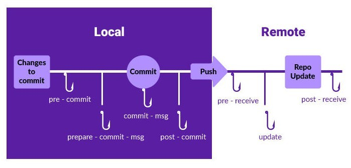

# Git

It is a version control system (VCS) for tracking changes in files and coordinating work on those files among multiple people.

Version Control is a system which records the changes made to a file so that you can recall a specific version later.

Types of Version Control Systems:

- **Local**: It allows you to copy files into another directory and rename it (For example, project.1.1). This method is error-prone and introduces redundancy.
- **Centralized**: All version files are present in a single central server. For example, CVS, SVN, and Perforce.
- **Distributed**: All changes are available in the server as well as in local machines. For example, Git and Mercurial.

There are 3 stages:

| #   | Stages            | Details                                                       |
| --- | ----------------- | ------------------------------------------------------------- |
| 1   | Working Directory | Un-tracked new files and modified directories are found here. |
| 2   | Staging Area      | Things we want to commit and ignore which we don't want.      |
| 3   | Remote Repository | `.git` directory(Repository)                                  |

## Git Internals

The `.git` folder contains different files and folders. One of those folders is called objects.

This folder consists of 4 types of objects:

1. Blob (Binary large object): Copy of contents of the file.
2. Tree
3. Commit: Creates a snapshot of the project at a given point.
4. Annotated tag

### Head

**HEAD** is a reference variable that always **points to the tip of your current branch, that is, recent commit of your current branch**.

HEAD can be used with the following symbols to refer to other commits:

- *Tilde symbol (`~`)*: Used to point to the previous commits from base HEAD
- *Caret symbol (`^`)*: Used to point to the immediate parent commit from the current referenced commit

### Dot Operators


## Configuration

All the Git configuration are stored in a file:

- The configurations specific to the users resides in home directory as `~/.gitconfig` or `~/.config/git/config` file. To add configurations to this file we pass `--global` option in the CLI.
- The configurations specific to a repository resides as `.git/config` file. To add configurations to this file we pass `--local` option in the CLI.
- The configurations specific to that machine resides as `/etc/gitconfig` file. To add configurations to this file we pass `--system` option in the CLI.

The priority in which these configuration files are used is: **local** > **global** > **system**

For the initial setup the user must provide their identity such as full name and an email address, this is required by git commits.

```bash
git config --global user.name "First Last"
git config --global user.email "myemail@domain.com"
```

List all configurations:

```bash
git config --list
```

To see a configuration:

```bash
git config <CONFIG NAME>
git config user.name
```

To see in which file a specific configuration resides:

```bash
git config --show-origin <CONFIG NAME>
git config --show-origin user.name
```

To change the core editor:

```bash
git config --global core.editor <EDITOR NAME>
git config --global core.editor vim
```

We can modify the configurations from the CLI or by directly modifying the configurations file.

::: tip WINDOWS
In windows Git looks for `.gitconfig` file in `$HOME` directory (`C:\Users\$USER`).
:::

## SSH

```bash
ssh-keygen -t rsa -b 4096 -C "string"
```

## Repositories

When working on a Git project most of the time the user will have to deal with two repositories:

- Remote Repository: They are versions of your project that are hosted on the Internet or network somewhere.
- Local Repository: It is a copy of the remote repository that exists on the user's workstation. This is the repository where the user works on the project.

## Git Commands

Git was initially a toolkit for a VCS and hence consists of a number of subcommands divided into:

- Plumbing: Subcommands that do low-level work and were designed to be chained together UNIX-style or called from scripts.

- Porcelain: More user-friendly commands.

### Help

You can get information about any of the Git commands by:

```bash
git help <GIT COMMAND NAME>
git help config

# OR

git <GIT COMMAND NAME> --help
git config --help

# OR

man git-<COMMAND NAME>
```

### Initialize Git

Initializes the current folder to track its changes by Git:

```bash
git init
```

The above command creates a hidden `.git` folder which contains all the necessary files required by Git.

### Clone Repository

Git clone gets the complete project from remote to your local machine.

```bash
git clone <REPO URL>
```

### Remote Repository

When we clone a remote repository using the URL a reference will be added to that repository. This reference is used to communicate changes between the local repository and the remote repository.

List all remote repositories with URL:

```bash
git remote -v
```

### Remove Git Tracking

To remove Git tracking from the project, just delete the hidden `.git` folder.

```bash
rm -rf .git
```

### Status

Displays the current state of the staging area and the working directory, that is, which files are added/removed/modified.

```bash
git status

# GET SHORT STATUS WITH BRANCH NAME
git status -sb
```

### Add File

Adds the changes to the staging area. If you have added a new file, this command starts tracking the file for modifications.

```bash
git add <FILENAME>

# ADD ALL THE FILES
git add .
git add -A
```

### Commit

Will save all the changes with a unique hash number in the local repository

```bash
git commit -m <COMMIT MESSAGE>
```

Amend commit:

```bash
# FIX PREVIOUS COMMIT
git commit --amend

# AMEND ONLY COMMIT MESSAGE
git commit --amend -m "NEW MESSAGE"
```

::: danger NOTE
Amending commits is not advisable. It changes the commit-hash and hence changing the history.
:::

### Rename File

Change file name or file path and prepare it for commit.

```bash
git mv <ORIGINAL FILENAME> <NEW FILENAME>
```

### Remove File

Delete the file from the _working area_ or _stagging area_ and add the deletion to the _staging area_.

```bash
git rm <FILENAME>
```

Remove file from version control but preserve the file locally:

```bash
git rm --cached <FILENAME>
```

### Git Clean

Git clean undoes files from the repository. It **primarily focuses on untracked files**.

### Restore File

Restore a deleted file which was tracked by git.

- Find the commit where the file was deleted:

  ```bash
  git rev-list -n 1 HEAD -- <FILENAME>
  ```

- Checkout to that commit to get the file back:

  ```bash
  git checkout <commitSHA>^ -- <FILENAME>
  ```

### Ignoring File

Files or folders can be ignored so that Git dose not track them. For that create a file named `.gitignore` and add all the file or folder listing patterns.

Example:

```text
# ignore all .a files
*.a

# but do track lib.a, even though you're ignoring .a files above
!lib.a

# only ignore the TODO file in the current directory, not subdir/TODO
/TODO

# ignore all files in any directory named build
build/

# ignore doc/notes.txt, but not doc/server/arch.txt
doc/*.txt

# ignore all .pdf files in the doc/ directory and any of its subdirectories
doc/**/*.pdf
```

Lists all ignored files in this project

```bash
git ls-files --other --ignored --exclude-standard
```

### Logs

List version history for the current branch:

```bash
git log
```

List version history for a file, including renames

```bash
git log --follow <FILENAME>
```

### Branch

Create new branch:

```bash
git branch <BRANCH NAME>
```

List all branches:

```bash
git branch -a
```

Rename branch:

```bash
git branch -m <NAME>
```

Delete a branch:

```bash
git branch -d <BRANCH NAME>

# DELETE BRANCH FROM REMOTE REPO
git push origin --delete <BRANCH NAME>
```

See all the merged branches:

```bash
git branch --merged
```

### Reset

Git reset as the name suggests resets things. Reset the working area to a specific commit.

It can **undo the changes that are already committed**.

Move file from _stagging area_ back to _working area_:

```bash
git reset <FILENAME>
```

Reset everything to the latest snapshot.

```bash
git reset --hard HEAD
```

Reset commit with the following options:

- `--soft`: **Moves the commit changes into stagging area** and does not affect the current working area.
- `--hard`: **Deletes all the commit changes. Be cautious with this flag**. Might lose all changes from both stagging and working area to match the commit.
- `--mixed`: Default operation. Moves commit changes to the _working area_.

Apply reset command on:

- Staged files
- Commits

::: tip NOTE
Use revert whenever possible.
:::

### Revert

Git revert is similar to reset however, **`git revert` inverses the changes from that old commit and creates a new revert commit**.

### Differences

Compares contents of the working directory with the staging area.

```bash
git diff
```

Compare staging to the head of the branch of the repository:

```bash
git diff --staged

# OR

git diff --cached
```

Compare changes of a file between current state and last commit:

```bash
git diff <FILENAME>
```

Compare two branches:

```bash
git diff <FIRST BRANCH> <SECOND BRANCH>
```

::: tip TOOL
We can use a GUI tool or an external diff viewing program.

```bash
git difftool
```

To get help and add your preferred tool:

```bash
git difftool --tool-help

# ADD A TOOL
git difftool --tool=<TOOL>
```

:::

### Checkout

Git checkout is **used to switch**. Switch between _branches_, _commits_, and _files_.

Go back to the head

```bash
git checkout master
```

Discard changes of a file in working area

```bash
git checkout <FILENAME>
```

Goto to a specific snapshot (commit).

- This command **creates a detached head**, meaning, this will **give a temporary branch to work and debug**.
- **Do not commit in this temporary branch**.

```bash
git checkout <commitSHA>
```

You can apply checkout command on:

- Working file
- Commit

### Fetch File


### Re-base

```bash
# REBASE TO LAST 4 COMMITS
git rebase -i HEAD~4
```

### Cherry-Pick

Copy commit from one branch to another.

```bash
git cherry-pick <commitSHA>

git cherry-pick <commitSHA> -m 1
```

### Stash

Git stash temporarily saves the changes made in working directory and work on some other changes.

```bash
# SAVE CURRENT CHANGES
git stash

# SAVE WITH A MESSAGE
git stash save <MESSAGE>

# RETRIEVE THE SAVED CHANGES (IT WILL NOT REMOVE THE STASH FROM THE LIST)
git stash apply <stash@{ID}>

# GET THE LIST OF ALL STASHES
git stash list

# GET THE LATEST STASH AND APPLY IT IN THE WORKING AREA
git stash pop <stash@{ID}>

# DELETE A STASH
git stash drop <stash@{ID}>
```

::: tip NOTE
Git stash is branch agnostic. All branches use the same stash list. This is helpful when moving the changes from one branch to another branch.
:::

::: warning UNTRACKED FILES
By default, Git will not stash changes made to untracked or ignored files

```bash
# TO STASH UNTRACKED FILES
git stash -u or --include-untracked <FILENAME>
```

:::

### Show

Outputs metadata and content changes of the specified commit.

```bash
git show <commitSHA>
```

Allows us to see git objects details:

```bash
git show <objectSHA>

git show --pretty=raw <objectSHA>
```

### ls-tree

```bash
git ls-tree <objectTreeSHA>
```

Which shows the object details.

```text
FILE PERMISSIONS / TYPE OF FILE / objectSHA / FILE NAME
100644 blob e69de29bb2d1d6434b8b29ae775ad8c2e48c5391    README.md
```

### Reflog

- Git reflog has the superpower to **track the head**.

- The difference between log and reflog is that:

  - `git log` will track every commit that you make and record it as a snapshot at a particular time, whereas `git reflog` will keep track of commits that are made as well as the commits that are discarded.

- This is provided in a rolling buffer for 30 days

- The `git reflog` command will list down the logs whenever the HEAD changes like the branch was created, cloned, checked-out, renamed, or any commits made on the branch.

```bash
git reflog
```

### Blame

Shows what revision and author last modified each line of a file.

```bash
git blame <FILENAME>
```

Options:

- `-L`: to filter based on line numbers.
- `-s`: to suppress the author's name and time stamp from the output.
- `-e`: to show the author's email instead of the author's name.
- `-f`: to show the filename in the original commit.
- `-n`: to show the line number in the original commit.

### Bisect

Git bisect will:

1. Perform a binary search in the commits.
2. Allow us to check it manually.
3. Allow us to declare its status as good or bad.

Start bisecting:

```bash
git bisect start
```

Provide a commit to start from:

```bash
git bisect good <commitSHA>
```

Now add the current commit as bad, Git will go through all the commits between the start commit and the current bad commit.

```bash
git bisect bad
```

From now check the application and verify if the application has the bug or not,
if the commit dose not have bug then mark it as good and if you find the commit that has the bug then mark it as bad. Repeat this process till the tool narrows down to the commit that introduced the bug.

- `git bisect log`: To find the flow of Git Bisect, that is, to see what has been done so far.
- `git bisect reset`: To reset if something went wrong.

## Tagging

- Tag allows you to capture a reference point in your project history, such as release versions.
- An **annotated tag** contains additional information such as name, message, and email of the person who created the tag.
- A **lightweight tag** points to just a commit hash.

Create a tag:

```bash
git tag <TAG NAME>

# CREATE A TAG FOR OLDER COMMIT
git tag <TAG NAME> <commitSHA>
```

Annotated tags:

```bash
git tag -a <TAG NAME> -m <MESSAGE>
```

Push tags to remote repository:

```bash
git push origin <TAG NAME>

# PUSH ALL TAGS
git push origin --tags

git push --tags
```

To delete the tag:

```bash
git tag -d or --delete <TAG NAME>
```

## Git Submodule

It often happens that while working on one project, you need to use another project from within it. Git addresses this issue using submodules.

Submodules allow you to keep a Git repository as a subdirectory of another Git repository. This lets you clone another repository into your project and keep your commits separate.

```bash
git submodule add <URL OF REPO>

# VIEW STATUS (WORKING, STAGING, OR INDEXED FILES) OF ALL THE SUBMODULES.
git submodule status

# UPDATES SUBMODULES AFTER SWITCHING BRANCHES.
git submodule update

# AFTER CLONING A NEW REPO, IF YOU NEED TO ADD SUBMODULES TO IT FROM .GITMODULES FILE, USE THIS COMMAND.
git submodule update --init

# IF THE SUBMODULES INSIDE A NEWLY CLONED REPO ARE NESTED, THEN USE THIS.
git submodule update --init --recursive

# PULLS ALL CHANGES IN THE SUBMODULES.
git submodule update --remote
```

A `.gitmodules` file is created when we add a submodule to the project. This is a configuration file that stores the mapping between the project's URL and the local subdirectory you've pulled it into:

```text
[submodule "DbConnector"]
    path = DbConnector
    url = https://github.com/chaconinc/DbConnector
```

## Git Hooks

Git Hooks are shell scripts that get triggered when we perform a specific action in Git.

Git hooks reside in the `<project-dir>/.git/hooks/` directory.



Based on the git operation, any one of the following `git hooks` will be triggered.

1. **Client-side**:

   - Committing workflow hooks:

     - pre-commit
     - prepare-commit-msg
     - commit-msg
     - post-commit

   - Email workflow hooks

     - applypatch-msg
     - pre-applypatch
     - post-applypatch

   - Other client hooks

     - pre-rebase
     - post-rewrite
     - post-checkout
     - post-merge

2. **Server-side**:

   - update
   - pre-receive
   - post-receive

- Hooks are simple text files.
- Hooks can be written in any _scripting language_ like python, Ruby, and so on.
- The script **filename should match the hooks' name**. For `post-commit` hook the script filename should be `post-commit`.
