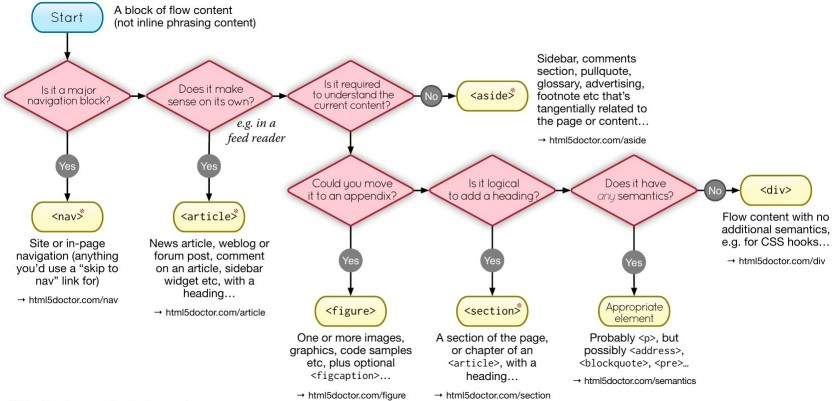

# HTML

HTML (HyperText Markup Language) (1993) is the standard markup language for documents designed to be displayed in a web browser

- It defines the structure of the web content

- It structures the content on the web, providing a foundation for the text, images, and forms displayed in browsers

- _"Hypertext"_ refers to links that connect web pages to one another, either within a single website or between websites

## Document Type Declaration (DTD)

The **Document Type Declaration** (DTD), or **DOCTYPE** is an instruction to the web browser about what [version of HTML](#html-versions) the page is written in and how the browser should render the page

- It is not an [HTML tag](#tag)

- It essentially acts as a switch, ensuring that the browser interprets the page according to the correct standards

- The DOCTYPE tells the browser whether to render the page in **standards mode** (following web standards) or **quirks mode** (emulating old browser behaviour for backward compatibility)

- Modern browsers perform DOCTYPE "sniffing" or "switching" to determine the rendering mode of the page

- **Without a DOCTYPE**, the browser will render the page in quirks mode, which can lead to **inconsistent rendering across different browsers** and **render the page incorrectly** according to the modern web standards

The general syntax for a document type declaration is:

- It must be placed at the very top of an HTML document, before the `<html>` tag

```html
<!DOCTYPE root-element PUBLIC "/quotedFPI/" "/quotedURI/" [ <!-- internal subset declarations -->
]>

<!--or-->

<!DOCTYPE root-element SYSTEM "/quotedURI/" [ <!-- internal subset declarations -->
]>
```

_Example:_

```html
<!-- HTML5 DOCTYPE -->
<!doctype html>

<!-- HTML 4.01 Strict DOCTYPE -->
<!DOCTYPE html PUBLIC "-//W3C//DTD HTML 4.01//EN" "http://www.w3.org/TR/html4/strict.dtd">
```

## Element

HTML elements are the building blocks of HTML documents. They represent different parts of a web page, such as text, [images](#images), [links](#anchor), [headings](#header), paragraphs, and more

An **element** is a part of a web-page. In XML and HTML, an element may contain a data item or a chunk of text or an image, or perhaps nothing

- A typical element includes an opening [tag](#tag) with some [attributes](#attribute), enclosed text content, and a closing tag

_Example:_

```html
<p class="nice">Hello world!</p>
```


There are two levels of elements:

1. **Block-level elements**: Start on a new line and take up the full width available (e.g., `<div>`, `<h1>`, `<p>`, `<ul>`, `<li>`, `<table>`, `<form>`)

2. **Inline elements**: Do not start on a new line and only take up as much width as necessary (e.g., `<span>`, `<a>`, `<strong>`, `<em>`, ``, `<input>`)

- Don't place block-level element within in-line elements

  ```html
  <!-- Don't do this -->
  <a href="#">
    <p>Click me</p>
  </a>
  ```

## Tag

A tag is used for creating an [element](#element)

They are used to define the structure and content of a web page. Each tag is enclosed in angle brackets (`<` and `>`)

- Tags act like containers. They tell you something about the information that lies between their opening and closing tags

Types of tags:

- Opening tags: These tags define the start of an element (`<p>`, ``, `<a>`)
- Closing tags: These tags indicate the end of an element. They have a forward slash (`/`) before the element name (`</p>`, `</img>`, `</a>`)

In HTML element (paragraph) `<p>This is an amazing website!</p>`:

- `<p>` is opening tag
- `</p>` is closing tag

### Custom Tags

1. To create a custom tag like `radio-button`:

   ```javascript
   class RadioButton extends HTMLElement {
     constructor() {
       super();
     }

     connectedCallback() {
       this.setAttribute("role", "radio");
       this.setAttribute("tabindex", -1);
       this.setAttribute("aria-checked", false);
     }
   }

   window.customElements.define("radio-button", RadioButton);
   ```

2. Now create a parent element `radio-group`:

   ```javascript
   const VK_LEFT = 37;
   const VK_UP = 38;
   const VK_RIGHT = 39;
   const VK_DOWN = 40;

   class RadioGroup extends HTMLElement {
     constructor() {
       super();
     }

     connectedCallback() {
       this.setAttribute("role", "radiogroup");
       this.radios = Array.from(this.querySelectorAll("radio-button"));

       // SETUP INITIAL STATE
       if (this.hasAttribute("selected")) {
         let selected = this.getAttribute("selected");
         this._selected = selected;
         this.radios[selected].setAttribute("tabindex", 0);
         this.radios[selected].setAttribute("aria-checked", true);
       } else {
         this._selected = 0;
         this.radios[0].setAttribute("tabindex", 0);
       }

       this.addEventListener("keydown", this.handleKeyDown.bind(this));
       this.addEventListener("click", this.handleClick.bind(this));
     }

     handleKeyDown(e) {
       switch (e.keycode) {
         case VK_UP:
         case VK_LEFT: {
           e.preventDefault();

           if (this.selected === 0) {
             this.selected = this.radios.length - 1;
           } else {
             this.selected--;
           }
           break;
         }
         case VK_DOWN:
         case VK_RIGHT: {
           e.preventDefault();

           if (this.selected === this.radios.length - 1) {
             this.selected = 0;
           } else {
             this.selected++;
           }
           break;
         }
       }
     }

     handleClick(e) {}

     set selected(idx) {
       if (isFinite(this.selected)) {
         // SET THE OLD BUTTON TO TABINDEX -1
         let previousSelected = this.radios[this.selected];
         previousSelected.tabIndex = -1;
         previousSelected.removeAttribute("aria-checked", false);
       }

       // SET THE NEW BUTTON TO TABINDEX 0 AND FOCUS IT
       let newSelected = this.radios[idx];
       newSelected.tabIndex = 0;
       newSelected.focus();
       newSelected.setAttribute("aria-checked", true);

       this.setAttribute("selected", idx);
       this._selected = idx;
     }

     get selected() {
       return this._selected;
     }
   }
   ```

## Attribute

[Elements](#element) in HTML have **attributes**; these are additional values that configure the elements or adjust their behaviour in various ways to meet the criteria the users want

- They are placed within the opening [tag](#tag) of an element and are typically used to modify the appearance, behaviour, or functionality of the element

- Some attributes are specific to certain elements, while others can be used with multiple elements

- They are made up of a _name_ and a _value_, separated by an equals sign (`=`) and enclosed in quotes (`"`)

Common Attributes and Their Uses:

- `id`: Unique identifier for an element

  - Its value should start with a letter (A-Z or a-z) and can be followed by letters (A-Z or a-z), digits (0-9), hyphens (`-`), underscores (`_`), colons (`:`), and periods (`.`)
  - No two elements in the same document can have the same `id`
  - It is known as a **global attribute** because it can be used with any HTML element

- `class`: Specifies one or more classes to apply to an element
- `style`: In-line styles for an element
- `href` (_hypertext reference_): Specifies the URL of a linked resource
- `src`: Specifies the URL of a resource to be embedded in an element
- `alt`: Provides an alternative text for images and other non-text content
- `target`: Specifies where to open a linked resource (e.g., `_blank` for a new tab)
- `title`: Provides a tooltip or advisory text for an element
- `disabled`: Disables an element
- `required`: Indicates that an input field must be filled in before submitting a form
- `type`: Specifies the type of an input element (e.g., `text`, `checkbox`, `button`)

_Example:_ [Anchor element](#anchor)

```html
<a href="https://www.example.com" target="_blank" title="Visit Example">
  Click here to visit Example
</a>
```

The `a` element has the following attributes:

- `href`: Specifies the URL to link to
- `target`: Opens the link in a new tab
- `title`: Provides a tooltip when hovering over the link

::: info
HTML5 allows you to use uppercase attribute names and omit the quotemark, but this is not recommended
:::

### WAI-ARIA Roles

The `role` attribute, describes the purpose of an element to assistive technologies like screen readers

- They come from the WAI-ARIA (Web Accessibility Initiative – Accessible Rich Internet Applications) specification

- Roles are essential in providing semantic meaning to HTML elements, particularly when the default semantics of an element do not fully convey its function or when custom components (e.g., JavaScript widgets) are used

Types of Roles:

1. **Landmark Roles**: Used to define regions of a page, such as headers, footers, and navigation sections making it easier for users to navigate the page

   - `role="banner"`: Represents a banner or a header, typically at the top of the page
   - `role="navigation"`: Represents a group of navigational links
   - `role="main"`: Indicates the main content of the page
   - `role="complementary"`: Represents content that is related to the main content, but not essential to its understanding

2. **Document Structure Roles**: Used to define the structure of a document, such as headings, paragraphs, and lists

   - `role="heading"`: Represents a heading for a section (like `<h1>`, `<h2>`, etc.)
   - `role="paragraph"`: Represents a paragraph of text
   - `role="list"`: Identifies a list of items (used in conjunction with `role="listitem"`)
   - `role="presentation"`: Indicates that an element should not be treated as a landmark or interactive element. Invisible to assistive technologies

3. **Widget Roles**: Used to define interactive components, such as buttons, sliders, and checkboxes

   - `role="button"`: Represents a clickable button
   - `role="checkbox"`: Represents a checkbox
   - `role="slider"`: Represents a graphical slider control
   - `role="tablist"`, `role="tab"`, `role="tabpanel"`: Used to create tabbed interfaces

4. **Live Region Roles**: Used to define regions of a page that are updated dynamically, such as alerts, status messages, and chat messages

   - `role="alert"`: Used to notify the user of important changes that do not require immediate user interaction
   - `role="status"`: Provides feedback that is not disruptive (e.g., progress updates)
   - `role="log"`: Represents a list of messages that are not interactive

5. **Composite Roles**: Used to define complex components that are made up of multiple elements, such as menus, trees, and grids

   - `role="menu"`: Represents a list of menu items
   - `role="tree"`: Represents a hierarchical structure of items
   - `role="grid"`: A grid of elements, often used in data tables

_Example:_

```html
<div role="button" tabindex="0" onclick="doSomething()">Click me</div>

<nav role="navigation">
  <ul>
    <li><a href="#home">Home</a></li>
    <li><a href="#about">About</a></li>
    <li><a href="#contact">Contact</a></li>
  </ul>
</nav>

<div role="alert" aria-live="assertive">Error: Invalid email address</div>

<div
  role="progressbar"
  aria-valuenow="50"
  aria-valuemin="0"
  aria-valuemax="100"
>
  50% complete
</div>
```

## Accessibility in HTML

Making _Web Content Accessible to All_

Accessibility in HTML refers to the practice of making web content usable for all people, regardless of their abilities or disabilities

- It involves using HTML elements and attributes that enable better access for individuals with various impairments, such as visual, auditory, motor, and cognitive disabilities

- Properly designed HTML can enhance the user experience for everyone, including people who use assistive technologies like **[screen readers](#screen-reader)** or **[keyboard navigation](#keyboard-navigation)**

A design _affordance_ is a clue about how an object should be used, typically provided by the object itself or its context. For example, a button looks like something you can press

- Affordance means that the purpose of an element can be inferred by its sensory characteristics

### Semantic HTML

Semantic HTML uses elements that clearly **describe their meaning** in a human- and machine-readable way

- Elements that convey meaning about the content

- Helps screen readers and search engines interpret the content correctly

1. **Semantic elements**: HTML tags that describe the purpose of the content they contain (e.g., `<header>`, `<article>`, and `<footer>`)

   - Semantic elements have implicit roles describing their role in the document

   ```html
   <header>
     <h1>Welcome to My Website</h1>
     <nav>
       <ul>
         <li><a href="#home">Home</a></li>
         <li><a href="#about">About</a></li>
         <li><a href="#contact">Contact</a></li>
       </ul>
     </nav>
   </header>
   ```

2. **Non-semantic elements**: Tags that do not provide any information about the content within them (e.g., `<div>` and `<span>`)

   ```html
   <div class="header">
     <h1>Welcome to My Website</h1>
     <div class="nav">
       <ul>
         <li><a href="#home">Home</a></li>
         <li><a href="#about">About</a></li>
         <li><a href="#contact">Contact</a></li>
       </ul>
     </div>
   </div>
   ```



- [Image from HTML5 Doctor](https://html5doctor.com/)

Roles and Landmarks of some elements:

| Element                 | Role          | Landmark      |
| ----------------------- | ------------- | ------------- |
| [`<header>`](#header)   | banner        | banner        |
| `<div>`                 | -             | -             |
| [`<aside>`](#aside)     | complementary | complementary |
| [`<main>`](#main)       | main          | main          |
| [`<article>`](#article) | article       | -             |
| [`<footer>`](#footer)   | contentinfo   | contentinfo   |

### Assistive Technologies

Assistive technologies are tools that help people with disabilities access digital content

- They include [screen readers](#screen-reader), magnifiers, voice recognition software, and alternative input devices

#### Screen Reader

A screen reader is a form of assistive technology designed to interpret and convert text, images, and other content from a computer screen into spoken words, Braille output, or other non-visual formats

How Screen Readers Work:

1. **Text-to-Speech**: Screen readers use **text-to-speech (TTS)** technology to vocalize the content displayed on the screen, such as text from web pages, documents, or software applications

2. **Braille Display**: Some screen readers are connected to **refreshable Braille displays**, translating on-screen text into Braille characters

3. **[Keyboard Navigation](#keyboard-navigation)**: Users control screen readers with keyboard shortcuts, enabling them to navigate through pages, read content, interact with elements (e.g., forms, links), and control media

Popular Screen Readers:

- **JAWS (Job Access With Speech)** - Windows
- **NVDA (NonVisual Desktop Access)** - Windows (open-source)
- **VoiceOver** - macOS, iOS (built-in)
- **TalkBack** - Android (built-in)
- **Narrator** - Windows (built-in)

#### Keyboard Navigation

Keyboard navigation is the ability to interact with and navigate through web pages, applications, or operating systems using only the keyboard, without needing a mouse or touchpad

### Web Content Accessibility Guidelines (WCAG)

The **Web Content Accessibility Guidelines (WCAG)** are a set of guidelines developed by the World Wide Web Consortium (W3C) to ensure that web content is accessible to people with disabilities

- The guidelines are organized into four principles: **Perceivable**, **Operable**, **Understandable**, and **Robust** (POUR)

### Accessible Rich Internet Applications (ARIA)

Accessible Rich Internet Applications (**ARIA**) is a set of [roles](#wai-aria-roles) and [attributes](#attribute) that define ways to make web content and web applications (especially those developed with JavaScript) more accessible to people with disabilities

- ARIA attributes help provide additional information to assistive technologies

- These are useful when default HTML elements don't provide enough information about dynamic content or interactive components

::: warning
**Developers should prefer using the correct semantic HTML element over using ARIA**, if such an element exists
:::

#### ARIA Rules

1. If you _can_ use a native HTML element or attribute with the semantics and behaviour you require **already built in**, instead of re-purposing an element and adding an ARIA role, state or property to make it accessible

2. Do not change native semantics, unless you really have to

   _Example:_ Developer wants to build a heading that's a tab

   - Do **not** do this:

   ```html
   <h2 role="tab">heading tab</h2>
   ```

   - **Do** this:

   ```html
   <div role="tab"><h2>heading tab</h2></div>
   ```

   ::: tip
   If a non-interactive element is used as the basis for an interactive element, developers have to add the semantics using ARIA and the appropriate interaction behaviour using scripting. In the case of a button, for example, it is **much better** and easier to Just use a (native HTML) [button](#button)
   :::

3. All interactive ARIA controls must be usable with the keyboard

   _Example:_ If using `role="button"` the element must be able to receive focus and a user must be able to activate the action associated with the element using **both** the `enter` (on WIN OS) or `return` (MAC OS) and the `space` key

4. Do not use `role="presentation"` or `aria-hidden="true"` on a **focusable** element

   - Do **not** do this:

   ```html
   <button role="presentation">press me</button>
   ```

   - Do **not** do this:

   ```html
   <button aria-hidden="true">press me</button>
   ```

   - Applying `aria-hidden` to a parent/ancestor of a visible interactive element will also result in the interactive element being hidden, so **don't do this either**:

   ```html
   <div aria-hidden="true">
     <button>press me</button>
   </div>
   ```

   - If an interactive element **cannot be seen or interacted with**, then you can apply `aria-hidden`, as long as it's not focusable

   _Example:_

   ```html
   <style>
     button {
       opacity: 0;
     }
   </style>

   <button tabindex="-1" aria-hidden="true">press me</button>
   ```

   - If an interactive element is hidden using `display:none` or `visibility:hidden` (either on the element itself, or any of the element's ancestors), it won't be focusable, and it will also be removed from the accessibility tree. This makes the addition of `aria-hidden="true"` or explicitly setting `tabindex="-1"` unnecessary

5. All interactive elements must have an accessible name

   _Example:_ The input `type=text` in the code example below has a visible label "user name", but no accessible name:

   - Do **not** do this:

   ```html
   user name <input type="text" />

   <!--or-->

   <span>user name</span> <input type="text" />
   ```

   - **Do** this:

   ```html
   <!-- Note: use of for/id or wrapping label around text
    and control methods will result in an accessible name -->

   <input type="text" aria-label="User Name" />

   <!--or-->

   <span id="p1">user name</span> <input type="text" aria-labelledby="p1" />
   ```

   - **Even better**: For regular HTML inputs, follow the First Rule of ARIA, and use the label element with a for attribute to associate labels with input elements

   ```html
   <label for="user-name"
     >User Name:
     <input id="user-name" type="text" />
   </label>
   ```

Adding an ARIA role **overrides** the native role semantics in the accessibility tree which is reported via the accessibility API, and therefore ARIA indirectly affects what is reported to a screen reader or other assistive technology

_Example:_

```html
<h1 role="button">text</h1>
```

Becomes this in the accessibility tree:

```text
Heading text - push button
```

Adding an ARIA role will not make an element look or act differently for people **not** using assistive technology. It **does not** change the behaviours, states and properties of the host element but only the native role semantics

_Example:_

```html
<button role="heading" aria-level="1">text</button>
```

Becomes this in the accessibility tree:

```text
(none) - heading
  |
  --- ab| text - editable text
```

But it can still be pressed, it is still in the default tab order, still looks like a button and still triggers any associated actions when pressed

Common ARIA attributes:

- `aria-label`: Provides a label for an element that doesn't have visible text
- `aria-labelledby`: References an element that acts as a label for another element
- `aria-describedby`: Identifies the element (or elements) that describes the element on which the attribute is set

Refer [Using ARIA](https://www.w3.org/TR/using-aria)

## Structure of HTML Document

The structure of an HTML document consists of a series of nested elements that define the content and layout of a web page

- The basic structure of an HTML document includes the **document type declaration**, the **html element**, the **head element**, and the **body element** (among others)

```html
<!doctype html>
<html lang="en">
  <head>
    <meta charset="UTF-8" />
    <title>Document</title>
  </head>
  <body></body>
</html>
```

### HTML Element

The `<html>` element represents the root (top-level element) of an HTML document, so it is also referred to as the _root element_

- All other elements must be descendants of this element
- There can be **only one `<html>` element in a document**

`<html>` attributes:

- `lang`: Specifies the primary language for the content of the document

  - It helps screen readers and search engines understand the language of the content

  - It is recommended to use the [ISO language code](https://www.loc.gov/standards/iso639-2/php/code_list.php) for the `lang` attribute

  ```html
  <html lang="en">
    ...
  </html>
  ```

- `dir`: Specifies the text direction of the content (e.g., `ltr` for left-to-right or `rtl` for right-to-left)

  ```html
  <html lang="en" dir="ltr">
    ...
  </html>
  ```

### Head

The `<head>` element contains machine-readable information (metadata) about the document, like its title, scripts, and style sheets

- There can be **only one `<head>` element in an HTML document**
- It is not displayed on the page itself

`<head>` elements:

- `<title>`: Sets the title of the document, which appears in the browser tab or window title bar

  ```html
  <head>
    <title>My Website</title>
  </head>
  ```

- `<meta>`: Provides metadata about the HTML document, such as the character encoding, viewport settings, and author information

  ```html
  <head>
    <meta charset="UTF-8" />

    <!-- Viewport settings for responsive design -->
    <!-- width=device-width: Sets the width of the viewport to the device width -->
    <!-- initial-scale=1.0: Sets the initial zoom level when the page is first loaded -->
    <meta name="viewport" content="width=device-width, initial-scale=1.0" />

    <!-- Description of the document -->
    <meta name="description" content="This is a description of the document" />

    <!-- Author information -->
    <meta name="author" content="John Doe" />

    <!-- Keywords for search engines -->
    <meta name="keywords" content="HTML, CSS, JavaScript" />

    <!-- Refresh the page every 30 seconds -->
    <meta http-equiv="refresh" content="30" />

    <!-- Set the character encoding for the document -->
    <meta http-equiv="Content-Language" content="en" />

    <!-- Prevent search engines from indexing the page -->
    <meta name="robots" content="noindex, nofollow" />

    <!-- Set the theme colour for the browser -->
    <meta name="theme-color" content="#ffffff" />

    <!-- Set the colour scheme for the document -->
    <meta name="color-scheme" content="light dark" />

    <!-- Cache control directives -->
    <meta http-equiv="pragma" content="no-cache" />

    <!-- Expires header for caching -->
    <meta http-equiv="expires" content="Fri, 01 Jan 2022 00:00:00 GMT" />

    <!-- Open Graph metadata for social media -->
    <meta property="og:title" content="My Website" />
    <meta
      property="og:description"
      content="This is a description of the document"
    />
    <meta property="og:image" content="https://example.com/image.jpg" />
    <meta property="og:url" content="https://myawesomewebsite.com" />

    <!-- Twitter Card metadata for Twitter -->
    <meta name="twitter:card" content="summary" />
    <meta name="twitter:title" content="My Website" />
    <meta
      name="twitter:description"
      content="Web development tutorials and guides."
    />
    <meta
      name="twitter:image"
      content="https://myawesomewebsite.com/image.jpg"
    />
    <meta name="twitter:site" content="@example" />
  </head>
  ```

- `<link>`: Links external resources, such as style sheets or web fonts, to the document

  ```html
  <head>
    <link rel="stylesheet" href="styles.css" />

    <!-- Import a stylesheet from another CSS file -->
    <link rel="import" href="styles.css" />

    <!-- Alternate stylesheets for different devices -->
    <link
      rel="stylesheet"
      media="screen and (max-width: 600px)"
      href="small.css"
    />

    <!-- Stylesheet for printing the document -->
    <link rel="stylesheet" href="print.css" media="print" />

    <!-- favicon icon for the document -->
    <link rel="icon" href="favicon.ico" type="image/x-icon" />

    <!-- Apple touch icons -->
    <link rel="apple-touch-icon" sizes="180x180" href="apple-touch-icon.png" />

    <!-- Preconnect to a server before making an HTTP request -->
    <link rel="preconnect" href="https://example.com" />

    <!-- DNS prefetching to resolve domain names before a user clicks on a link -->
    <link rel="dns-prefetch" href="//example.com" />

    <!-- Preload resources to improve page performance -->
    <link rel="preload" href="image.jpg" as="image" />

    <!-- Prefetch resources to load them in the background -->
    <link rel="prefetch" href="image.jpg" />

    <!-- Canonical URL for search engines -->
    <!-- Helps avoid duplicate content issues by specifying the preferred URL for a web page -->
    <link rel="canonical" href="https://example.com/page" />

    <!-- Alternate language versions of the document -->
    <link rel="alternate" hreflang="es" href="https://example.com/es/page" />

    <!-- RSS feed for the document -->
    <link rel="alternate" type="application/rss+xml" href="rss.xml" />

    <!-- Manifest file for progressive web apps -->
    <link rel="manifest" href="manifest.json" />
  </head>
  ```

- `<script>`: Embeds scripts in the document, such as JavaScript code or external scripts

  ```html
  <head>
    <!-- External JavaScript file -->
    <script src="script.js"></script>

    <!-- Inline JavaScript code -->
    <script>
      console.log("Hello, World!");
    </script>
  </head>
  ```

- `<base>`: Specifies the base URL for all relative URLs in the document

  ```html
  <head>
    <base href="https://example.com/" />
  </head>
  ```

#### SEO

Search Engine Optimization (SEO) is the practice of increasing the quantity and quality of traffic to your website through organic search engine results

- **On-Page SEO**: Refers to the practice of optimizing web pages to improve a website's search engine rankings and earn organic traffic
- **Off-Page SEO**: Refers to actions taken outside of your own website to impact your rankings within search engine results pages (SERPs)
- **Technical SEO**: Refers to the process of optimizing your website for the crawling and indexing phase
- **Local SEO**: Refers to the process of optimizing your online presence to attract more business from relevant local searches
- **Mobile SEO**: Refers to the practice of optimizing your website for users on smartphones and tablets

The [`<head>`](#head) element is where you can add metadata that helps search engines understand the content of your page

### Body

The `<body>` element contains the content of the document, such as text, images, links, and other elements

```html
<body>
  <h1>Welcome to My Website</h1>
  <p>This is the main content of the page...</p>
</body>
```

### Header

`<header>` HTML element represents introductory content, typically a group of introductory or navigational aids

- Defines a header for a document or a section

- It may contain some [heading](#section-heading-elements) elements but also navigation links, a logo, a search form, an author name, and other elements

```html
<header>
  <h1>My Website</h1>
  <nav>
    <ul>
      <li><a href="#home">Home</a></li>
      <li><a href="#about">About</a></li>
      <li><a href="#contact">Contact</a></li>
    </ul>
  </nav>
</header>
```

#### Section Heading elements

The `<h1>` to `<h6>` HTML elements represent six levels of section headings

- `<h1>` is the highest section level and `<h6>` is the lowest
- **Block-level** box in the layout (default)
- **Do not skip heading levels**: always start from `<h1>`, followed by `<h2>` and so on
- Avoid using multiple `<h1>` elements on one page

```html
<h1>Beetles</h1>
<h2>External morphology</h2>
<h3>Head</h3>
<h4>Prothorax</h4>
```

#### Heading Group

The `<hgroup>` element should be used where you want a main heading with one or more subheadings

- This is **not used** very much

- The `<hgroup>` element can only contain other headers, that is `<h1>` to `<h6>` and including `<hgroup>`

  ```html
  <hgroup>
    <h1>Heading 1</h1>
    <h2>Subheading 1</h2>
    <h2>Subheading 2</h2>
  </hgroup>
  ```

### Navigation

Defines a block of navigation links

- The `<nav>` element indicates that the content within it provides site navigation

```html
<nav>
  <ul>
    <li><a href="/home">Home</a></li>
    <li><a href="/about">About</a></li>
    <li><a href="/contact">Contact us</a></li>
  </ul>
</nav>
```

Use Accessible Current Page Navigation State:

- Like a colour/icon combination to indicate the page a user is currently on

```html
<a href="/blog/" aria-current="page">
  Blog
  <svg
    xmlns="http://www.w3.org/2000/svg"
    fill="currentColor"
    width="1em"
    height="1em"
    viewbox="0 0 24 24"
    aria-hidden="true"
    focusable="false"
  >
    <path
      fill-rule="evenodd"
      d="M4.293 15.707a1 1 0 010-1.414l5-5a1 1 0 011.414 0l5 5a1 1 0 01-1.414 1.414L10 11.414l-4.293 4.293a1 1 0 01-1.414 0zm0-6a1 1 0 010-1.414l5-5a1 1 0 011.414 0l5 5a1 1 0 01-1.414 1.414L10 5.414 5.707 9.707a1 1 0 01-1.414 0z"
      clip-rule="evenodd"
    />
  </svg>
</a>

<style>
  .site-header a[aria-current="page"] svg {
    position: absolute;
    bottom: 0;
    left: 50%;
    transform: translateX(-50%);
  }
</style>
```

### Main

`<main>` HTML element represents the **main content of a document**. It is used to **indicate the dominant content** of a page

- The `<main>` element should **only appear once** on a page and contains the central content related to the page's purpose

```html
<main>
  <article>
    <h2>Article Title</h2>
    <p>This is the main content of the article...</p>
  </article>
</main>
```

### Article

An `<article>` is intended to be independently distributable or reusable

- The article element represents a complete, or self-contained, composition in a document, page, application, or site and that is, in principle, independently distributable or reusable, e.g. in syndication

- Represents independent, self-contained content. This could be a blog post, news article, or forum post

- Content that you would like to link to, such as blog posts, comments, etc.

```html
<article>
  <h2>Understanding JavaScript Promises</h2>
  <p>JavaScript promises are used for handling asynchronous operations...</p>
</article>
```

### Section

Represents a thematic grouping of content, typically with a heading

- The `<section>` element is used to divide content into sections with a common theme

```html
<section>
  <h2>Our Services</h2>
  <p>
    We offer a wide range of services including web development, mobile app
    development...
  </p>
</section>
```

### Footer

Defines the footer for a document or section

- The `<footer>` element can contain copyright information, links to legal documents, or other footer-related content

```html
<footer>
  <p>&copy; 2024 My Company</p>
  <nav>
    <ul>
      <li><a href="#privacy">Privacy Policy</a></li>
      <li><a href="#terms">Terms of Service</a></li>
    </ul>
  </nav>
</footer>
```

### Aside

The `<aside>` element is intended for content that is not part of the flow of the text in which it appears, however still related in some way. `<aside>` can be used as a sidebar to your main content

- Represents content that is tangentially related to the main content (e.g., a sidebar or a pull quote)

- The `<aside>` element is often used for supplementary content, such as sidebars, related links, or advertisements

- It is similar to `role="complementary"`

```html
<aside>
  <h2>Related Articles</h2>
  <ul>
    <li><a href="#article1">How to Learn JavaScript</a></li>
    <li><a href="#article2">10 Tips for Web Development</a></li>
  </ul>
</aside>
```

### Anchor

The `<a>` HTML element (or _anchor_ element), with its `href` attribute, creates a hyperlink to web pages, files, email addresses, locations in the same page, or anything else a URL can address

- Anchor tags are focusable via the keyboard (using the `Tab` key)

_Example:_

```html
<a href="https://example.com">Website</a>

<a href="mailto:m.bluth@example.com">Connect over Email</a>

<a href="tel:+123456789">Call our store</a>
```

#### Anchor Pseudo Classes

- `:hover`: The user hovers a pointing device (usually a mouse) over the item

- `:active`: The item is activated by the user clicking or selecting it

- `:focus`: The element currently has focus (is selected)

- `:focus-visible`: The element has focus and should be visibly focused

- `:visited`: The link target has been visited (only use when necessary, consider privacy implications)

- `:link`: The link target has not yet been visited

- `:local-link`: The absolute URL of the current page and link target match

- `:target`: The target element of the referring URI

```css
a {
  text-decoration: underline;
}

a:link {
  color: blue;
}

a:hover,
a:focus {
  text-decoration: none;
  outline: 2px solid blue;
}

a:active {
  color: orange;
}

a:visited {
  color: purple;
}
```

#### Anchor Attributes

- `href`: The URL of the page the link goes to

  - Absolute URL: The full URL of the linked page, including the protocol (e.g., `href="https://example.com"`)
  - Relative URL: The path to the linked page, relative to the current page (e.g., `href="/about"`)
  - Anchor Link: The ID of an element on the same page to link to (e.g., `href="#section1"`)
  - Email Address: The email address to send a message to (e.g., `href="mailto:[email-id]"`)
  - Phone Number: The phone number to call (e.g., `href="tel:[phone-number]"`)

- `download`: attribute causes the browser to treat the linked URL as a download. You cannot use cross origin URLs

  ```html
  <a href="/example.pdf" download> Download PDF </a>

  <!-- Provide a file-name -->
  <a href="/example.pdf" download="case-study.pdf"> Download PDF </a>

  <!-- Download files generated by you, such as data from a table -->
  <a href="data:..." download="case-study.pdf"> Download PDF </a>

  <a href="blob:..." download="case-study.pdf"> Download PDF </a>
  ```

  - For cross origin downloads, fetch the file and turn it into an object URL

  ```javascript
  const fileText = await fetch(url).then((res) => res.text());
  const blob = new Blob([fileText], {
    type: "application/pdf",
  });

  const blobUrl = URL.createObjectURL(blob);

  // Add this URL to anchor tag
  anchor.href = blobUrl;
  ```

- `referrerpolicy`: How much of the referrer to send when following the link

  - `no-referrer`: The Referer header will not be sent (set this for security reasons)

- `target`: Where to display the linked URL

  - `_self`: the current browsing context. (Default)

  - `_blank`: usually a new tab, but users can configure browsers to open a new window instead. Set `rel="noopener"` which does not set `window.opener`, for some browsers it is the default behaviour

    - **Not good for accessibility**, as user is navigated away from the current context and not clear indication to go back

    - Use `target="_blank"` Sparingly

    - Provide visual or textual cues

    - Use `aria-label` to announce the behaviour to screen readers

    ```html
    <!-- Non-accessible: -->
    <a href="https://example.com" target="_blank">Visit Example Website</a>

    <!-- Accessible: -->
    <a
      href="https://example.com"
      target="_blank"
      aria-label="Opens in a new tab"
    >
      Visit Example Website (opens in a new tab)
    </a>
    ```

  - `_parent`: the parent browsing context of the current one. If no parent, behaves as `_self`

  - `_top`: the topmost browsing context (the "highest" context that's an ancestor of the current one). If no ancestors, behaves as `_self`

- `title`: Using a title attribute in your anchor elements will improve accessibility when used the right way

  ```html
  <a href="http://blog.com/all-articles" title="A list of all articles."
    >Click here.</a
  >
  ```

#### Anchor Best Practices

1. **Provide Descriptive Link Text**: Ensure that the text within the anchor tag describes the destination or purpose of the link. Avoid vague text like "Click here" or "Read more.". Clearer for the screen reader users and improves [SEO](#seo)

   ```html
   <!-- Non-accessible: -->
   <a href="article.html">Click here</a>

   <!-- Accessible: -->
   <a href="article.html"
     >Read the full article on web accessibility best practices</a
   >
   ```

2. **Use `aria-label` for Icon-Only Links**: If an anchor tag contains only an icon or image without text, use the `aria-label` attribute to provide a textual description for screen readers

   ```html
   <!-- Non-accessible: -->
   <a href="https://twitter.com"><i class="icon-twitter"></i></a>

   <!-- Accessible: -->
   <a href="https://twitter.com" aria-label="Follow us on Twitter">
     <i class="icon-twitter"></i>
   </a>
   ```

   ```html
   <a href="https://twitter.com/25prabhu10" title="Twitter">
     <svg
       aria-hidden="true"
       focusable="false"
       xmlns="http://www.w3.org/2000/svg"
       viewbox="0 0 16 16"
     >
       ...
     </svg>
     <span class="sr-only">Twitter</span>
   </a>
   ```

3. **Don't Use Anchor Tags as Buttons**: Anchor tags should be used for navigation, while buttons should be used for actions (e.g., submitting forms)

   ```html
   <!-- Non-accessible: -->
   <a href="#" onclick="submitForm();">Submit</a>

   <!-- Accessible: -->
   <button type="submit">Submit</button>
   ```

4. **Use Skip Links**: For users who navigate via keyboard, long pages can be frustrating to navigate. Skip links allow them to bypass navigation and jump to the main content

   ```html
   <a href="#maincontent" class="skip-link">Skip to main content</a>
   ```

5. Add more info for links which have same text (avoid same text if possible)

   ```html
   <a href="/pickle-health.html">
     Continue reading <span class="sr-only">pickled cheese is healthy.</span>
   </a>

   <a href="/cricket.html">
     Continue reading <span class="sr-only">about cricket</span>
   </a>
   ```

6. Try to keep _underline_ for clear communication (optional)

7. If you click an `<a>` element without an `href`? Absolutely nothing

   - Browser won't focus the `<a>` element when tab is pressed

#### Creating URL the right way

```javascript
// Don't use string concatenation
const url = `https://builder.io/api/v1/image?height=${encodeURIComponent(
  height,
)}&width=${encodeURIComponent(width)}`;

// Instead use the global URL constructors
const url = new URL("https://builder.io/api/v1/image");

url.searchParams.set("height", height);
url.searchParams.set("width", width);
url.toString();

// Get current URL
const page = new URL(location.href).searchParams.get("page");
```

### Button

- They don't do anything out of the box

- Button behaviour is added by hooking them to browser events or using JavaScript

- Add more info for buttons

  ```html
  <button id="close-modal">
    <svg>(...)</svg>
    <span class="sr-only">Close order form modal popup.</span>
  </button>
  ```

_Example:_ Button CSS reset

```css
button {
  font-family: inherit;
  font-style: 100%;
  line-height: 1.15;
  margin: 0;
  overflow: hidden;
  text-transform: none;
  /* -webkit-appearance: button; */
  border: 0;
  background: none;
}

button:hover {
  cursor: pointer;
}

button:hover,
button:focus,
button:active {
  background: none;
  border-color: inherit;
  border-radius: 0;
}
```

### Images

The ability to embed [images](../../Concepts/Web/Images.md) in web pages has been officially supported since 1995

The `` element is used to embed images in an HTML document

```html

```

- Provide `src`, `alt`, `height`, and `width` attributes for each image

  - `src`: The URL of the image file
  - `height`: The height of the image in pixels
  - `width`: The width of the image in pixels
  - `title`: The title of the image (optional)

- `alt` attribute must be provided (can be empty)

  - If an image is decorative, it needs to have an empty/null alternative text attribute (assistive technology devices (ATs) ignore this image as it is not necessary for understanding the content or action on the page)

  - An empty/null alternative text attribute is not the same as a missing alternative text attribute. If the alternative text attribute is missing, the AT might read out the file name or surrounding content in an attempt to give the user more information about the image

  - Types of Images that Definitely Need Alt Text:

    - Images that are links or buttons
    - Images which contain important text
    - Logos

  - Alternative content needs to be meaningful and descriptive, should not exceed 250 characters, and should be unique

  - What to write in `alt` attribute: [An `alt` Decision Tree](https://www.w3.org/WAI/tutorials/images/decision-tree/)

- Use `srcset` and `size` when working with large images

Browsers now have a built-in support for lazy loading images; (no need fort extra JavaScript code)

```html

```

_Example:_ Image CSS reset

```css
/* standard */
img {
  display: block;
  width: 100%;
  height: auto;
}

/* modern CSS remedy */
img {
  display: block;
  max-width: 100%;
  height: auto;
}
```

#### Picture

The `<picture>` HTML element contains **zero or more `<source>` elements** and **one `` element** to offer alternative versions of an image for **different display/device scenarios**

_Example:_

```html
<picture>
  <source
    srcset="/media/cc0-images/surfer-240-200.jpg"
    media="(min-width: 800px)"
  />

  
</picture>
```

#### SVG

The [`<svg>`](../../Concepts/Web/Images.md#svg) element is a container for SVG graphics

```html
<svg
  xmlns="http://www.w3.org/2000/svg"
  width="100"
  height="100"
  viewBox="0 0 24 24"
  fill="none"
  stroke="currentColor"
  stroke-width="2"
  stroke-linecap="round"
  stroke-linejoin="round"
>
  <circle cx="12" cy="12" r="10"></circle>
  <line x1="12" y1="8" x2="12" y2="16"></line>
  <line x1="8" y1="12" x2="16" y2="12"></line>
</svg>
```

#### Icons

Use [SVGs](#svg) for icons

- They can be made accessible, and they don't interfere with assistive technologies the way icon fonts do (screen readers might read them out)

_Example:_

```html
<a href="https://www.linkedin.com/" aria-label="Go to LinkedIn">
  <svg aria-hidden="true" focusable="false">
    <!-- svg content -->
  </svg>
</a>

<!-- Or use hidden text-->

<a href="https://www.linkedin.com/">
  <svg aria-hidden="true" focusable="false">
    <!-- svg content -->
  </svg>
  <span class="sr-only">Go to LinkedIn</span>
</a>
```

- Print button:

```html
<button>
  <svg aria-hidden="true" focusable="false">
    <!-- svg content -->
  </svg>
  Print <span aria-hidden="true"> this page</span>
  <span class="sr-only">Pickled Cheese Recipes.</span>
</button>
```

### Figure

The `<figure>` HTML element represents self-contained content, potentially with an optional caption, which is specified using the `<figcaption>` element

- The figure, its caption, and its contents are referenced as **a single unit**

Can be used for:

- Adding captions to your images in HTML

  ```html
  <!-- Don't do this -->
  <div>
    
    <p>This is a picture of a man working on his computer</p>
  </div>

  <!-- use the `<figcaption>` element to add captions -->
  <figure>
    
    <figcaption>This is a picture of a man working on his computer</figcaption>
  </figure>
  ```

- Code snippets

  ```html
  <figure>
    <figcaption>main.js</figcaption>

    <pre>
        const name = "JavaScript";
        console.log(name);
    </pre>
  </figure>
  ```

- Quotations

  ```html
  <figure>
    <figcaption><b>Edsger Dijkstra:</b></figcaption>
    <blockquote>
      If debugging is the process of removing software bugs, then programming
      must be the process of putting them in.
    </blockquote>
  </figure>
  ```

- Poems

  ```html
  <figure>
    <p style="white-space:pre">
      Bid me discourse, I will enchant thine ear, Or like a fairy trip upon the
      green, Or, like a nymph, with long dishevelled hair, Dance on the sands,
      and yet no footing seen: Love is a spirit all compact of fire, Not gross
      to sink, but light, and will aspire.
    </p>
    <figcaption>
      <cite>Venus and Adonis</cite>, by William Shakespeare
    </figcaption>
  </figure>
  ```

_Example:_

```html
<figure>
  

  <figcaption>An elephant at sunset</figcaption>
</figure>

<style>
  figure {
    border: thin #c0c0c0 solid;
    display: flex;
    flex-flow: column;
    padding: 5px;
    max-width: 220px;
    margin: auto;
  }

  img {
    max-width: 220px;
    max-height: 150px;
  }

  figcaption {
    background-color: #222;
    color: #fff;
    font: italic smaller sans-serif;
    padding: 3px;
    text-align: center;
  }
</style>
```

### Lists

Lists are used to group related items together

- Lists can be ordered (numbered) or unordered (bulleted)

#### Unordered List

The `<ul>` HTML element represents an unordered list of items, typically rendered as a bulleted list

- Use unordered lists when the order of the items does not matter

```html
<ul aria-label="Fruits">
  <li>Apple</li>
  <li>Orange</li>
  <li>Banana</li>
</ul>
```

#### Ordered List

The `<ol>` HTML element represents an ordered list of items, typically rendered as a numbered list

- Use ordered lists when the order of the items matters

```html
<ol>
  <li>First item</li>
  <li>Second item</li>
  <li>Third item</li>
</ol>
```

- Use `type` attribute to change the numbering style

```html
<ol type="A">
  <li>First item</li>
  <li>Second item</li>
  <li>Third item</li>
</ol>
```

- Nested Lists

```html
<ol>
  <li>First item</li>
  <li>
    Second item
    <ol type="A">
      <li>Subitem 1</li>
      <li>Subitem 2</li>
    </ol>
  </li>
  <li>Third item</li>
</ol>
```

#### Description List

The `<dl>` HTML element represents a description list. The element encloses a list of groups of terms (`<dt>`) and descriptions (`<dd>`)

- Use description lists when you have a list of terms and their descriptions
- `<dt>`: a term in a description list
- `<dd>`: the description of a term in a description list

```html
<dl aria-label="Programming Languages">
  <dt>HTML</dt>
  <dd>HyperText Markup Language</dd>
  <dt>CSS</dt>
  <dd>Cascading Style Sheets</dd>
</dl>
```

### Tables

The `<table>` HTML element represents tabular data-that is, information presented in a two-dimensional table comprised of rows and columns of cells containing data

- Each block in the grid is referred to as a _table cell_

_Example:_

```html
<table>
  <tr>
    <th>First Name</th>
    <th>Last Name</th>
    <th>Favourite Animal</th>
  </tr>
  <tr>
    <td>Beau</td>
    <td>Bow</td>
    <td>Cow</td>
  </tr>
  <tr>
    <td>John</td>
    <td>Larson</td>
    <td>Dog</td>
  </tr>
</table>
```

The above code will be rendered as:

| FirstName | LastName | Favourite Animal |
| --------- | -------- | ---------------- |
| Beau      | Bow      | cow              |
| Quincy    | Larson   | dog              |

#### Table Elements

- `<table>`: The container element for the table
- `<caption>`: Value that clearly and concisely describes the table's purpose
- `<thead>`: The header of the table
- `<tbody>`: The body of the table
- `<tfoot>`: The footer of the table
- `<tr>`: A row in the table
- `<th>`: A header cell in the table
- `<td>`: A data cell in the table
- `<colgroup>`: A group of columns in the table
- `<col>`: A single column in the table
- `<thead>`: The header of the table

Attributes:

- `scope`: Specifies whether a header cell is a header for a column, row, group, or the entire table

  - `col`: The header cell is a header for a column
  - `row`: The header cell is a header for a row
  - `rowgroup`: The header cell is a header for a row group
  - `colgroup`: The header cell is a header for a column group
  - `auto`: The default value. The header cell is a header for the cell it's in

- `rowspan`: The number of rows a cell should span
- `colspan`: The number of columns a cell should span

_Example:_

```html
<div role="region" aria-labelledby="cap1" tabindex="0">
  <table id="People" role="table">
    <caption id="cap1">
      Front-end web developer course 2021
    </caption>
    <thead>
      <tr>
        <th scope="col">Person</th>
        <th scope="col">Most interest in</th>
        <th scope="col">Age</th>
      </tr>
    </thead>
    <tbody>
      <tr>
        <th scope="row">Chris</th>
        <td>HTML tables</td>
        <td>22</td>
      </tr>
      <tr>
        <th scope="row">Dennis</th>
        <td>Web accessibility</td>
        <td>45</td>
      </tr>
      <tr>
        <th scope="row">Sarah</th>
        <td>JavaScript frameworks</td>
        <td>29</td>
      </tr>
      <tr>
        <th scope="row">Karen</th>
        <td>Web performance</td>
        <td>36</td>
      </tr>
    </tbody>
    <tfoot>
      <tr>
        <th scope="row" colspan="2">Average age</th>
        <td>33</td>
      </tr>
    </tfoot>
  </table>
</div>
```

- [A Responsive Accessible Table](https://adrianroselli.com/2017/11/a-responsive-accessible-table.html)

### HTML Forms

An HTML [form](#form) is used to collect user [input](#input). The user input is most often sent to a server for processing

- Form controls are elements that allow users to interact with the form, such as adding text,, making choices, or submitting the form

_Example:_

```html
<form action="" method="get" class="form-example">
  <div class="form-example">
    <label for="name">Enter your name: </label>
    <input type="text" name="name" id="name" required />
  </div>
  <div class="form-example">
    <label for="email">Enter your email: </label>
    <input type="email" name="email" id="email" required />
  </div>
  <div class="form-example">
    <input type="submit" value="Subscribe!" />
  </div>
</form>
```

#### Form

The `<form>` element is used to create an HTML form for user input:

```html
<form>...</form>
```

Attributes:

- `action`: The URL that processes the form submission. This value can be overridden by a form-action attribute on a `<button>`, `<input type="submit">`, or `<input type="image">` element

- `method`: The HTTP method to submit the form with

  - `post`: The **POST method**; form data sent as the request body
  - `get`: The **GET method**; form data appended to the action URL with a `?` separator. Use this method when the form has no side-effects
  - `dialog`: When the form is inside a `<dialog>`, closes the dialog on submission
  - This value is overridden by `formmethod` attributes on `<button>`, `<input type="submit">`, or `<input type="image">` elements

- `enctype`: If the value of the **method attribute is post, enctype is the MIME type** of the form submission

  - `application/x-www-form-urlencoded`: (**default**) Form data is URL-encoded before being sent to the server
  - `multipart/form-data`: Use this if the form contains `<input>` elements with `type=file`
  - `text/plain`: Introduced by HTML5 for debugging purposes
  - This value can be overridden by `formenctype` attributes on `<button>`, `<input type="submit">`, or `<input type="image">` elements

- `autocomplete`: Indicates whether input elements can by default have their values automatically completed by the browser

  - `off`: No autofill (expect for username and password)
  - `on`: The browser may automatically complete entries

- `name`: The name of the form. Must **not be empty string** and must **be unique among other form elements**

- `rel`: Specifies the relationship between the current document and the linked document

- `novalidate`: This Boolean attribute indicates that the form shouldn't be validated when submitted. If this attribute is not set (and therefore the form is validated), it can be overridden by a `formnovalidate` attribute on a `<button`>, `<input type="submit">`, or `<input type="image"`> element belonging to the form.

- `target`: Indicates where to display the response after submitting the form. In HTML5, it is a name/keyword for a browsing context (for example, tab, window, or iframe). The following keywords have special meanings:

  - `_self (default)`: Load into the same browsing context as the current one.
  - `_blank`: Load into a new unnamed browsing context.
  - `_parent`: Load into the parent browsing context of the current one. If no parent, behaves the same as `_self.`
  - `_top`: Load into the top-level browsing context (i.e., the browsing context that is an ancestor of the current one and has no parent). If no parent, behaves the same as `_self.`
  - This value can be overridden by a form-target attribute on a `<button>`, `<input type="submit">`, or `<input type="image">` element.

::: tip NOTE

- Setting `target="\_blank"` on `<form>` elements implicitly provides the same `rel` behaviour as setting `rel="noopener"` which does not set window.opener

- It is possible to use the `:valid` and `:invalid` CSS pseudo-classes to style a `<form>` element based on whether or not the elements inside the form are valid

:::

##### Grouping Form Elements

The `<fieldset>` element is used to group related form elements together

- The `<legend>` element is used to provide a caption for the `<fieldset>` element

```html
<form>
  <fieldset>
    <legend>Personal Information</legend>
    <label for="name">Name:</label>
    <input type="text" id="name" name="name" />
    <label for="email">Email:</label>
    <input type="email" id="email" name="email" />
  </fieldset>
</form>
```

#### HTML Form Validation

When a form is submitted, the browser will validate the form fields based on the attributes of the input elements

- The browser will display an error message if the input does not match the validation criteria

- Validation helps ensure that the data submitted is in the correct format, and it can help prevent errors in the data that is submitted

- Reduces the amount of data that needs to be validated on the server

- Enables users to receive immediate feedback on the data they have entered

Attributes:

- `required`: The input field must be filled out before submitting the form
- `pattern`: The input field must match the specified pattern
- `minlength`: The minimum number of characters required in the input field
- `maxlength`: The maximum number of characters allowed in the input field
- `min`: The minimum value allowed in the input field
- `max`: The maximum value allowed in the input field
- `disabled`: The input field is disabled and cannot be edited

  - An element is disabled if it can't be activated (selected, clicked on, typed into, etc.) or accept focus
  - Disabled elements are usually rendered in gray by default in browsers

- `readonly`: The input field is read-only and cannot be edited

CSS Pseudo-classes:

- `:valid`: The input field is valid

  - `:user-valid` (new 2023): Validate only when the user interacts with the input field unlike `:valid` which validates on form submission

- `:invalid`: The input field is invalid

  - `:user-invalid` (new 2023)

- `:required`: The input field is required
- `:optional`: The input field is optional
- `:in-range`: The input field is within the specified range
- `:out-of-range`: The input field is outside the specified range
- `:read-only`: The input field is read-only such as a disabled input field
- `:read-write`: The input field is read-write such as text input
- `:placeholder-shown`: The input field is displaying the placeholder text
- `:empty`: The input field is empty

  - `:blank` (experimental): The input field is blank

_Example:_

```html
<form>
  <label for="username">Username:</label>
  <input type="text" id="username" name="username" required />
  <label for="password">Password:</label>
  <input
    type="password"
    id="password"
    name="password"
    pattern=".{8,}"
    title="Password must be at least 8 characters long"
    required
  />
  <input type="submit" value="Submit" />
</form>
```

### Input

The `<input>` HTML element is used to create interactive controls for web-based forms in order to **accept data from the user**

```html
<input type="text" id="username" name="username" />
```

The `<label>` element is used to define a label for an `<input>` element

- This is useful for screen readers, as they can read the label when the user is focused on the input element

Ways to associate a label with an input:

1. Using the `for` attribute

   ```html
   <label for="username">Username:</label>
   <input type="text" id="username" name="username" />
   ```

2. Nesting the input inside the label

   ```html
   <label>
     Username:
     <input type="text" name="username" />
   </label>
   ```

3. Using the `aria-labelledby` attribute

   ```html
   <label id="username-label">Username:</label>
   <input type="text" aria-labelledby="username-label" />
   ```

4. Using the `aria-label` attribute

   ```html
   <input type="text" aria-label="Username" />
   ```

Attributes:

- `name`: The name of the input field. This is used when submitting the form data

  ```html
  <input type="text" name="username" />
  <input type="password" name="password" />
  ```

  - The form data is sent to the server as a key-value pair with the name as the key and the value as the value
  - The above code will be sent as `username=John&password=12345`

- `value`: The value of the input field

How an `<input>` works varies considerably depending on the value of its `type` attribute:

- Default is `type="text"`

Some input types:

1. `text`: Single line text input
2. `textarea`: Multi-line text input
3. `number`: A control for entering a number

   ```html
   <input type="number" />
   ```

   - Parse the number:

   ```javascript
   const num = parseInt(input.value, 10);
   ```

   - Better way to extract the number:

   ```javascript
   const num = input.valueAsNumber;

   // We can set the number value
   input.valueAsNumber = 25;
   ```

4. `email`: A control for entering an email address
5. `radio`: A radio button allowing a single value to be selected out of multiple options

   - `checked` attribute is used to set the default value (valid values are `checked` and `unchecked`)

   ```html
   <input type="radio" name="genre" value="rock" checked="checked" />
   <input type="radio" name="genre" value="pop" />
   <input type="radio" name="genre" value="jazz" />
   ```

6. `checkbox`: A check box allowing multiple values to be selected

   ```html
   <input type="checkbox" name="service" value="itunes" checked="checked" />
   <input type="checkbox" name="service" value="spotify" />
   <input type="checkbox" name="service" value="youtube" />
   ```

7. `password`
8. `search`: A single-line text field for entering search strings

   ```html
   <form role="search">
     <div>
       <input
         type="search"
         id="mySearch"
         name="q"
         placeholder="Search the site…"
         aria-label="Search through site content"
       />
       <button>Search</button>
     </div>
   </form>
   ```

   - `placeholder`: A hint to the user of what can be entered in the field

   ```html
   <input type="search" placeholder="Search..." />
   ```

   - `list`: The ID of a `<datalist>` element that contains the predefined options for the search

   ```html
   <input type="search" list="search-options" />
   <datalist id="search-options">
     <option value="apple" />
     <option value="banana" />
     <option value="cherry" />
   </datalist>
   ```

   - `spellcheck`: Whether the search should be spell-checked

   Non-standard attributes:

   - `autocorrect`: Whether the search should be automatically corrected

   - `incremental`: Whether the search should be incremental

   ```html
   <input type="search" incremental />
   ```

   - `results`: The URL of the search results page

   ```html
   <form action="/search" method="get">
     <input type="search" name="q" />
     <input type="submit" value="Search" />
   </form>
   ```

   - `autosave`: The URL to use for storing form data

   ```html
   <input type="search" autosave="search-history" />
   ```

9. `file`: Upload files

   - `accept`: The file types that the server accepts
   - `multiple`: Allow multiple files to be uploaded
   - `capture`: Used to specify which camera to use for capturing image or video data
   - Use `POST` method to upload files

   ```html
   <form action="/upload" method="post" enctype="multipart/form-data">
     <input type="file" name="file" accecpt="image/*" />
     <input type="submit" value="Upload" />
   </form>
   ```

10. `button`
11. `submit`: A button that submits the form

    - `value`: The text displayed on the button
    - `formaction`: The URL that processes the form submission

    ```html
    <input type="submit" value="Submit" formaction="/submit" />
    ```

12. `image`: A graphical submit button

    - `src`: The URL of the image to display on the button
    - `alt`: The alternative text for the image

    ```html
    <input type="image" src="submit.png" alt="Submit" />
    ```

13. `range`
14. `date`: A control for entering a date

    - `min`: The minimum date that can be selected
    - `max`: The maximum date that can be selected

    ```html
    <input type="date" min="2021-01-01" max="2021-12-31" />
    ```

    - `valueAsDate`: Get and set the date value

    ```javascript
    // Get the date value
    const date = input.valueAsDate;

    // Set the date value
    input.valueAsDate = new Date();
    ```

15. `tel`
16. `url`: A control for entering a URL

    ```html
    <form>
      <label for="url">Enter a URL:</label>
      <input type="url" id="url" name="url" />
    </form>
    ```

17. `hidden`: A hidden input field

    - Used to store data that should not be visible to the user, such as CSRF tokens

    ```html
    <input type="hidden" name="csrf" value="12345" />
    ```

18. `color`

#### Select Element

The `<select>` element is used to create a drop-down list, which can be used to select single/multiple option(s) from a list of options

- `<option>`: The options available in the drop-down list

  - `selected`: The default value, if not provided, the first option is selected
  - `optgroup`: The option group

- `multiple`: Allows multiple options to be selected

  - Let the user know that they can select multiple options by adding a note above the select element

- `size`: The number of options to show at once

_Example:_

```html
<select name="cars" id="cars">
  <option value="volvo" selected>Volvo</option>
  <option value="saab">Saab</option>
  <option value="mercedes">Mercedes</option>
  <option value="audi">Audi</option>
</select>
```

#### Data-List

The `<datalist>` HTML element contains a set of `<option>` elements that represent the **permissible or recommended options available to choose** from within other controls.

- Recommend values to various input types

- Connect `datalist` with `input` element using `id` and `list` attributes

_Example:_

```html
<!-- Text -->
<label for="ice-cream-choice">Choose a flavour:</label>
<input list="ice-cream-flavors" id="ice-cream-choice" name="ice-cream-choice" />

<datalist id="ice-cream-flavors">
  <option value="Chocolate"></option>
  <option value="Coconut"></option>
</datalist>

<!-- Datetime -->
<input type="time" list="popularHours" />
<datalist id="popularHours">
  <option value="12:00"></option>
  <option value="13:00"></option>
</datalist>

<!-- Range -->
<input type="range" list="tickmarks" />
<datalist id="tickmarks">
  <option value="10"></option>
  <option value="25"></option>
</datalist>
```

### Date and Time

#### Time

The `<time>` element allows an unambiguous ISO 8601 date to be attached to a human-readable version of that date.

```html
<time datetime="2017-10-31T11:21:00+02:00">Tuesday, 31 October 2017</time>
```

### Dialog

The `<dialog>` HTML element represents a dialog box or other interactive component, such as a dismissible alert, inspector, or subwindow.

- Can be used as modal instead of creating one manually

- By default dialog elements are not shown

- Use `open` attribute to show the element

_Example:_

```html
<dialog>
  <p>Greetings, one and all!</p>
  <form method="dialog">
    <button>OK</button>
  </form>
</dialog>

<style>
  dialog::backdrop {
    background: rgba(0, 0, 0, 0.6);
  }
</style>

<scrip>
    <!-- Open dialog -->
    document.querySelector('dialog').showModal()

    <!-- Close dialog -->
    document.querySelector('dialog').close()
</script>
```

::: danger NOTE
The `tabindex` attribute must not be used on the `<dialog>` element.
:::

### Details Disclosure

The `<details>` HTML element creates a disclosure widget in which information is visible only when the widget is toggled into an _"open"_ state.

- A summary or label must be provided using the `<summary>` element.

_Example:_

```html
<details>
  <summary>Details</summary>

  <p>Something small enough to escape casual notice.</p>
</details>
```

### Dynamic Assets

The [`<audio>`](#audio) and [`<video>`](#video) elements were added in 2015

Used as:

- Information
- Decoration

Discourage the practice of automatically starting sounds (especially if they last more than 3 seconds), and encourage that the sound be started by an action initiated by the user after they reach the page

- Avoid using `autoplay` and `loop` attributes together
- Don't use animations or transitions that flash or resize objects quickly
- Don't use animation as the only way to convey essential information
- Provide a way to pause or stop the animation
- Avoid flashing content

Transcripts for Video and Audio:

- Make information accessible to anyone through text

- Make information searchable, copyable, and auto-translatable

- Make information indexable for search engines

**Load embedded media only when necessary**, load them only when user interacts with them

Embedded media issues:

- The embed loads even if the visitor never interacts with it

- The embed slows down rendering of the page

- The embed `iframe` can create a keyboard navigation trap where the user can't escape the embed to get back to the current page

_Example:_ Better way to embedded videos

```html
<body>
  <main>
    <iframe
      src="https://www.youtube.com/c/MortenRandHendriksen"
      width="720"
      height="540"
      srcdoc="
      <style>
        * {
          padding: 0;
          margin: 0;
          overflow: hidden;
        }
        html,
        body {
          height: 100%;
        }
      </style>
      <a href=https://www.youtube.com/embed/dQw4w9WgXcQ?autoplay=1>
        
        <span>&#x25BA;</span>
      </a>      
      "
      frameborder="0"
      allow="accelerometer; autoplay; clipboard-write; encrypted-media; gyroscope; picture-in-picture"
      allowfullscreen
      title="Variable Fonts Explained: Morten Rand-Hendriksen"
      loading="lazy"
    ></iframe>
  </main>
</body>
```

#### Audio

It is used to embed sound content in documents using the `<audio>` element

- It may contain one or more audio sources, represented using the `src` attribute or the `<source>` element: the browser will choose the most suitable one

- It can also be the destination for streamed media, using a _MediaStream_

Attributes:

- `src`: The URL of the audio file
- `controls`: Show the default audio controls
- `autoplay`: Automatically start playing the audio
- `loop`: Automatically start playing the audio
- `muted`: Mute the audio

```html
<audio controls src="/sounds/.mp3"></audio>

<figure>
  <figcaption>Listen to the T-Rex:</figcaption>
  <audio controls src="/media/cc0-audio/t-rex-roar.mp3"></audio>
  <a href="/media/cc0-audio/t-rex-roar.mp3"> Download audio </a>
</figure>
```

#### Video

The `<video>` element is used to embed video content in documents

- It may contain one or more video sources, represented using the `src` attribute or the `<source>` element: the browser will choose the most suitable one

- `src`: The URL of the video file
- `poster`: The URL of an image to display while the video is downloading, or until the user hits the play button
- `preload`: The video should be loaded when the page loads

  - `none`: The video should not be loaded when the page loads
  - `metadata`: Only metadata should be loaded when the page loads
  - `auto`: The video should be loaded when the page loads

- `controls`: Show the default video controls
- `autoplay`: Automatically start playing the video
- `loop`: Automatically start playing the video
- `muted`: Mute the video

Using `<source>` element, you can specify multiple video files for different browsers

```html
<video controls>
  <source src="movie.mp4" type="video/mp4" />
  <source src="movie.ogg" type="video/ogg" />
  Your browser does not support the video tag
</video>
```

### Content Division element

The `<div>` HTML element is the generic container for flow content. It has no effect on the content or layout until styled using CSS

- Used to group elements for styling purposes (using the `class` or `id` attributes)
- Used to create a block-level container for other elements

```html
<div class="warning">
  
  <p>Beware of the leopard</p>
</div>
```

### Content Span element

The `<span>` HTML element is a generic inline container for phrasing content, which does not inherently represent anything

- Used to apply inline styles to a piece of text

```html
<p>This is a <span style="color: red">red</span> word</p>
```

### Inline Frame element

The `<iframe>` HTML element represents a nested browsing context, embedding another HTML page into the current one

```html
<iframe src="https://www.w3schools.com"></iframe>

<iframe
  id="inlineFrameExample"
  title="Inline Frame Example"
  width="300"
  height="200"
  src="https://www.openstreetmap.org/export/embed.html?bbox=-0.004017949104309083%2C51.47612752641776%2C0.00030577182769775396%2C51.478569861898606&layer=mapnik"
>
</iframe>
```

Attributes:

- `src`: The URL of the page to embed
- `srcdoc`: The HTML content of the page to embed
- `width`: The width of the frame
- `height`: The height of the frame
- `loading`: The loading behaviour of the frame

  - `eager`: Load the frame immediately
  - `lazy`: Defer loading the frame until it is visible

- `allow`: A space-separated list of the features the iframe's document may use

  - The policy defines what features are available to the `<iframe>` (for example, access to the microphone, camera, battery, web-share, etc.) based on the origin of the request

  - **`Permissions-Policy` header** provides a mechanism to allow and deny the use of browser features in a document or within any `<iframe>` elements in the document

    ```http
    Permissions-Policy: <directive>=<allowlist>
    ```

- `allowfullscreen`: Allow the iframe to be in fullscreen mode (default is `false`)

- `browseingtopics` (experimental): the selected topics for the current user should be sent with the request for the `<iframe>`'s source

- `credentialless` (experimental): its content will be loaded in a new, ephemeral context. It doesn't have access to the network, cookies, and storage data associated with its origin

- `csp`: The `Content-Security-Policy` header value for the embedded content

- `seamless`: Indicates that the iframe should look like it is a part of the containing document

- `referrerpolicy`

- `sandbox`: Security restrictions for the content in the frame. It can be empty to apply all restrictions, or space-separated values to apply specific restrictions

  - `allow-downloads`: Allows the embedded browsing context to download files
  - `allow-forms`: Allows the embedded browsing context to submit forms
  - `allow-modals`: Allows the embedded browsing context to open modal windows
  - `allow-orientation-lock`: Allows the embedded browsing context to lock the screen orientation
  - `allow-pointer-lock`: Allows the embedded browsing context to use the Pointer Lock API
  - `allow-popups`: Allows the embedded browsing context to open new windows
  - `allow-popups-to-escape-sandbox`: Allows the embedded browsing context to open new windows without forcing them into a sandbox
  - `allow-presentation`: Allows the embedded browsing context to use the Presentation API
  - `allow-same-origin`: Allows the embedded browsing context to navigate its top-level browsing context
  - `allow-scripts`: Allows the embedded browsing context to run scripts
  - `allow-top-navigation`: Allows the embedded browsing context to navigate its top-level browsing context
  - `allow-top-navigation-by-user-activation`: Allows the embedded browsing context to navigate its top-level browsing context, but only if initiated by a user gesture
  - `allow-top-navigation-by-custom-protocols`

::: warning
Because each browsing context is a complete document environment, every `<iframe>` in a page requires increased memory and other computing resources. While theoretically you can use as many `<iframe>s` as you like, check for performance problems
:::

### Empty Elements

The elements that do not have any words between an opening and closing tag are called empty elements

Elements like `<br>`, `<hr>`

### Other Elements

- `<address>`: Used for email address, social network account, street address, telephone number, or something you can get in touch with

  - The address element represents the contact information for its nearest article or body element ancestor

- `<abbr>`: The Abbreviation element. When including an abbreviation or acronym, provide a full expansion of the term in plain text on first use, along with the `<abbr>` to mark up the abbreviation. This informs the user what the abbreviation or acronym means

  ```html
  <p>
    You can use <abbr>CSS</abbr> (Cascading Style Sheets) to style your
    <abbr>HTML</abbr> (HyperText Markup Language). Using style sheets, you can
    keep your <abbr>CSS</abbr> presentation layer and <abbr>HTML</abbr> content
    layer separate. This is called "separation of concerns."
  </p>

  <abbr title="Hypertext Markup Language">HTML</abbr>

  <style>
    abbr {
      font-style: italic;
      color: chocolate;
    }
  </style>
  ```

### Escape Characters

Characters that have a special meaning in HTML are called _"reserved characters"_

- To display a reserved character in HTML, use the corresponding escape character
- The escape character is a backslash (`\`) followed by the character you want to display

| Character | Escape Character |
| --------- | ---------------- |
| ` `       | `&nbsp;`         |
| `&`       | `&amp;`          |
| `<`       | `&lt;`           |
| `>`       | `&gt;`           |
| `©`      | `&copy;`         |
| `“`       | `&ldquo;`        |
| `”`       | `&rdquo;`        |
| `"`       | `&quot;`         |
| `'`       | `&apos;`         |

### Comments

Comments are used to add notes to the code, which are not displayed in the browser

- `<!-- comment goes here -->` for comments

### Accessible Design

1. Colour contrast:

   - Background to text colour contrast ratios ([WCAG](#web-content-accessibility-guidelines-wcag) recommendations):

     - Small text (23x or less): 4.5
     - Small bold text (17x or less): 4.5
     - Large text (24x or more): 3

   - [Contrast Checker](https://webaim.org/resources/contrastchecker/)
   - [Adobe Colour Pallet Accessibility](https://color.adobe.com/create/color-accessibility)
   - [Adobe Colour Contrast Analyser](https://color.adobe.com/create/color-contrast-analyzer)

2. Colour blindness:

   - Up to 8% male population are red-green colour blind

   - There are several other types of colour blindness, some of which primarily affect the female population

   - User interface often use red and green to distinguish between "on" and "off" states

   - Don't rely on colour difference only when indicating state (supplement with text)

3. Typography:

   - Larger font sizes (within reason) are preferred

     - Default size of _16px_ is OK
     - _18px_ or _20px_ is better

   - Avoid complex fonts for anything but decoration

     - Handwriting and decorative fonts look good
     - Are difficult to read

   - Avoid mono-space fonts unless share code

   - Avoid "fancy" fonts with unusual Features

     - Fonts with stylish ligaments and non-standard glyphs are difficult to read

   - Keep Max sentence length between 70 and 80 characters

     - `max-width: 70ch;` and your done!

4. Hierarchies and Flows

#### Tab Order

The order in which elements receive focus when the user navigates through the page using the `Tab` key

- The order should be logical and intuitive
- The order should follow the visual order of the page
- The order should be easy to navigate with the keyboard and screen reader

Use `tabindex` attribute to control the tab order

- `tabindex` only accepts integer as value from `-1` to `32767` (default is `0`)

- `tabindex="0"`: The element should be focusable in the order defined by the document's source order
- `tabindex="-1"`: The element should be focusable, but not in the tab order
- `tabindex` greater than `0`: The element should be focusable and should be navigated to in the order defined by the value of the `tabindex` attribute
- **Avoid using** `tabindex` **greater than `0`**

HTML Roving Tab Index:

- A roving tab-index basically sets the `tabindex` to `-1` on all elements except the one that should be focused
- This is useful when you have a group of elements that should be navigated in a specific order

```html
<div>
  <button tabindex="-1">Previous</button>
  <button tabindex="0">Currently focused</button>
  <button tabindex="-1">Next</button>
</div>
```

Tab order - Use `inert.js` polyfill. `tabindex=0`. `document.querySelector('[tabindex="-1"]').focus()`

#### Focus

The goal of `:focus` is to give the user **guidance on where exactly they are** in the document and help them navigate through it

- Only one element can be focused at a time

- Browsers use the `:focus-visible` CSS pseudo class to **give outlines (focus indicators)** to form fields and other elements **when they're focused**

  - `:focus-visible` is a pseudo-class that is activated when an element is focused and UA determines via heuristics the user's input modality

- `:focus-within` is a pseudo-class that is activated when an element is focused, or contains an element that is focused

  ```text
  table
  ├── caption
  ├── tr:focus-within
  ├──── td
  ├─────── a:focus
  ```

  ```css
  /* if a selector list contains an invalid selector,
     the entire list is considered invalid.
     Thus this doesn't gracefully degrade: */
  .main-nav:hover,
  .main-nav:focus-within {
    background-color: rgba(0, 0, 0, 0.6);
  }
  ```

- **Never remove CSS outlines** unless you replace them with something better

  - Don't remove outline completely with `outline: none;`, instead set outline colour to transparent `outline: 0.25rem solid transparent;`
  - This will hide the outline in normal mode but overridden correctly in high contrast mode, where the transparent colour will be replaced with a colour set by the user

- Try adding padding to the focused element to increase the clickable area and make it easier to see the focus indicator

- `outline-offset` can be used to adjust the space between the outline and the element

- Box shadows can be used to create a more subtle focus indicator

```css
*:focus {
  outline: 2px solid #d71ef7;
  outline-offset: 0.25rem;
}

button:focus {
  box-shadow:
    0 0 0 0.5rem var(--color-background),
    /* background colour here */ 0 0 0 0.75rem var(--color-focus); /* outline colour here */
  /* this results in a blue outline 0.25rem wide, offset 0.5rem from the element */
  outline: none;
}

/* high contrast mode */
@media screen and (-ms-high-contrast: active) {
  button:focus {
    background-color: buttonFace;
    color: window;
  }
}
```

```html
<!--elements that should be focusable-->
<a>Link</a>
<button>Click</button>
<details><summary>Details</summary></details>

<!--sometimes-->
<object>Object</object>

<label />
<!--with-->
<input />
<select />
<!--or-->
<textarea />
```

Even default outlines may be **unintentionally removed** when the parent of the intractable control has `overflow: hidden` on it

- Consider using negative value to outline offset, such as `outline-offset: -.25rem;` or an inset box shadow (eg. `box-shadow: inset 0 0 0 0.25rem red;`) in order to render an outline without changing the CSS on the parent element

If your design **contains sticky elements**, it's possible for the sticky element to inadvertently overlap your focusable element, making it impossible to focus on the element

- Use `scroll-padding-block-start` to ensure your focused elements aren't covered

#### Hiding content

If something is set to `display: none;` or otherwise hidden, screen readers might not read its content

| Method                       | Visible               | Accessible |
| ---------------------------- | --------------------- | ---------- |
| `.sr-only` class             | No                    | Yes        |
| `aria-hidden="true"`         | Yes                   | No         |
| `hidden=""`                  | No                    | No         |
| `display: none`              | No                    | No         |
| `visibility: hidden`         | No, but space remains | No         |
| `opacity: 0`                 | No, but space remains | Depends    |
| `clip-path: circle(0)`       | No, but space remains | Depends    |
| `transform: scale(0)`        | No, but space remains | Yes        |
| `width: 0 + height: 0`       | No                    | No         |
| `content-visibility: hidden` | No                    | No         |

Different ways to hide content:

1. **`hidden` (attribute)**: The `hidden` global attribute is a Boolean attribute indicating that the element is not yet, or is no longer, directly relevant to the page's current state or direction

   - All HTML elements may have the hidden content attribute set
   - User agents should not render elements that have the `hidden` attribute specified

   ```html
   <p hidden>This content is hidden.</p>
   ```

   Effects:

   - Content not displayed to **any user**
   - Semantic indicator of state in HTML code
   - CSS style of `display: none;` is applied by browsers
   - Focusable content is not included in the tab order
   - Not included in the accessibility tree
   - `hidden` where setting a `display: block;` will override the attribute's default styling and semantics

2. **`aria-hidden="true"`**: attribute of the element that should be **only hidden from screen readers**

   - This attribute applies to current element and **all its children**
   - It is used to hide elements from screen readers, but keep them **visible on the page**
   - It is important to note that any focusable elements within an element with `aria-hidden="true"` **remains focusable**, which can be a big problem for screen readers. Make sure there are no focusable elements within such container and that the element itself is also not focusable either (see the [fourth rule of ARIA](#aria-rules))
   - `aria-hidden=false` is not mapped in any browser that supports `aria-hidden`, thus its use has no meaning or in other words has the same meaning as its absence

   ```html
   <p aria-hidden="true">This content is hidden.</p>
   <p aria-hidden="false">This content is not hidden.</p>
   <!-- aria-hidden="false" is same as -->
   <p aria-hidden="true">This content is hidden.</p>
   <p>This content is not hidden.</p>
   ```

3. **CSS `display: none`**: The element is completely removed from the document

   - The element is not rendered
   - The element is not included in the accessibility tree
   - The element is not focusable
   - The element is not read by screen readers

   ```html
   <p style="display: none;">This content is hidden.</p>
   ```

   - To hide content from all users, use the HTML5 `hidden` attribute (along with `display: none;` in CSS for browsers that don't support the `hidden` attribute). **No need to use** `aria-hidden="true"` in this case

   ````html
   <p hidden class="hidden">this content is hidden from all users</p>
   <style>
     .hidden {
       display: none;
     }
   </style>
   ```
   ````

4. Use CSS to hide elements in such a way that they are **hidden visually but are accessible for screen readers**

   _Example:_

   ```html
   <button type="button">
     <span aria-hidden="true">&times;</span>
     <span class="sr-only">Close</span>
   </button>

   <a href="/" class="sr-only sr-only-focusable">Skippy</a>

   <div dir="rtl">
     <button type="button">
       <span aria-hidden="true">&times;</span>
       <span class="sr-only">Close</span>
     </button>

     <a href="ffoodd.fr" class="sr-only sr-only-focusable">ffoodd.fr</a>
   </div>
   ```

   ```css
   /* option 1 */
   .sr-only {
     /* make the element 0x0 px */
     clip: rect(1px, 1px, 1px, 1px);
     clip-path: inset(50%);
     height: 1px;
     width: 1px;
     margin: -1px;
     padding: 0;
     position: absolute;
     overflow: hidden;
   }

   /* option 2 */
   .sr-only {
     clip: rect(1px, 1px, 1px, 1px);
     clip-path: inset(100%);
     height: 1px;
     width: 1px;
     position: absolute;
     overflow: hidden;
     white-space: nowrap; /* added line */
   }

   /* option 2.1 */
   /* focusable element inside the hidden element */
   .sr-only:focus {
     position: relative;
     clip: auto;
     width: auto;
     height: auto;
     overflow: auto;
   }

   /* option 3 */
   .sr-only:not(:focus):not(:active) {
     clip: rect(0 0 0 0);
     clip-path: inset(50%);
     height: 1px;
     overflow: hidden;
     position: absolute;
     white-space: nowrap;
     width: 1px;
   }

   /* option 4 */
   /* below CSS style should only be used to mask text */
   .sr-only {
     border: 0 !important;
     clip: rect(1px, 1px, 1px, 1px) !important;
     -webkit-clip-path: inset(50%) !important;
     clip-path: inset(50%) !important;
     height: 1px !important;
     overflow: hidden !important;
     margin: -1px !important;
     padding: 0 !important;
     position: absolute !important;
     width: 1px !important;
     white-space: nowrap !important;
   }

   /* option 4.1 */
   /* focusable element inside the hidden element */
   .sr-only-focusable:focus,
   .sr-only-focusable:active {
     clip: auto !important;
     -webkit-clip-path: none !important;
     clip-path: none !important;
     height: auto !important;
     overflow: visible !important;
     width: auto !important;
     white-space: normal !important;
   }
   ```

5. `visibility: hidden`: The element is invisible but **still takes up space** in the layout

   - The element is not focusable
   - The element is not rendered, but it still takes up space in the layout
   - Does not remove the content from the normal DOM flow, so its "physical space" is still retained in the document
   - Unlike `display: none`, it will respect CSS transitions
   - This makes it a preferred choice when hidden content is meant to transition between its hidden and revealed state
   - It is best paired with other CSS properties that negate its position in the DOM. e.g., use `position: absolute` to remove it from the normal DOM flow in the hidden state, or `overflow: hidden` and `height: 0;`, etc.

   ```html
   <p style="visibility: hidden;">This content is hidden.</p>
   ```

   _Example:_ Grouped skip links

   ```html
   <!--
      a list of skip links to jump directly to the 
      primary navigation or content of an interface.
    -->
   <ul class="off-screen-ul">
     <li>
       <a href="#primary_nav" class="skip-link"> Skip to Primary Navigation </a>
     </li>
     <li>
       <a href="#primary_content" class="skip-link">
         Skip to Primary Content
       </a>
     </li>
   </ul>

   <style>
     /*
        Hides the list off screen, since these are links
        that are only useful for keyboard users, and do
        not require being consistently visible.
      */
     .off-screen-ul {
       left: -100vw;
       list-style: none;
       position: absolute;
     }

     /*
        Style the skip links to be fixed to the 
        top of the page, and have an initial 
        negative Y-axis value.
      */
     .skip-link {
       background: #000;
       color: #fff;
       left: 0;
       padding: 0.75em;
       position: fixed;
       top: 0;
       transform: translateY(-10em);
       transition: transform 0.2s ease-in-out;
     }

     /*
        Upon focus of the skip link, transition
        it into view by returning it's Y-axis to
        the default 0 value.
      */
     .skip-link:focus {
       transform: translateY(0em);
     }
   </style>
   ```

Summary:

- Use of HTML5 `hidden` (+ CSS `display:none`) worked in **all** screen reader/browser combinations tested
- Use of the `.sr-only` technique worked in **all** screen reader/browser combinations tested
- Use of `aria-hidden=true` worked in **some** screen reader/browser combinations tested
- [Screen reader support for hidden content](https://www.html5accessibility.com/tests/hidden2013.html)
- [Hiding content responsibly](https://kittygiraudel.com/2021/02/17/hiding-content-responsibly/)
- [Inclusively Hidden](https://www.scottohara.me/blog/2017/04/14/inclusively-hidden.html)

## Code Best Practices

- Use non-breaking space: is a space character that prevents an automatic line break at its position

  ```html
  <p>This book can read in 1&#xA0;hour.</p>
  ```

[A collection of HTML best practices](https://github.com/hail2u/html-best-practices)

### Linting

Following a set of rules to right HTML helps in readability and maintenance of the code

#### Attribute order

HTML attributes should come in this particular order for easier reading of code:

- `class`
- `id`, `name`
- `data-*`
- `src`, `for`, `type`, `href`, `value`
- `title`, `alt`
- `role`, `aria-*`

Classes make for great reusable components, so they come first. Ids are more specific and should be used sparingly (e.g., for in-page bookmarks), so they come second

```html
<a class="..." id="..." data-toggle="modal" href="#"> Example link </a>

<input class="form-control" type="text" />


```

## HTML Versions

In 1989, while working at CERN, Tim Berners-Lee invented the [World Wide Web](../../Concepts/Web/World_Wide_Web.md) (WWW) and the first web browser and WYSIWYG HTML editor. He also wrote the first web page editor (browser-editor) and the first web server. By October 1990, he had begun writing the code for a web browser and a web server

- The first publicly available description of HTML was a document called _"HTML Tags"_
- It describes 18 elements comprising the initial, relatively simple design of HTML

### HTML 1.0 (1993)

- Basic tags for creating web pages, such as `<p>`, `<h1>`, ``, and `<a>`
- Very limited in terms of structure and styling
- Supported by early browsers like Mosaic
- No formal document type was defined

### HTML 2.0 (1995)

- Introduced the `<form>` elements, such as Form elements `<input>`, `<textarea>`, `<button>`, etc.
- Improved support for tables, images, and internationalization
- Supported by Netscape Navigator, Internet Explorer 1.0

The DOCTYPE for HTML 2.0 was:

```html
<!DOCTYPE html PUBLIC "-//IETF//DTD HTML 2.0//EN">
```

### HTML 3.2 (1997)

First version to be standardized by the W3C (World Wide Web Consortium) (initially code-named "Wilbur")

- Better support for tables, text styling, and scripts
- Introduced the `<style>` element for embedding CSS
- Introduction of `<font>` and `<center>` tags (later deprecated)
- Browser-specific elements like `<blink>` and `<marquee>`
- MathML used for mathematical formulas and SVG for vector graphics were introduced
- Internet Explorer 3 and Netscape Navigator 3 were key players

The DOCTYPE for HTML 3.2 was:

```html
<!DOCTYPE html PUBLIC "-//W3C//DTD HTML 3.2 Final//EN">
```

### HTML 4.0 (1997)

Significant improvements in structuring documents (Initially code-named "Cougar")

- Support for Cascading Style Sheets (CSS) to separate content from design
- Introduction of frames, in-line frames (`<iframe>`), and multimedia

**Strict**, **Transitional**, and **Frameset** DOCTYPE were introduced:

- Strict: For documents that follow the HTML 4.0 specification
- Transitional: Allowed deprecated tags for backward compatibility
- Frameset: Included support for `<frame>` elements

```html
<!DOCTYPE html PUBLIC "-//W3C//DTD HTML 4.01//EN" "http://www.w3.org/TR/html4/strict.dtd">

<!DOCTYPE html PUBLIC "-//W3C//DTD HTML 4.01 Transitional//EN" "http://www.w3.org/TR/html4/loose.dtd">

<!DOCTYPE html PUBLIC "-//W3C//DTD HTML 4.01 Frameset//EN" "http://www.w3.org/TR/html4/frameset.dtd">
```

- HTML 4 conforms to conforming to ISO 8879 – SGML (Standard Generalized Markup Language)

- Supported by Internet Explorer 4, Netscape Navigator 4

- HTML 4.01 was the last version of HTML before the introduction of XHTML

### XHTML 1.0 (2000)

XHTML (Extensible Hypertext Markup Language) was a reformulation of HTML 4.01 as an XML application

- Introduced stricter rules (e.g., closing all tags, case-sensitive tag names)

- Supported by most modern browsers, but adoption was slow due to its strict rules

The DOCTYPE for XHTML 1.0 was:

```html
<!DOCTYPE html PUBLIC "-//W3C//DTD XHTML 1.0 Strict//EN" "http://www.w3.org/TR/xhtml1/DTD/xhtml1-strict.dtd">
```

### HTML5 (2014)

A major revision of HTML that introduced new elements, attributes, and APIs

- Introduced many new semantic elements (`<article>`, `<section>`, `<header>`, `<footer>`, etc.)
- Native support for audio (`<audio>`) and video (`<video>`) elements
- Introduced the `<canvas>` element and Canvas API for drawing graphics
- [WebSockets](../../Concepts/Web/WebSocket.md) and Web Workers for better communication and background tasks
- Improved form controls with new attributes and input types
- Deprecated elements like `<font>` and `<center>`
- No longer based on SGML, but on a parsing algorithm
- No need for a strict DTD
- Supported by all modern browsers

The simplified DOCTYPE for HTML5 is:

```html
<!doctype html>
```

### HTML Living Standard (Current)

HTML5 is now considered a "living standard" that is continuously updated

- New features like Web Components, Custom Elements, and Shadow DOM have been added

## References

- [A Complete Guide To Accessible Front-End Components](https://www.smashingmagazine.com/2021/03/complete-guide-accessible-front-end-components/#accessible-cookie-consent-prompts)
