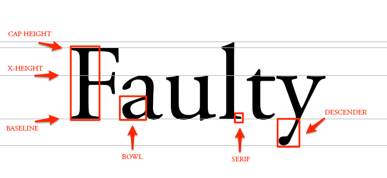

# Typography

Typography is the art and technique of arranging type, type meaning letters and characters

## Typefaces

A typeface is a set of one or more fonts that share common design features. Each font of a typeface has a specific weight, style, condensation, width, slant, italicization, ornamentation, and designer or foundry (and formerly size, in metal fonts)

In Typography, _Typeface_ is the overall design of an entire family of fonts like _Helvetica_ and the _Font_ is the graphical representation of text characters, like font size, font weight, italic, boldness, etc.

## Font

A font is a particular size, weight, and style of a typeface. Each font was a matched set of type, one piece (called a "sort") for each glyph, and a typeface consisting of a range of fonts that shared an overall design

### Font Properties

- **Font Family**: A group of fonts that share common characteristics. For example, Arial, Helvetica, and Verdana are all part of the sans-serif font family
- **Font Style**: The style of the font, such as regular, _italic_, or oblique
- **Font Weight**: The thickness of the font characters, such as light, normal, **bold**, or `100` to `900`
- **Font Size**: The size of the font, usually defined in pixels, `ems`, or `rems`
- **Line Height**: The vertical space between lines of text
- **Letter Spacing**: The space between characters in a word
- **Text Transform**: The transformation of text, such as uppercase, lowercase, or capitalize

### Font Types

Font families are divided into different types based on their appearance. The most common font types are:

1. **Serif**: These have extra details on the ends of the main strokes of the letters. They are considered more traditional and are often used in print. Examples include Times New Roman and Georgia
   - Easier to read

2. **Sans-serif**: They have straight ends to letters, and therefore have much cleaner design. They are considered more modern and are often used on the web. Examples include Arial, Verdana, and Helvetica
   - Low resolution screens
   - Small font sizes

3. **Monospace**: Every letter in a monospace (for fixed-width) font is the same width, which can be useful for code snippets

4. **Cursive**: These fonts are designed to look like handwriting. They are often used for decorative purposes. Examples include Comic Sans and Brush Script

5. **Fantasy**: These fonts are decorative and often used for titles. Examples include Impact and Papyrus

### Font Formats

- **TrueType Font (TTF)**: Developed by Apple and Microsoft in the late 1980s, TrueType fonts are the most common font format today. They are compatible with both Windows and Mac OS X

- **OpenType Font (OTF)**: Developed by Adobe and Microsoft in the late 1990s, OpenType fonts are an extension of TrueType fonts. They can contain more characters than TrueType fonts and support advanced typographic features

- **Web Open Font Format (WOFF)**: Developed by the W3C in 2009, WOFF is a font format optimized for the web. It is supported by all modern browsers

- **Embedded OpenType Font (EOT)**: Developed by Microsoft in 1997, EOT is a font format optimized for Internet Explorer. It is supported by all versions of Internet Explorer

- **Scalable Vector Graphics Font (SVG)**: Developed by the W3C in 2003, SVG is a font format based on the SVG standard. It is supported by all modern browsers

Best Practices:

- Use WOFF2 for modern browsers
- Use WOFF for older browsers
- Use TTF/OTF for desktop applications
- Use SVG for vector graphics

## Typeface vs Font

| Typeface                                                       | Font                                                         |
| -------------------------------------------------------------- | ------------------------------------------------------------ |
| A typeface is a family of fonts                                | A font is a single weight and width of a typeface            |
| A typeface is a design                                         | A font is a file                                             |
| A typeface is a collection of characters, letters, and numbers | A font is a file that tells the computer how to display text |

## Anatomy of a Typeface



1. **Baseline**: The line where the letters sit

2. **Cap Height**: The distance from the baseline to the top of the capital letter

3. **X-height**: Located in between the baseline and the cap height, it's the height of the body of the lowercase letter. (In this case, it's the letters 'a','u', and 'y')

4. **Bowl**: The curved part of the character that encloses the circular or curved parts of some letters, like 'd,' 'b,' 'o,' 'D,' and 'B.' (In this case, it's that round shape sticking off the letter 'a')

5. **Serif**: The slight projection finishing off a stroke of a letter in certain typefaces. (In this case, it's that little foot sticking off the letter 'l')

6. **Descender**: The longest point on a letter that falls beyond the baseline

7. **Ascender**: The part of a lowercase letter that extends above the x-height

8. **Stem**: The main vertical stroke of a letter

9. **Counter**: The enclosed or partially enclosed circular or curved negative space of a letter

### Terms

- **Kerning**: The adjustment of space between individual letter forms
- **Leading**: The space between lines of text
- **Tracking**: The overall spacing between characters in a block of text
- **Widows**: A single word on a line by itself at the end of a paragraph
- **Orphans**: A single word on a line by itself at the beginning of a paragraph
- **Rivers**: Gaps in text that form a pattern of white space that runs diagonally down a block of text
- **Ligature**: Two or more letters are joined as a single glyph
- **Dingbat**: A decorative character or symbol
- **Glyph**: A specific form of a character

## Variable Fonts

- **DECOVAR Font**

```css
@font-face {
  font-family: "Source Sans Variable";
  src: url("ss-variable.woff") format("woff-variations");
  font-weight: 200 700;
}

h1 {
  font-family: "Source Sans Variable";
  font-weight: 658.756;
}
```
