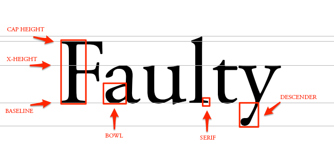

# Typography

Typography is the art and technique of arranging type, type meaning letters and characters.

## Typeface vs Font

## Anatomy Of A Typeface



1. Baseline: The line where the letters sit.
2. Cap Height: The distance from the baseline to the top of the capital letter.
3. X-height: Located in between the baseline and the cap height, it's the height of the body of the lowercase letter. (In this case, it's the letters 'a','u', and 'y').
4. Bowl: The curved part of the character that encloses the circular or curved parts of some letters, like 'd,' 'b,' 'o,' 'D,' and 'B.' (In this case, it's that round shape sticking off the letter 'a')
5. Serif: The slight projection finishing off a stroke of a letter in certain typefaces. (In this case, it's that little foot sticking off the letter 'l')
6. Descender: The longest point on a letter that falls beyond the baseline.

## Variable Fonts

- **DECOVAR Font**

```css
@font-face {
  font-family: "Source Sans Variable";
  src: url("ss-variable.woff") format("woff-variations");
  font-weight: 200 700;
}

h1 {
  font-family: "Source Sans Variable";
  font-weight: 658.756;
}
```
