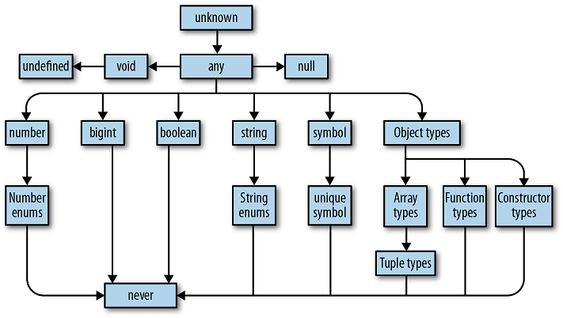

# TypeScript

May be, superset of JavaScript...

## Introduction

TypeScript has _type safety_[^1].

[^1]: Using types to prevent programs from doing invalid things.[1](https://learning.oreilly.com/library/view/programming-typescript/9781492037644/ch01.html#idm45665077132712)

- strongly typed

- wrapper around typescript

- typescript --> compile--> JavaScript

```bash
# Initialize a new NPM project (follow the prompts)
npm init

# Install TSC, TSLint, and type declarations for NodeJS
npm install --save-dev typescript tslint @types/node

# Install Lite Server, for live reload
npm install lite-server --save-dev
```

## TypeScript Compiler

### How programs are compiled

Ans: Programs are files that contain a bunch of text. That text is parsed by a special program called a _compiler_, which transforms it into an **abstract syntax tree (AST)**, a data structure that ignores things like whitespace, comments, and where you stand on the tabs versus spaces debate. The compiler then converts that _AST_ to a lower-level representation called _bytecode_. You can feed that bytecode into another program called a _runtime_ to evaluate it and get a result.

### Compiler

- TypeScript dose not compile straight to bytecode.

- TypeScript **compiles** to… **JavaScript** code! This JavaScript code is run in browser or NodeJS.

> Note: JavaScript compilers and runtime tend to be smashed into a single program called an engine; as a programmer, this is what you’ll normally interact with. It’s how V8 (the engine powering NodeJS, Chrome, and Opera), SpiderMonkey (Firefox), JSCore (Safari), and Chakra (Edge) work, and it’s what gives JavaScript the appearance of being an interpreted language.

#### tsconfig.json

Initialize project with TypeScript compiler. The below line generates [`tsconfig.json`](https://www.typescriptlang.org/docs/handbook/tsconfig-json.html) file.

```bash
tsc --init
```

`tsconfig.json` file contains:

```json
{
  "compilerOptions": {
    "lib": ["es2015"],
    "module": "commonjs",
    "outDir": "dist",
    "sourceMap": true,
    "strict": true,
    "target": "es2015"
  },
  "include": ["src"]
}
```

- JavaScript file is generated even when there are compiler errors. To over come this use `"noEmitOnError": true` in `tsconfig.json` file.

- `"noImplicitAny": true` :- complain about implicit `any` type (enabled by default when in strict mode).

- `"strictNullChecks": true` :- complier gives error if a variable does not have a value assigned to it.

- `"noUnusedParameters": true"` :- error if parameters are not used.

- check `"sourceMap": true` :- it creates a map file, this will allow debugging typescript in the browser itself.

> [Compiler Options](https://www.typescriptlang.org/docs/handbook/compiler-options.html) - For more compiler options.

### tslint.json

The following command will generate a _tslint.json_ file with a default TSLint configuration:

```bash
./node_modules/.bin/tslint --init
```

```json
{
  "defaultSeverity": "error",
  "extends": ["tslint:recommended"],
  "rules": {
    "semicolon": false,
    "trailing-comma": false
  }
}
```

> For the full list of available rules, head over to the [TSLint documentation](https://palantir.github.io/tslint/rules/). You can also add custom rules, or install extra presets (like for [ReactJS](https://www.npmjs.com/package/tslint-react)).

### Project's folder structure

```bash
project/
├──node_modules/
├──src/
│ └──index.ts
├──package.json
├──tsconfig.json
└──tslint.json
```

> - Install `ts-node`, and use it to compile and run your TypeScript with a single command.
>
> - Use a scaffolding tool like `typescript-node-starter` to quickly generate your folder structure for you.

## Data Types

A set of values and the things you can do with them.

### Default Types

1. `any` (default type) {[to avoid this](####tsconfig.json)}

2. [`unknown`](https://learning.oreilly.com/library/view/programming-typescript/9781492037644/ch03.html##unknown)

3. `boolean`: `true` or `false`

   ```typescript
   let d: boolean = true;
   let e: true = true;
   ```

4. `number` (float)

   ```typescript
   let variable: number;
   let vars: 24 = 24;
   ```

5. `bigint`: `2^53` numbers (_new_)

6. `string`

7. `symbol`

8. [`Objects`](###Objects)

### TypeScript's type hierarchy:



### Type Aliases

array (by default members are type of object),

(only in TS):-->

tuples ==> order is important

`enum` ==> incremental numbers

union types

- The variable can be of two or more types

  ```typescript
  let myAge: number | string = 27;
  myAge = "27";

  myAge = true; // will cause error
  ```

`typeof` variable;

- check type of variable:

  ```typescript
  if (typeof variable == "string") {
    console.log(variable + " is a string.");
  }
  ```

`never`

- for functions which never returns anything:

  ```typescript
  function neverReturn(): never {
    throw new Error("An error!");
  }
  ```

Nullable types

- To do this add `"strictNullChecks": false` to `tsconfig.json` file.

- Now if we try to assign null to any other type variable, we get an error.

- To make variable null, add union to it:

  ```typescript
  let a: number | null = 12;
  ```

> Note: once a variable is set to null, will it give error if we assign different value to it.

#### TYPE SYSTEM

> A set of rules that a type checker uses to assign types to your program.
>
> In general, it is good style to let TypeScript infer as many types as it can for you, keeping explicitly typed code to a minimum.

```typescript
// array of heterogeneous data
let arr: any[] = ["a", 25];

// tuples
let tup: [string, number] = ["yes", 99];

// enum
enum Color {
  Gray, // 0
  Green = 100,
  Blue, // 2
}
let myColor: Color = Color.Green;
```

## Functions

specify function return type:

```typescript
function returnMyName(): string {
  return "Prabhu";
}

function voidFunc(): void {
  console.log("Hello!");
}
```

argument type:

```typescript
function returnMyName(name: string): string {
  return name;
}
```

functions as types:

```typescript
let myName: (a: string) => string;
myName = returnMyName;
```

default parameters

### Objects

```typescript
let userData: { name: string; age: string; wh: number } = {
  name: "Max",
  age: "22",
  wh: 22,
};
```

complex objects

```typescript
let complex: { data: number[]; output: (all: boolean) => number[] } = {
  data: [100, 3.99, 10],
  output: function (all: boolean): number[] {
    return this.data;
  },
};
```

[type alias](###Type Aliases)

- Create an object type and use it multiple times

  ```typescript
  type Complex = { data: number[]; output: (all: boolean) => number[] };

  let complex: Complex = {
    data: [100, 3.99, 10],
    output: function (all: boolean): number[] {
      return this.data;
    },
  };
  ```

### ES6 Features

- `let`, `const` and `var`

- **Arrow Functions**

- **Rest & Spread**

- **`Destructuring`** _Arrays_ and _Objects_

  ```typescript
  // arrays
  const myHobbies = ["Cooking", "Sports"];
  const [hobby1, hobby2] = myHobbies;

  // object
  const userData = { userName: "Max", age: 27 };
  const { userName: altName1, age: altName2 } = userData;
  ```

- Template Literals

  ```typescript
  const userName = "Max";
  const greetings = `This is a heading-
  I'm ${userName}.
  This is cool!`;
  ```

- symbols, iterators, generators

## Class

- There are some changes between _TypeScript_ class and _ES6_ class.

- Access modifier can be used `public`(default), `private`, `protected`

- syntax:

  ```typescript
  class Person {
    name: string; // public (default)
    private typ: string;
    protected age: number;

    // userName will automatically assigned to this.userName
    constructor(
      name: string,
      typ: string,
      age: number,
      public userName: string
    ) {
      this.name = name;
      this.typ = typ;
      this.age = age;
    }
  }

  const pers1 = new Person("Max", "admin", 27, "maxin");
  ```

- Methods don't have function keyword.

### Inheritance

- syntax:

  ```typescript
  class Max extends Person {
    name = "Max";

    constructor(userName: string) {
      super("Max", "Hulk", 2, userName);
    }
  }

  const newMax = new Max("maxin");
  ```
