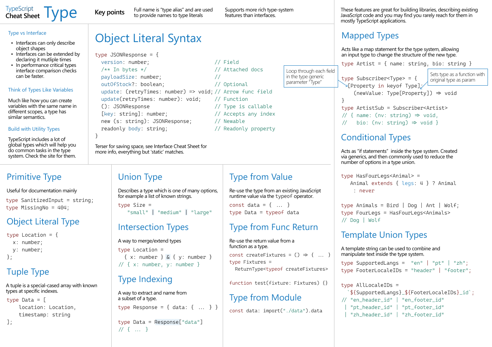
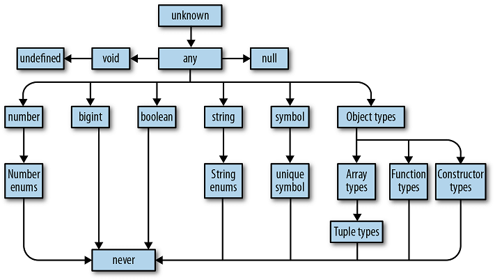
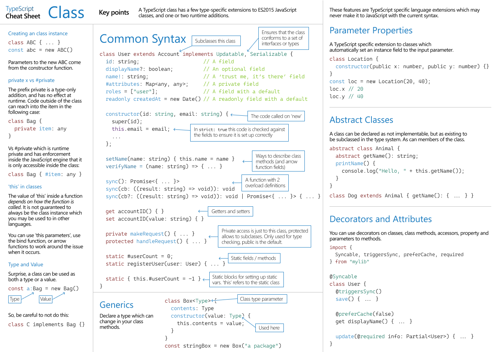

# TypeScript

TypeScript is JavaScript with syntax for types

It was developed by Microsoft in 2012 and is a superset of JavaScript

## Introduction

TypeScript has _type safety_ (using types to prevent programs from doing invalid things)

- Strongly typed

- Wrapper around JavaScript

- TypeScript --compiles to--> JavaScript

- TypeScript files have `.ts` extension

### TypeScript Features

- Static Type checking

- Can use Non-JavaScript features like [Interface](#interface) or [Generics](#generic-types)

- Use Next-gen JavaScript features now and compile it to older versions

- Meta-Programming features like [Decorators](#decorators)

- **TypeScript preserves the runtime behaviour of JavaScript**

- Type of a variable will be implicitly inferred if it is initialized during declaration

## TypeScript Compiler

JavaScript runtimes (browsers, Node.js, etc.) do not understand TypeScript code, so it must be compiled to JavaScript before it can be executed

- New versions of some runtimes can understand TypeScript code directly (e.g. [Deno](https://deno.com/), [Bun](https://bun.sh/))

TypeScript code needs to be compiled to JavaScript code before it can be executed in a browser or Node.js (or any other JavaScript runtime)

- TypeScript's [`tsc`](https://www.npmjs.com/package/typescript) CLI compiles TypeScript code to JavaScript
- It is a _transpiler_ (a compiler that converts source code from one language to another)

### How programs are compiled

Ans: Programs are files that contain a bunch of text. That text is parsed by a special program called a _compiler_, which transforms it into an **abstract syntax tree (AST)**, a data structure that ignores things like whitespace, comments, and where you stand on the tabs versus spaces debate. The compiler then converts that _AST_ to a lower-level representation called _bytecode_. You can feed that bytecode into another program called a _runtime_ to evaluate it and get a result

- TypeScript dose not compile straight to bytecode

- TypeScript **compiles** to **JavaScript** code! This JavaScript code is run in browser or [Node.js](../Node.js)

> [!NOTE]
> JavaScript compilers and runtime tend to be smashed into a single program called an engine; as a programmer, this is what you'll normally interact with. It's how V8 (the engine powering NodeJS, Chrome, and Opera), SpiderMonkey (Firefox), JSCore (Safari), and Chakra (Edge) work, and it's what gives JavaScript the appearance of being an interpreted language

### Using TypeScript Compiler

1. Install TypeScript compiler as global package

2. Setup TypeScript in individual projects (recommended) and use npm scripts or [`gulp`](../Tools/Gulp.js/Gulp.js.md) or any other tool

   ```bash
   # initialize a new NPM project (follow the prompts)
   npm init

   # install TypeScript and type declarations for NodeJS
   npm install --save-dev typescript @types/node

   # create a new file called index.ts
   touch index.ts

   # add some TypeScript code to index.ts
   echo "console.log('Hello, TypeScript!');" > index.ts

   # compile the TypeScript code to JavaScript
   npx tsc index.ts

   # it will create a new file called index.js
   # run the JavaScript code
   node index.js
   ```

3. You can install TypeScript globally and use it to compile TypeScript files

   ```bash
   # install TypeScript globally
   npm install -g typescript

   # compile the TypeScript code to JavaScript
   tsc index.ts
   ```

4. You can watch for changes in TypeScript files and compile them automatically

   ```bash
   # watch for changes in TypeScript files
   tsc index.ts --watch
   ```

### TypeScript Compiler Configuration

Using `tsconfig.json` or `jsconfig.json` file, we can configure the TypeScript compiler to compile the TypeScript code in a specific way

The below command generates [`tsconfig.json`](https://www.typescriptlang.org/docs/handbook/tsconfig-json.html) file:

```bash
# will create a tsconfig.json file
npx tsc --init

# after initializing, TypeScript compiler
# will look into this file for compilation configuration
npx tsc
```

`tsconfig.json` (recommended base) file contains:

```json
{
  "compilerOptions": {
    "target": "es2016",
    "module": "commonjs",
    "esModuleInterop": true,
    "forceConsistentCasingInFileNames": true,
    "strict": true,
    "skipLibCheck": true
  },
  "display": "Recommended",
  "$schema": "https://json.schemastore.org/tsconfig"
}
```

Common Compiler Options:

- `"target":"es2016` (default `es5`): Set the JavaScript language version for emitted JavaScript and include compatible library declarations
- `"module": "commonjs"`: Specify module code generation
- `"esModuleInterop": true`: Interop with CommonJS/AMD/UMD modules
- `"forceConsistentCasingInFileNames": true`: Ensure that casing is correct in imports
- `"strict": true`: Enable all strict type-checking optionsA
- `"skipLibCheck": true`: Skip type checking of all declaration files (`.d.ts`)
- `include: ["src/**/*"]`: Files to include in compilation
- `exclude: ["node_modules"]`: Files to exclude from compilation
- `outDir: "dist"`: Redirect output structure to the directory
- `onEmit: true`: Whether to emit JavaScript files or not after compilation

[More `tsconfig.json` options](https://www.typescriptlang.org/tsconfig/) and [Centralized Recommendations for TSConfig bases](https://github.com/tsconfig/bases) are available

_Example:_ Sample Node.js Project

```json
{
  "compilerOptions": {
    "module": "NodeNext",
    "moduleResolution": "NodeNext",
    "target": "ES2020",
    "sourceMap": true,
    "outDir": "dist"
  },
  "include": ["src/**/*"]
}
```

- Recommended options:

```json
{
  "compilerOptions": {
    /* Base Options: */
    "skipLibCheck": true, // Skip type checking of declaration files
    "target": "es2022", // Specify ECMAScript target version
    "esModuleInterop": true, // Emit additional JavaScript to ease interop with CommonJS modules
    "allowJs": true, // Allows JavaScript files to be imported into the TypeScript project
    "resolveJsonModule": true, // Allows JSON files to be imported into your TypeScript project
    "moduleDetection": "force", // Treat all `.ts` files as a module, instead of a script
    "isolatedModules": true, // Ensure that each file can be safely transpiled without relying on other files

    /* Strictness */
    "strict": true, // Enable all strict type-checking options
    "noUncheckedIndexedAccess": true, // Disallow unchecked access to indexed properties

    /* If transpiling with tsc: */
    "module": "NodeNext",
    "outDir": "dist",
    "sourceMap": true,
    "verbatimModuleSyntax": true,

    /* AND if you're building for a library: */
    "declaration": true,

    /* AND if you're building for a library in a monorepo: */
    "composite": true,
    "declarationMap": true,

    /* If NOT transpiling with tsc: */
    "module": "Preserve",
    "noEmit": true,

    /* If your code runs in the DOM: */
    "lib": ["es2022", "dom", "dom.iterable"],

    /* If your code doesn't run in the DOM: */
    "lib": ["es2022"]
  },
  "include": ["src/**/*"],
  "$schema": "https://json.schemastore.org/tsconfig"
}
```

#### TypeScript Doesn't Polyfill

`target` option in `tsconfig.json` file is used to specify the ECMAScript version of the output JavaScript files

- While `target` can transpile newer syntaxes into older environments, it won't do the same with API's that don't exist in the target environment

- The target environment will throw an error if the API doesn't exist, you configure the environment your code executes in with `lib` option

- We need to configure polyfills for the target environment

### TypeScript Compiler Flags

You can pass flags to the TypeScript compiler to change its behaviour instead of using a `tsconfig.json` file

- `--init`: Initialize a TypeScript project and create a `tsconfig.json` file
- `--watch`: Watch input files and trigger recompilation on changes
- `--noEmitOnError`: Do not emit outputs if any errors were reported
- `--strict`: Enable all strict type-checking options
- `--noImplicitAny`: Raise error on expressions and declarations with an implied `any` type

## TypeScript Basics

TypeScript uses annotations to help you catch errors and bugs in your code

- TypeScript annotations are used to define the type of a variable, function, or class
- TypeScript annotations are optional, but they are recommended to help you catch errors and bugs in your code

Annotations will often use the `:` character, this is used to tell TypeScript that a variable or function parameter is of a certain type

```typescript
// TypeScript annotation
let name: string = "Max";
```

### Type Annotations

Type annotations are used to explicitly specify the type of a variable, function parameter, or function return value

```typescript
// variable annotation
let name: string = "Max";
let age: number = 27;

// function annotation
function greet(name: string): string {
  return `Hello, ${name}`;
}
```

### Type Inference

TypeScript can infer the type of a variable based on its value

- If you initialize a variable with a value, TypeScript will infer the type of the variable based on the value
- If you don't initialize a variable with a value, TypeScript will infer the type of the variable as `any`

```typescript
let name = "Max"; // TypeScript infers the type of name as `string`
let age; // TypeScript infers the type of age as `any`
```

## Type System

A set of rules that a type checker uses to assign types to your program

- In general, it is good style to let TypeScript infer as many types as it can for you, keeping explicitly typed code to a minimum

```typescript
// array of heterogeneous data
let arr: any[] = ["a", 25];

// tuples
let tup: [string, number] = ["yes", 99];

// enum
enum Color {
  Gray, // 0
  Green = 100,
  Blue, // 2
}
let myColor: Color = Color.Green;
```

### Type Casting

Type casting is a way to tell TypeScript that you know more about the type of a value than TypeScript does and that you want to treat it as a different type

- Type casting is done using the `as` keyword
- Type casting is also known as _type assertion_

```typescript
const userInp = document.getElementById("username");

// Type: HTMLElement
// Error: as HTMLElement is generic, hence
// not all HTML elements have the 'value' property
userInp.value = "hello";

// Type Casting
const userInp = <HTMLInputElement>document.getElementById("username")!;

// alternative syntax
const userInp = document.getElementById("username") as HTMLInputElement;

userInp.value = "hello";
```

- Nullable:

```typescript
const userInp = document.getElementById("username");

if (userInp) {
  (userInp as HTMLInputElement).value = "hello";
}
```

### Type Checking

TypeScript can check the type of a variable at runtime

- `typeof` variable;
  - Check type of variable:

  ```typescript
  if (typeof variable == "string") {
    console.log(variable + " is a string.");
  }
  ```

Nullable types

- To do this add `"strictNullChecks": false` to `tsconfig.json` file

- Now if we try to assign null to any other type variable, we get an error

- To make variable null, add union to it:

  ```typescript
  let a: number | null = 12;
  ```

> Note: once a variable is set to null, will it give error if we assign different value to it

### Type Guard

Type guards are some expressions that perform runtime checks that guarantee the type in some scope

- Base types

```typescript
type Combinable = string | number;

function add(a: Combinable, b: Combinable) {
  // This will throw an error
  return a + b;
}

function add(a: Combinable, b: Combinable) {
  // Type guard
  if (typeof a === "number" || b === "number") {
    return a.toString() + b.toString();
  }
  return a + b;
}
```

- User defined types

```typescript
type Admin = {
  name: string;
  privileges: string[];
};

type Employee = {
  name: string;
  startDate: Date;
};

type ElevatedEmployee = Admin | Employee;

function show(a: ElevatedEmployee) {
  console.log(a.name);

  // Type guards
  if ("privileges" in a) {
    console.log(a.privileges);
  }

  if ("startDate" in a) {
    console.log(a.startDate);
  }
}
```

- Class

```typescript
class Car {
  drive() {
    console.log("Driving...");
  }
}

class Truck {
  drive() {
    console.log("Driving Truck...");
  }

  loadCargo(amount: number) {
    console.log(amount);
  }
}

type Vehicle = Car | Truck;

const v1 = new Car();
const v2 = new Truck();

function useVehicle(v: Vehicle) {
  v.drive();

  if (v instanceof Truck) {
    v.loadCargo(21);
  }
}
```

### Wider vs. Narrower Types

TypeScript uses the concept of _wider_ and _narrower_ types to determine the type of a variable

Some types are _wider_ than others, `string` is wider than the literal string `"small"`. This is because `string` can be any string, while `"small"` can only be the string `"small"`. Hence, `"small"` is a _narrower_ type than `string`

It is similar to the concept of 'subtypes' and 'supertypes' in set theory

Narrowing in TypeScript lets us take a wider type and make it narrower using runtime code

Narrowing with `typeof`, `instanceof`, and `in`:

```typescript
// you can narrow down the type of a variable
const getAlbumYear = (year: string | number) => {
  if (typeof year === "string") {
    console.log(`The album was released in ${year.toUppercase()}.`); // `year` is string
  } else if (typeof year === "number") {
    console.log(`The album was released in ${year.toFixed(0)}.`); // `year` is number
  }
};

// using `in` operator
const getAlbumYear = (year: string | number) => {
  if ("toUppercase" in year) {
    console.log(`The album was released in ${year.toUppercase()}.`); // `year` is string
  } else {
    console.log(`The album was released in ${year.toFixed(0)}.`); // `year` is number
  }
};

// using `instanceof` operator
class Album {
  constructor(public year: number) {}
}

const getAlbumYear = (year: Album | string) => {
  if (year instanceof Album) {
    console.log(`The album was released in ${year.year}.`); // `year` is Album
  } else {
    console.log(`The album was released in ${year}.`); // `year` is string
  }
};
```

### Declaration Merging

Declaration merging is a feature of TypeScript that allows you to combine multiple declarations of the same name into a single definition

- It is used to extend interfaces, functions, classes, and enums
- When multiple interfaces with the same name in the same scope are created, TypeScript automatically merges them

```typescript
interface User {
  name: string;
}

interface User {
  age: number;
}

let user: User = {
  name: "Max",
  age: 27,
};
```

## Data Types

A set of values and the things you can do with them. TypeScript has several built-in data types that you can use to define variables




### TypeScript Type Hierarchy

TypeScript has a type hierarchy that is used to define the types of variables, functions, and classes

- The type hierarchy is a tree-like structure that shows the relationships between different types



### Basic Types

1. `number` (floating point): All numbers, no differentiation between integers or floats

   ```typescript
   let variable: number;

   variable = 1;
   variable = 5.3;

   let vars: 24 = 24;
   ```

2. `string`: All text values

   ```typescript
   let name: string;

   name = "Same";
   name = "As";
   name = `JavaScript`;
   ```

3. `boolean`: Just like JavaScript, `true` or `false`

   ```typescript
   let d: boolean = true;
   let e: true = true; // valid as `true` is a subtype of `boolean`

   e = false; // Error: Type 'false' is not assignable to type 'true'
   ```

4. `bigint`: Special numeric type that represents whole numbers larger than `2^53 - 1`
   - `n` suffix is used to create a `bigint` value

   ```typescript
   let big: bigint = 100n;
   ```

5. `symbol`: Unique and immutable value that may be used as an identifier for object properties

   ```typescript
   const sym1: symbol = Symbol("key");

   let obj = {
     [sym1]: "value",
   };

   console.log(obj[sym1]); // "value"
   ```

6. `null`: Represents an intentional absence of any object value

7. `undefined`: Represents an uninitialized value

8. `any` (default type): Any kind of value, no specific type assignment
   - Avoid using `any` as it defeats the purpose of using TypeScript (it is not type-safe)
   - If you don't specify a type, TypeScript will infer the type as `any`

   ```typescript
   // These variables can be of any type
   let a: any;

   // Implicit cast to type `any`
   let variable;

   variable = 1;
   variable = "Name";
   ```

You can express much more complex types (arrays, objects, etc.) using a combination of these basic types

### Unknown Type

Unknown is the [widest type](#wider-vs-narrower-types) in TypeScript. It represents something that we don't know what it is

- `unknown` is preferred choice to represent a truly unknown value, like data coming from outside source

```typescript
let user: unknown;

user = 25;
user = "Name";

const fn = (input: unknown) => {};

// Anything is assignable to unknown!
fn("hello");
fn(42);
fn(true);
fn({});
fn([]);
fn(() => {});
```

- Error is thrown if we try to assign a variable of `unknown` type to any other variable

```typescript
let user: unknown;
let userName: string;
let userAge: any;

user = 25;

userName = user; // Will throw an error

userAge = user; // No error
```

`any` vs. `unknown`:

- `any` doesn't fit the definition of 'wide' and 'narrow' types
- It breaks the type system. It's not really a type al all - it's a way to opt out of the type checking
- `any` can be assigned to any type, and any type can be assigned to `any`
- `unknown` is a type-safe counterpart of `any`. It is a type that is safe to assign to, but not from

`unknown` means _"I don't know what this is"_, while `any` means _"I don't care what this is"_

### Never Type

The `never` type represents the type of values that never occur

- It is the [narrowest type](#wider-vs-narrower-types) in TypeScript
- It is used to represent the type of values that never occur, like a function that never returns
- It is a subtype of all types, but no type is a subtype of `never`
- You cannot assign anything to `never`, except `never` itself

```typescript
// the function never returns a value
function generateError(): never {
  throw new Error("An error occurred!");
}

const fn = (input: never) => {};

fn("hello"); // Error: Argument of type 'string' is not assignable to parameter of type 'never'

fn(generateError()); // OK as `generateError()` returns never
```

[`void`](#void-type) vs. `never`:

- `void` is a type that represents the absence of a value
- `never` is a type that represents a value that never occurs

```typescript
// the function returns nothing
function printName(name: string): void {
  console.log(name);
}

// the function never returns a value
function generateError(): never {
  throw new Error("An error occurred!");
}
```

### Void Type

The `void` type is used to represent the absence of a value

```typescript
function printName(name: string): void {
  console.log(name);
}
```

## Type Aliases

It is a way to give a name to a type, and use that name wherever the type is needed

```typescript
// creating a type alias
type Combinable = number | string;

type ConversionResType = "as-number" | "as-text";

function combine(
  inp1: Combinable, // using type alias
  inp2: Combinable,
  resultConversion: ConversionResType
) {
  // ...
}
```

## Interface

An interface is a way to define a contract in your code and is used to define the structure of an object

- It is core part of TypeScript (shipped with first version)

```typescript
type Album = {
  title: string;
  artist: string;
  releaseYear: number;
};

interface Album {
  title: string;
  artist: string;
  releaseYear: number;
}
```

- Interfaces are used to define the structure of an object

```typescript
interface Car {
  seats: number;
  color: string;

  printCar(): void;
}

const newCar: Car = {
  color: "Red",
  seats: 5,
  printCar() {
    console.log(this.seats + this.color);
  },
};
```

- Interfaces have the ability to extend other interfaces

```typescript
interface Admin {
  name: string;
  privileges: string[];
}

interface Employee {
  name: string;
  startDate: Date;
}

// has all properties of Admin and Employee
interface ElevatedEmployee extends Admin, Employee {}

const emp: ElevatedEmployee = {
  name: "Java",
  privileges: ["None"],
  startDate: new Date(),
};
```

- Prefer `interface extends` over [Intersections](#intersection-types) as it dose not provide errors if same key is used in both interfaces with different types

- `interface extends` has better performance

```typescript
type User1 = {
  age: number;
};

type User2 = {
  age: string;
};

type User = User1 & User2; // no error and `age` is of type `never`

interface User1 {
  age: number;
}

interface User extends User1 {
  // Interface 'User' incorrectly extends interface 'User1'.
  //  Types of property 'age' are incompatible
  //    Type 'string' is not assignable to type 'number'.
  age: string;
}
```

Modifiers:

- `readonly` properties
- Optional properties and functions

```typescript
interface Car {
  seats: number;
  color?: string;

  printCar?(a: string): void;
}
```

Interfaces for functions (Function Types):

```typescript
// type AddFunc = (a: number, b: number) => number;

// Same with interface
interface AddFunc {
  (a: number, b: number): number;
}
```

`type` vs `interface`:

- By default, use `type` unless you need to use `interface extends`

| Interfaces                                  | [Type Aliases](#type-aliases)                         |
| ------------------------------------------- | ----------------------------------------------------- |
| Preferred for objects and classes           | Preferred for functions and everything else           |
| Open for extensions                         | Fixed object structure                                |
| Supports Inheritance                        | Can be done using [Intersection](#intersection-types) |
| [Declaration merging](#declaration-merging) | No declaration merging                                |


- `abstract` vs `interface`

## Arrays

To define an [array](../JavaScript.md#array) in TypeScript, you can use the `[]` syntax

```typescript
let names: string[] = ["Max", "Manu"];

// TypeScript will infer the type of the array
let names = ["Max", "Manu"];

names.push(3); // Error: Argument of type 'number' is not assignable to parameter of type 'string'
```

Another way to define an array is to use the `Array` [generic type](#generic-types)

```typescript
let names: Array<string> = ["Max", "Manu"];
```

- You can use `readonly` modifier to make an array immutable, mutable functions like `push`, `pop`, `splice`, etc. are not allowed

```typescript
const readOnlyGenres: readonly string[] = ["rock", "pop", "unclassifiable"];

readOnlyGenres.push("jazz"); // Error: Property 'push' does not exist on type 'readonly string[]'

// Alternative syntax using Array type
const readOnlyGenres: ReadonlyArray<string> = ["rock", "pop", "unclassifiable"];
```

### Tuple Type

Tuples let you specify an array with a fixed number of elements, where each element has its own type

- Order is important

_Example:_

```typescript
// typle
let album: [string, number] = ["Rubber Soul", 1965];

// Error is thrown
album[0] = 1965; // Error: Type 'number' is not assignable to type 'string'
```

- You can add elements to a tuple, but it defeats the purpose of using tuple over an array. Remove `push` function from tuple:

  ```typescript
  type StrictTuple<T extends any[]> =
    Omit<T, keyof any[]> extends infer O ? { [K in keyof O]: O[K] } : never;

  const x: StrictTuple<[number, string]> = [1, ""]; // {0: number; 1: string }

  x[1] = "okay";
  x[0] = 123;
  x.push(123); // error!

  //~~~~ Property 'push' does not exist on type { 0: number; 1: string; }
  ```

- Second option:

  ```typescript
  const testArray: readonly [number, string] = [10, "test"] as const;
  testArray.push("test"); // error
  ```

## Enum Type

Enums are used to define a set of named constants

```typescript
enum DIRECTION {
  Up,
  Down,
  Left,
  Right,
}

// Up has value: 0
// All of the following members are auto-incremented
```

- Initialize values:

```typescript
enum DIRECTION {
  Up = 1,
  Down,
  Left,
  Right,
}

// Up has value: 1
// Down has value: 2
```

- If string is used instead of numbers to initialize, we need to provide value to all the elements

```typescript
enum ROLES {
  ADMIN = "ADMIN",
  READ_ONLY = 0,
  AUTHOR,
}
```

## Objects

Same as [JavaScript objects](../JavaScript.md#), we can add types to the keys and values of the object

_Example:_

```typescript
let userData: { name: string; age: string; wh: number } = {
  name: "Max",
  age: "22",
  wh: 22,
};
```

- Complex objects

  ```typescript
  let complex: { data: number[]; output: (all: boolean) => number[] } = {
    data: [100, 3.99, 10],
    output: function (all: boolean): number[] {
      return this.data;
    },
  };
  ```

- Create an object type and use it multiple times

  ```typescript
  type Complex = { data: number[]; output: (all: boolean) => number[] };

  let complex: Complex = {
    data: [100, 3.99, 10],
    output: function (all: boolean): number[] {
      return this.data;
    },
  };
  ```

- Use `?` to make a key optional

  ```typescript
  type User = {
    name: string;
    age?: number;
  };

  let obj: User = {
    name: "Max",
    age: 27,
  };

  let obj2: User = {
    name: "Max",
  };
  ```

### Dynamic Object Keys

In JavaScript, we can start with an empty object and add keys and values to it dynamically, but if we do the same in TypeScript, we get an error

```typescript
const albumAwards = {};

albumAwards.Grammy = true; // Error: Property 'Grammy' does not exist on type '{}'
```

- We're 'indexing' into `albumAwards` with a string key, `Grammy`, and assigning it a value
- TypeScript doesn't know what keys `albumAwards` will have, so it throws an error
- To fix this, we can use an _index signature_
- `boolean` not allowed for keys

```typescript
const albumAwards: {
  [index: string]: boolean;
} = {};

albumAwards.Grammy = true;
albumAwards.MercuryPrize = false;
albumAwards.Billboard = true;
```

- The `[index: string]: boolean` syntax is an index signature
- It tells TypeScript that `albumAwards` will have any number of keys, all of which will be strings, and all of which will have boolean values

It is better to use [`Record`](#utility-types) utility type to define an object with dynamic keys

- `Record` utility type supports union type for keys, but an index signature does not

```typescript
const albumAwards: Record<string, boolean> = {};

albumAwards.Grammy = true;

// using union type for keys
const albumAwards1: Record<"Grammy" | "MercuryPrize" | "Billboard", boolean> = {
  Grammy: true,
  MercuryPrize: false,
  Billboard: true,
};

const albumAwards2: {
  [index: "Grammy" | "MercuryPrize" | "Billboard"]: boolean;
  // An index signature parameter type cannot be a literal type or generic type. Consider using a mapped object type instead
} = {
  Grammy: true,
  MercuryPrize: false,
  Billboard: true,
};
```

Combining know and dynamic keys:

```typescript
// using type alias
type BaseAwards = "Grammy" | "MercuryPrize" | "Billboard";

type ExtendedAlbumAwards = Record<BaseAwards, boolean> & {
  [award: string]: boolean;
};

// using interfaces
interface BaseAwards {
  Grammy: boolean;
  MercuryPrize: boolean;
  Billboard: boolean;
}

interface ExtendedAlbumAwards extends BaseAwards {
  [award: string]: boolean;
}

const extendedNominations: ExtendedAlbumAwards = {
  Grammy: true,
  MercuryPrize: false,
  Billboard: true, // Additional awards can be dynamically added
  "American Music Awards": true,
};
```

### Indexed Access Types

Indexed access types are a way to get the type of a property in an object

_Example:_

```typescript
type UserRoleAttr =
  | {
      role: "admin";
      adminPassword: string;
    }
  | {
      role: "user";
    }
  | {
      role: "super-admin";
      superAdminPassword: string;
    };

type Roles = UserRoleAttr["role"];
// "admin" | "user" | "super-admin"

type Roles = UserRoleAttr.role; // Error: Cannot access 'UserRoleAttr.role' because 'UserRoleAttr' is a type, but not a namespace
```

### `PropertyKey` Type

`PropertyKey` is a built-in global type in TypeScript that represents the type of a property key

- It is useful when working with dynamic keys in objects

```typescript
// string | number | symbol
type Example = PropertyKey;

type Album = {
  [key: PropertyKey]: string;
};

type RecordWithAllKeys = Record<PropertyKey, unknown>;
```

### `object` Type

`object` is a built-in global type in TypeScript that represents any non-primitive type

- Primitive types such as `number`, `string`, `boolean`, etc. cannot be assigned to a variable of type `object`

```typescript
function acceptAllNonPrimitives(obj: object) {}

acceptAllNonPrimitives({});
acceptAllNonPrimitives([]);
acceptAllNonPrimitives(() => {});

acceptAllNonPrimitives(1); // Error: Argument of type 'number' is not assignable to parameter of type 'object'
```

It is better to use [`Record`](#utility-types) utility type instead of `object` type

```typescript
const obj: Record<string, unknown> = {};

obj.name = "Max";
obj.age = 27;
obj.getInfo = () => {};
```

### Object Property Inference

Objects are mutable in JavaScript:

```typescript
type AlbumAttributes = {
  status: "new-release" | "on-sale" | "staff-pick";
};

const updateStatus = (attributes: AlbumAttributes) => {
  // ...
};

const albumAttributes = {
  status: "on-sale",
};

updateStatus(albumAttributes);
// Error: Argument of type '{ status: string; }' is not assignable to parameter of type 'AlbumAttributes'
```

- TypeScript infers the type of `albumAttributes` as `{ status: string }` because it is mutable it can be reassigned, hence it throws an error

- You can use inline object or add type annotation to fix the error

```typescript
updateStatus({
  status: "on-sale",
}); // No error

const albumAttributes: AlbumAttributes = {
  status: "on-sale",
};

updateStatus(albumAttributes); // No error
```

An object variable declared with both `let` and `const` has properties that are mutable

```typescript
type AlbumAttributes = {
  status: "new-release" | "on-sale" | "staff-pick";
};

let albumAttributes: AlbumAttributes = {
  status: "on-sale",
};

albumAttributes.status = "new-release"; // can only be reassigned with valid values
albumAttributes.status = "invalid"; // Error: Type '"invalid"' is not assignable
```

- To make object properties immutable, use `readonly` modifier

```typescript
type AlbumAttributes = {
  readonly status: "new-release" | "on-sale" | "staff-pick";
};

const albumAttributes: AlbumAttributes = {
  status: "on-sale",
};

albumAttributes.status = "new-release"; // Error: Cannot assign to 'status' because it is a read-only property
```

- Use `Readonly` utility type to make all properties of an object readonly

```typescript
type AlbumAttributes = {
  status: "new-release" | "on-sale" | "staff-pick";
};

const albumAttributes: Readonly<AlbumAttributes> = {
  status: "on-sale",
};
```

## Union Types

A union type is TypeScript's way of allowing a variable to have more than one type

- We use the `|` operator to define a union type
- Each type of the union is called a _member_ of the union

```typescript
let myAge: number | string = 27;
myAge = "27";

myAge = true; // will cause error
```

Combining unions with unions to make one big union:

```typescript
type DigitalFormat = "MP3" | "FLAC";

type PhysicalFormat = "LP" | "CD" | "Cassette";

type MusicFormat = DigitalFormat | PhysicalFormat;

let format: MusicFormat = "MP3";
```

A union type is a [wider type](#wider-vs-narrower-types) than its members. For example, `string | number` is wider than `string` or `number` on their own

### Discriminated Unions

A pattern that makes working with unions much easier and more robust

- A common pattern in TypeScript is to have a type that has a `kind` property
- A discriminated union is a type that has a common property, the 'discriminant', which is a literal type that is unique to each member of the union

_Example:_

```typescript
type State = {
  state: "loading" | "success" | "error";
  error?: string; // error actually exists only when state is "error"
  data?: string; // data actually exists only when state is "success"
};

// making `State` type a discriminated union
type State =
  { state: "loading" } | { state: "success"; data: string } | { state: "error"; error: string };

// better approach
type LoadingState = {
  status: "loading";
};

type ErrorState = {
  status: "error";
  error: string;
};

type SuccessState = {
  status: "success";
  data: string;
};

type State = LoadingState | ErrorState | SuccessState;
```

```typescript
type User = {
  id: number;
  name: string;
} & (
  | {
      role: "admin";
      adminPassword: string;
    }
  | {
      role: "user";
    }
  | {
      role: "super-admin";
      superAdminPassword: string;
    }
);

let usr: User = {
  id: 25,
  name: "JS",
  role: "user",
};

let admin: User = {
  id: 25,
  name: "TS",
  role: "admin",
  adminPassword: "****",
};

let suAdmin: User = {
  id: 25,
  name: "C",
  role: "super-admin",
  superAdminPassword: "******",
};
```

```typescript
interface Bird {
  type: "bird";
  flyingSpeed: number;
}

interface Horse {
  type: "horse";
  runningSpeed: number;
}

type Animal = Bird | Horse;

function moveAnimal(animal: Animal) {
  switch (animal.type) {
    case "bird":
      console.log(animal.flyingSpeed);
      break;

    case "horse":
      console.log(animal.runningSpeed);
      break;
  }
}
```

## Intersection Types

An intersection type lets us combine multiple object types into a single type that has all the features of the individual types

- Intersection types are denoted by the `&` operator

- Intersection types with objects:

  ```typescript
  // using `type` keyword
  type Admin = {
    name: string;
    privileges: string[];
  };

  type Employee = {
    name: string;
    startDate: Date;
  };

  // has all properties of Admin and Employee
  type ElevatedEmployee = Admin & Employee;

  const emp: ElevatedEmployee = {
    name: "Java",
    privileges: ["None"],
    startDate: new Date(),
  };

  type CEO = Admin & Employee & { salary: number };
  ```

- If object types have same key with different types, the intersection type will have `never` type for that key

  ```typescript
  type User1 = {
    age: number;
  };

  type User2 = {
    age: string;
  };

  type User = User1 & User2; // makes `age` of type `never`

  const user: User = {
    age: 25, // Error: Type 'number' is not assignable to type 'never'
  };
  ```

- Intersection types with Primitive types:

  ```typescript
  type StringAndNumber = string & number; // it actually means `never`
  // because no value can be both a string and a number

  type Combinable = string | number;
  type Numeric = number | boolean;

  type Universal = Combinable & Numeric;
  // Universal is of type number,
  // as it is the only intersection between
  // Combinable and Numeric
  ```

## Literal Types

TypeScript allows you to create types which represent a specific primitive value, these are called _literal types_

```typescript
type YesOrNo = "yes" | "no";
type StatusCode = 200 | 404 | 500;
type TrueOrFalse = true | false;

let myAge: 80;
myAge = 28; // Error: Type '28' is not assignable to type '80'
```

## Variable Declaration

Use `let`, `const`, and `var` to declare variables

**`let`**: Used to declare a variable that can be reassigned (mutable)

```typescript
type AlbumGenre = "rock" | "country" | "electronic";

let albumGenre = "rock";

const handleGenre = (genre: AlbumGenre) => {
  // ...
};

handleGenre(albumGenre); // Error: Argument of type 'string' is not assignable to parameter of type 'AlbumGenre'
```

- As variable is mutable, we can reassign it, TypeScript will infer a wider type `string` for `albumGenre` in order to accommodate the reassignment

```typescript
let albumGenre: AlbumGenre = "rock";

const handleGenre = (genre: AlbumGenre) => {
  // ...
};

handleGenre(albumGenre); // no more error
```

**`const`**: Used to declare a variable that cannot be reassigned (immutable)

```typescript
const albumGenre = "rock";

const handleGenre = (genre: AlbumGenre) => {
  // ...
};

handleGenre(albumGenre); // No error
```

### `const` Assertions

New construct for literal values called `const` assertions (v3.4)

We can signal to the language that:

- No literal types in that expression should be widened (e.g. no going from `"hello"` to `string`)
- Object literals get `readonly` properties
- Array literals become `readonly` tuples
- It tells TypeScript to infer the most specific type for a variable

```typescript
// Type '"hello"'
let x = "hello" as const;
// Type 'readonly [10, 20]'
let y = [10, 20] as const;
// Type '{ readonly text: "hello" }'
let z = { text: "hello" } as const;
```

This is useful when you want to prevent widening of literal types:

```typescript
type AlbumAttributes = {
  status: "new-release" | "on-sale" | "staff-pick";
};

const albumAttributes: AlbumAttributes = {
  status: "on-sale",
};

// `status` is of type "new-release" | "on-sale" | "staff-pick";
// not of type "on-sale"

// object literal is inferred
const albumAttributes = {
  status: "on-sale",
} as const;

// now `status` is of type
// `readonly status: "on-sale";`
```

## Utility Types

TypeScript provides several [utility types](https://www.typescriptlang.org/docs/handbook/utility-types.html) to facilitate common type transformations. These utilities are available globally

- `Partial<Type>`: Create new object type with all properties set to optional

```typescript
interface Todo {
  title: string;
  description: string;
}

function updateTodo(todo: Todo, fieldsToUpdate: Partial<Todo>) {
  return { ...todo, ...fieldsToUpdate };
}

const todo1 = {
  title: "organize desk",
  description: "clear clutter",
};

const todo2 = updateTodo(todo1, {
  description: "throw out trash",
});

interface Goal {
  title: string;
  date: Date;
}

function createGoal(title: string, date: Date): Goal {
  let newGoal: Partial<Goal> = {};

  // Perform validations if required
  newGoal.title = title;
  newGoal.date = date;

  return newGoal as Goal;
}
```

- `Required<Type>`: Create new object type with all properties set to required
  - `Required` only work one level deep

  ```typescript
  interface Props {
    a?: number;
    b?: string;
  }

  const obj: Props = { a: 5 }; // OK
  const obj2: Required<Props> = { a: 5 }; // Error: property 'b' is missing

  type Album = {
    title: string;
    artist: string;
    releaseYear?: number;
    genre?: {
      parentGenre?: string;
      subGenre?: string;
    };
  };

  type RequiredAlbum = Required<Album>;
  // { title: string;
  //   artist: string;
  //   releaseYear: number;
  //   genre: {
  //     parentGenre?: string; // still optional
  //     subGenre?: string;
  //   };
  // }
  ```

- `Awaited<Type>`: Unwrap the type of a promise

  ```typescript
  type A = Awaited<Promise<string>>;
  // type A = string

  type B = Awaited<Promise<Promise<number>>>;
  // type B = number

  type C = Awaited<boolean | Promise<number>>;
  // type C = number | boolean

  async function getAPIResponse(): Promise<string> {
    return "Hello, TypeScript!";
  }

  type Response = Awaited<ReturnType<typeof getAPIResponse>>;
  ```

- `Readonly<Type>`: Make all properties in an object readonly

  ```typescript
  interface Todo {
    title: string;
  }

  const todo: Readonly<Todo> = {
    title: "Delete inactive users",
  };

  todo.title = "Hello"; // Error: Cannot assign to 'title' because it is a read-only property
  ```

- `Record<Keys, Type>`: Construct a type with a set of properties Keys of type Type

  ```typescript
  interface CatInfo {
    age: number;
    breed: string;
  }

  type CatName = "miffy" | "boris" | "mordred";

  const cats: Record<CatName, CatInfo> = {
    miffy: { age: 10, breed: "Persian" },
    boris: { age: 5, breed: "Maine Coon" },
    mordred: { age: 16, breed: "British Shorthair" },
  };

  cats.boris; // const cats: Record<CatName, CatInfo>
  ```

- `Pick<Type, Keys`: Constructs a type by picking the set of properties `Keys` (string literal or union of string literals) from `Type`

  ```typescript
  interface Todo {
    title: string;
    description: string;
    completed: boolean;
  }

  type TodoPreview = Pick<Todo, "title" | "completed">;

  const todo: TodoPreview = {
    title: "Clean room",
    completed: false,
  };
  ```

- `Omit<Type, Keys>`: Constructs a type by picking all properties from `Type` and then removing `Keys` (string literal or union of string literals). The opposite of `Pick`
  - `Omit` is looser than `Pick`, you are able to exclude properties that don't exist on an object type

  ```typescript
  interface Todo {
    title: string;
    description: string;
    completed: boolean;
    createdAt: number;
  }

  type TodoPreview = Omit<Todo, "description">;

  type User = {
    id: string;
    firstName: string;
  };

  // "name" is not present in the User type
  // but TypeScript will not throw an error
  type Example = Omit<User, "name">;

  type Spread<T1, T2> = T2 & Omit<T1, keyof T2>;

  type Example = Spread<{ overWriteMe: string }, { overWriteMe: number; dontOverwriteMe: boolean }>;

  // creating a strict Omit
  type StrictOmit<T, K extends keyof T> = Omit<T, K>;

  type Example = StrictOmit<User, "name">; // Error: 'name' does not exist in type 'User'
  ```

`Omit` and `Pick` don't work as excepted with union types

- When using `Omit` or `Pick` with union types, TypeScript will only apply the transformation to the common properties of the union

```typescript
type Album = {
  id: string;
  title: string;
  genre: string;
};

type CollectorEdition = {
  id: string;
  title: string;
  limitedEditionFeatures: string[];
};

type DigitalRelease = {
  id: string;
  title: string;
  digitalFormat: string;
};

type MusicProduct = Album | CollectorEdition | DigitalRelease;

type MusicProductWithoutId = Omit<MusicProduct, "id">;

// Expected:
type MusicProductWithoutId =
  Omit<Album, "id"> | Omit<CollectorEdition, "id"> | Omit<DigitalRelease, "id">;

// Actual:
type MusicProductWithoutId = {
  title: string;
};

// it is same for `Pick` utility type
```

- To fix the above issue, we can create `DistributiveOmit` and `DistributivePick` types:

```typescript
type DistributiveOmit<T, K extends PropertyKey> = T extends any ? Omit<T, K> : never;

type DistributivePick<T, K extends PropertyKey> = T extends any ? Pick<T, K> : never;

type MusicProductWithoutId = DistributiveOmit<MusicProduct, "id">;

// Expected:
type MusicProductWithoutId =
  Omit<Album, "id"> | Omit<CollectorEdition, "id"> | Omit<DigitalRelease, "id">;

// Actual:
type MusicProductWithoutId =
  Omit<Album, "id"> | Omit<CollectorEdition, "id"> | Omit<DigitalRelease, "id">;
```

## Functions

Functions in TypeScript are like functions in JavaScript, but with added type annotations for parameters and return values

- Specify function return type:
  - If a function does not return anything, use `void` type

  ```typescript
  // function that returns a string
  function returnMyName(): string {
    return "Prabhu";
  }

  function voidFunc(): void {
    console.log("Hello!");
  }
  ```

- Argument type:

  ```typescript
  function returnMyName(name: string): string {
    return name;
  }
  ```

- Optional parameters (using `?` operator) and default parameters:

  ```typescript
  function printName1(name?: string) {
    console.log(name);
  }

  //function printName2(name: string = "25") {
  function printName2(name = "25") {
    // same as above
    console.log(name);
  }

  printName1(); // undefined
  printName2(); // 25
  ```

### Function Types

Define the structure of a function that can be assigned to a variable

_Example:_

```typescript
// functions can be assigned to variables
// structure of the function not specified
let anyFunc: Function;

// define the structure of the function that can be
// assigned to it
let myName: (a: string) => string;

// assign a function to the variable
myName = function (name: string): string {
  return name;
};

// Optional parameters
type WithOptional = (index?: number) => number;

// Rest parameters
type WithRest = (...rest: string[]) => number;

// Multiple parameters
type WithMultiple = (first: string, second: string) => number;
```

- Callback Function:

```typescript
function printAndHandle(name: string, cb: (age: number) => void) {
  console.log(name);
  cb(27);
}
```

### Typing Asynchronous Functions

Functions that return a promise can be typed using the `Promise` type

```typescript
function fetchUser(): Promise<{ name: string }> {
  return new Promise((resolve) => {
    resolve({ name: "Max" });
  });
}
```

### Function Overloads

Function overloads are used to define multiple function signatures for a single function

- TypeScript will automatically determine which function signature to use based on the arguments passed to the function

```javascript
type Combinable = string | number;

function add(a: string, b: string): string;
function add(a: number, b: string): string;
function add(a: string, b: number): string;
function add(a: Combinable, b: Combinable) {
  if (typeof a === "number" || b === "number") {
    return a.toString() + b.toString();
  }

  return a + b;
}

const res = add("Maxi", "mum");

console.log(res); // Maximum
console.log(add(1, "2")); // 12
console.log(add("1", 2)); // 12

console.log(add(956, 42)); // Error: No overload matches this call
```

## Class

There are some changes between _TypeScript_ class and _ES6_ class

- Access modifier can be used `public`(default), `private`, `protected`

_Example:_

```typescript
class Person {
  name: string; // public (default)
  private typ: string;
  protected age: number;

  // userName will automatically assigned to this.userName
  constructor(
    name: string,
    typ: string,
    age: number,
    public userName: string
  ) {
    this.name = name;
    this.typ = typ;
    this.age = age;
  }
}

const pers1 = new Person("Max", "admin", 27, "maxin");
```

- Shorthand Initializer:

```typescript
class Person {
  constructor(
    public name: string,
    private typ: string,
    protected age: number,
    public userName: string
  ) {}
}

const pers1 = new Person("Max", "admin", 27, "maxin");
```

- `readonly` modifier mark a property that shouldn't be changed:

```typescript
class Car {
  constructor(
    public readonly seats: number = 36,
    private color: string
  ) {}

  printCar(this: Car) {
    console.log(this.seats + this.color);
  }
}
```

- Methods don't have `function` keyword

```typescript
class Car {
  seats: number;
  private color: string;

  constructor(seats: number, color: string) {
    this.seats = seats;
    this.color = color;
  }

  printCar() {
    console.log(this.seats + this.color);
  }
}
```

- Handling `this`:

```typescript
// The above class is used as an example
const newCar = new Car(25, "Red");

// Save the pointer to the function of the object
// So that it can be used later
const printDetails = { printCar: newCar.printCar };

// This will throw an error
// Because the `this` keyword inside
// the printCar method will not refer to the object of Car
// but to the object printDetails, which dose not have
// the seats and color properties
printDetails.printCar();
```

- To help us catch these mistakes we can explicitly define a type for `this`:

```typescript
class Car {
  seats: number = 20;
  private color: string;

  constructor(seats: number = 36, color: string) {
    this.seats = seats;
    this.color = color;
  }

  // The object calling this function
  // must be an object of Car
  printCar(this: Car) {
    console.log(this.seats + this.color);
  }
}
```



### Inheritance

- Multiple inheritance is not supported

```typescript
class Max extends Person {
  name = "Max";

  constructor(userName: string) {
    super("Max", "Hulk", 2, userName);
  }
}

const newMax = new Max("maxin");
```

### Setters And Getters

- Getters:

```typescript
class Car {
  constructor(
    public readonly seats: number = 36,
    private color: string
  ) {}

  printCar(this: Car) {
    console.log(this.seats + this.color);
  }

  get colorValue(): string {
    return this.color;
  }
}

const newCar = new Car(25, "Red");

console.log(newCar.colorValue);
```

- Setter:

```typescript
class Car {
  constructor(
    public readonly seats: number = 36,
    private color: string
  ) {}

  printCar(this: Car) {
    console.log(this.seats + this.color);
  }

  get colorValue(): string {
    return this.color;
  }

  set colorValue(v: string) {
    this.color = v;
  }
}

const newCar = new Car(25, "Red");

newCar.colorValue = "Pink";

console.log(newCar.colorValue);
```

### Abstract Class

- Abstract classes cannot be instantiated

```typescript
abstract class Car {
  constructor(
    public readonly seats: number,
    private color: string
  ) {}

  abstract printCar(this: Car): void;
}
```

### Singletons And Private Constructors

```typescript
class Car {
  private static instance: Car;

  private constructor(
    public readonly seats: number,
    private color: string
  ) {}

  printCar(this: Car) {
    console.log(this.seats + this.color);
  }

  static getInstance(seats: number, color: string) {
    if (this.instance) {
      return this.instance;
    }

    this.instance = new Car(seats, color);
    return this.instance;
  }
}

const newCar = Car.getInstance(25, "Red");
```

## `satisfies` Operator

`satisfies` (_v4.9_): Enforce a constraint on a variable, without changing its type

```typescript
type RGB = [red: number, green: number, blue: number];
type Color = RGB | string;

const myColor: Color = "red";

myColor.toUpperCase();
//     ^^^^^^^^^^^^^^ invalid operation as myColor can be string or RGB

const myColorNew = "red" satisfies Color; // works
const myIncorrectColor = 100 satisfies Color; // throws error

myColorNew.toUpperCase(); // valid operation as myColorNew is a string
```

## Generic Types

Generics are a way to create reusable components that can work with a variety of types

```typescript
const ages: Array<number | string | boolean> = ["a", 25, true];

const promise: Promise<number> = new Promise((resolve, reject) => {
  resolve(10);
});

promise.then((data) => data.toExponential());

function merge<T, U>(obj1: T, obj2: U) {
  return Object.assign(obj1, obj2);
}

const a = merge({ name: "Prabhu" }, { age: 27 });
```

- Generic Class

```typescript
class GenericNumber<NumType> {
  zeroValue: NumType;
  add: (x: NumType, y: NumType) => NumType;
}

let myGenericNumber = new GenericNumber<number>();
myGenericNumber.zeroValue = 0;
myGenericNumber.add = function (x, y) {
  return x + y;
};
```

- Type Constraints:

```typescript
function merge<T extends object, U extends object>(obj1: T, obj2: U) {
  return Object.assign(obj1, obj2);
}
```

- `keyof` type operator: Takes an object type and produces a string or numeric literal union of its keys

```typescript
type Point = { x: number; y: number };
type P = keyof Point;

// Example
function extractAndConvert<T extends object, K extends keyof object>(obj: T, key: K) {
  return obj[key];
}
```

## Global Variables

Global variables can be declared in TypeScript using `declare` keyword

```typescript
// If a var is defined in script tag or
// in a JavaScript file
// <script>
//    var GLOBAL = "yes";
// </script>

// Declare in TypeScript file
declare var GLOBAL: string;

console.log(GLOBAL);
```

- `window` object;

```typescript
// STOP doing this:
(window as any).foo();
//              ^? any

// Do THIS instead:
declare global {
  interface Window {
    bar: () => void;
  }
}

window.bar();
//    ^? (property) Window.bar: () => void
```

## Modules

Code organization is important in any programming language and TypeScript is no exception. Modules are used to organize code in a way that is easy to understand and maintain

- Using `namespace`: Grouping related code
  - Per-file or bundled compilation is possible (less imports to manage)
  - TypeScript specific

  ```typescript
  // Interface file: IPeople.ts
  namespace People {
    export interface IPeople {
      name: string;
      age: number;
    }

    export const defName = "Admin";
    export const defAge = 0;
  }

  // Class file: People.ts

  /// <reference path="IPeople.ts" />
  namespace People {
    class Person implements IPeople {
      name: string;
      age: number;

      constructor(name: string, age: number) {
        this.name = name ?? defName;
        this.age = age ?? defAge;
      }
    }
  }
  ```

  - Set `outfile`, to concatenate files into a single file

- Using ES6 Imports/Exports
  - Per-file compilation but single `<script>` import
  - Bundling via third-party tools (e.g. Webpack)

  ```typescript
  // Interface file: IPeople.ts
  export interface IPeople {
    name: string;
    age: number;
  }

  export const defName = "Admin";
  export const defAge = 0;

  // Class file: People.ts
  import { defAge, defName, IPeople } from "./counter";

  class Person implements IPeople {
    name: string;
    age: number;

    constructor(name: string, age: number) {
      this.name = name ?? defName;
      this.age = age ?? defAge;
    }
  }
  ```

## Decorators

Decorators are a special kind of declaration that can be attached to a class declaration or a class member, method, accessor, property, or parameter

- They are evaluated at runtime
- They are supported experimental feature in TypeScript (Use `experimentalDecorators` flag in `tsconfig.json`)

```typescript
function Logger(constructor: Function): void {
  console.log("Decorator called...");
  console.log(constructor);
}

@Logger
class Person {
  name = "Max";

  constructor() {
    console.log("Creating object");
  }
}

const per = new Person();

console.log(per);
```

- Decorator Factories

```typescript
function Logger(logString: string) {
  return function (constructor: Function): void {
    console.log(logString);
    console.log(constructor);
  };
}

@Logger("Logging - Person")
class Person {
  name = "Max";

  constructor() {
    console.log("Creating object");
  }
}
```

- Multiple Decorator: Bottom ones run first
- Runs when a class defined not when it is instantiated

## Snippets

```typescript
const getDeepValue = <TObj, TFirstKey extends keyof TObj, TSecondKey extends keyof TObj[TFirstKey]>(
  obj: TObj,
  firstKey: TFirstKey,
  secondKey: TSecondKey
) => {
  return obj[firstKey][secondKey];
};

const obj = {
  foo: {
    a: true,
    b: 2,
  },
  bar: {
    c: "12",
    d: 28,
  },
};

const value = getDeepValue(obj, "foo", "a");
// typeof value === boolean
```

```typescript
type Animal = {
  name: string;
};

type Human = {
  firstName: string;
  lastName: string;
};

type GetRequiredInfo<TType> = TType extends Animal
  ? { age: number }
  : { socialSecurityNumber: number };

type RequiredInfoForAnimal = GetRequiredInfo<Animal>;
// typeof RequiredInfoForAnimal === { age: number }

type RequiredInfoForHuman = GetRequiredInfo<Human>;
// typeof RequiredInfoForHuman === { socialSecurityNumber: number }
```

```typescript
const deepEqualCompare = <Arg>(
  a: Arg extends any[] ? `Don't pass an array!` : Arg,
  b: Arg
): boolean => {
  return a === b;
};
```

```typescript
import second from "ts-toolbelt";

const query = `/home?a=foo&b=wow`;

type Query = typeof query;

type SecondQueryPart = String.Split<Query, "?">[1];

type QueryElements = String.Split<SecondQueryPart, "&">;

type QueryParams = {
  [QueryElement in QueryElements[number]]: {
    [Key in String.Split<QueryElement, "=">[0]]: String.Split<QueryElement, "=">[1];
  };
}[QueryElements[number]];

const obj: Uint8ArrayConstructor.Merge<QueryParams> = {
  a: "foo",
  b: "wow",
};
```

## Check Out

- Opaque Type in Typed languages

## Reference

- [A collection of essential TypeScript types](https://github.com/sindresorhus/type-fest)

- [10++ TypeScript Pro tips/patterns with (or without) React](https://medium.com/@martin_hotell/10-typescript-pro-tips-patterns-with-or-without-react-5799488d6680)
